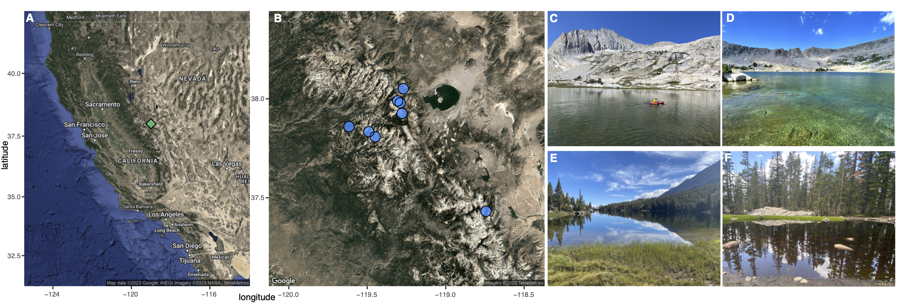

## Project Overview


<center>  
  
{width=80%}
 
</center>  

  
Compound specific isotope analysis of individual amino acids (CSIA-AA) is a new and exciting tool in the study of trophic ecology and animal nutrition. CSIA-AA are not constrained by the same spatiotemporal variability and fractionation effects observed in stable isotope analyses (SIA) of bulk tissues (carbons + lipids + proteins). Therefore, CSIA-AA represent a sea change in our ability to understand food webs and  trophic interactions.  

Certain amino acids can only be produced by primary producers (bacteria, algae, plants, fungi). These *de novo* synthesized amino acids, termed 'essential amino acids (AA~ESS~),' must be gained by animals through feeding/dietary means. Essential amino acids are passed from producers to consumers with limited fractionation or transamination, making them an ideal tool to examine the sources of carbon in consumers. Moreover, essential amino acids differ in their isotope signatures due to the biochemical pathways found in different Groups of producers (i.e., fungi, bacteria, microalgae, C~3~/C~4~/CAM plants), allowing producers signatures to be mapped with high resolution. By using multiple essential amino acids as a multivariate trait, an essential amino acid fingerprint can be used to identify the source of amino acids in consumers and the contributions and identify of producers in diets.

Terrestrial energy channels (collevtively, "allochthony") in aquatic systems is a resource for aquatic consumers and ecosystems, although its significance has been debated. Zooplankton prefer (and require) the high fatty acid content of microalgae (or autochthonous energy channels), which is a vital nutritional source.Terrestrial materials entering Lakes can leads to browning and a decrease in microalgae productivity as light is attenuated. In this case, allochthonous energy channels may limits primary production but can be an important alternative resource for consumers that are able to utilize the abundant (although low quality) nutritional source.

Here, we used CSIA-AA to ask whether zooplankton in high elevation alpine Lakes of the Sierra Nevada Mountains obtain their essential amino acids from in-water producers (particulate organic matter of microalgae origin) or from terrestrial C~3~ plants (sedges, pines, broadleaf deciduous trees). We sampled 7 Lakes and 1 dystropic pond across an elevation gradient (2500-3200m) and measured environmental conditions (temperature, pH, DOC, TN, TP, chlorophyll-*a*), measuring AA-carbon isotope values in producers and plankton consumers picked to individual species as well as a community size-fraction (>350um). 

```{r setup chunk, setup, include = FALSE, cache=FALSE, message=FALSE, warning=FALSE, collapse=TRUE}
if (!require('knitr')) install.packages('knitr'); library('knitr')
knitr::opts_chunk$set(warning=FALSE, message=FALSE, fig.align='center')

# load packages
if (!require("pacman")) install.packages("pacman") # for rapid install if not in library

# use pacman to load all the packages you are missing!
pacman::p_load('knitr', 'lme4', 'lmerTest', 'tidyverse', 'effects', 'plyr', 'dplyr', 'plotrix', 'car',"gridExtra", "cowplot", "tools", "mgcv", "gratia", "MASS", "stats", "tidymv", "sjstats", "coin", "emmeans", "ggplot2", "mda", "nortest", "reshape2", "gmm", "propagate","ggmap", "RgoogleMaps", "MixSIAR","GGally", "ggbiplot", "ggcorrplot", "vegan", "devtools", 'emmeans', 'multcompView', 'scales', 'pairwiseAdonis')

install_github("pmartinezarbizu/pairwiseAdonis/pairwiseAdonis")


### general formatting for figures 
Fig.formatting<-(theme_classic()) +
  theme(text=element_text(size=10),
        axis.line=element_blank(),
        legend.text = element_text(hjust=0, size=10),
        panel.border = element_rect(fill=NA, colour = "black", linewidth =1),
        aspect.ratio=1, 
        axis.ticks.length=unit(0.25, "cm"),
        axis.text.y=element_text(
          margin=unit(c(0.5, 0.5, 0.5, 0.5), "cm"), colour="black", size=10), 
        axis.text.x=element_text(
          margin=unit(c(0.5, 0.5, 0.5, 0.5), "cm"), colour="black", size=8)) +
  theme(legend.key.size = unit(0.4, "cm")) +
  theme(aspect.ratio=1.3) +
  theme(panel.spacing=unit(c(0, 0, 0, 0), "cm"))

```
```{r unused function, eval=FALSE}
# function to bind the data frames together
bind_cols_fill <- function(df_list) {
  max_rows <- map_int(df_list, nrow) %>% max()
  map(df_list, function(df) {
    if(nrow(df) == max_rows) return(df)
    first <- names(df)[1] %>% sym()
    df %>% add_row(!!first := rep(NA, max_rows - nrow(df)))
  }) %>% bind_cols()
}
```


### Site Maps
The map here will shows sampling locations in the Sierra Nevada Mountains. Note you must have a Google API to generate maps in `get_googlmaps`.  
```{r, site maps, fig.cap="**Figure 1**. Site map of the Eastern Sierra Nevada Mountains and sampling sites.", fig.align='center', results='hide'}

# load data
SNL.env<-read.csv("data/SNL.envdata.csv")
API<-read.csv("data/API_key.csv")
API.key<-API[1,1]

#quick map
# ggplot(SNL.env, aes(x = longitude, y = latitude)) + coord_quickmap() + geom_point()

######## using ggmap
register_google(key=API.key)

########
#California Map
########

CA.map<-get_googlemap(center=c(-121, y = 37), zoom = 6, source="google", mapType="hybrid",
                      style=c(feature="poi",element="labels",visibility="off")) 

# "poi" is to remove places of interest from map, other options avaialble too...
# no cities, roads, just "CA"...
# style = 'feature:road|element:all|visibility:simplified&style=feature:administrative.locality|element:labels|visibility:off')
# https://developers.google.com/maps/documentation/maps-static/styling#features

CA.map_for_man <- ggmap(CA.map) +
  geom_point(aes(x = -119, y = 38), pch=23,colour="black",fill="mediumseagreen", size = 3, stroke=0.5) +
  xlab("longitude") + ylab("latitude") +
 theme(text = element_text(size=6),
       plot.margin = unit(c(0.2, 0.5, 0.2, 0.2), "cm")) 
  #ggsn::scalebar(x.min=-124, x.max=-123, y.min=32.5, y.max=33, dist=2000, dist_unit="km",transform=TRUE,st.bottom=FALSE, st.size=2, box.fill=c("gray50", "white"), model="WGS84",st.color="white", border.size=0.5)


##########
# site map
##########
SNL.rev=c(x=-119.25, y = 37.75)

map.SNL<-get_map(SNL.rev, 
                      zoom=9, 
                      scale = 2, 
                      mapType= "satellite",
                      source="google", extent= "device", legend="topright")

## sites lat long
lat.long<-SNL.env %>%
  dplyr::select(Lake, latitude, longitude, elevation..m)

SNL.sites<-
  ggmap(map.SNL)+
  geom_point(aes(x=longitude, y=latitude), data=lat.long, alpha=0.8, color="dodgerblue", size=4)+
  geom_point(aes(x=longitude, y=latitude), data=lat.long, alpha=1, color="black", size=4, pch=21)+
  labs(x="longitude", y="latitude") +
  theme(text = element_text(size=6),
       plot.margin = unit(c(0.2, 0.5, 0.2, 0.2), "cm")) 
  #scale_y_continuous(limits=c(19.81785, 19.8242))+
  #scale_x_continuous(limits=c(-155.3223, -155.311)) +
  #annotate("text", x=-155.3187, y=19.8225, label= "KP", size=3, col="white") +
  #annotate("text", x=-155.31478, y=19.8224, label= "RK", size=3, col="white") +
#ggsn::scalebar(x.min=-155.314, x.max=-155.311, y.min=19.818, y.max=19.824, dist=100, 
               #dist_unit="m", transform=TRUE,
              #st.bottom=FALSE, st.size=2, box.fill=c("gray50", "white"), model="WGS84",st.color="white", border.size=0.5)

###

site.plots<-plot_grid(CA.map_for_man, SNL.sites, 
          labels=c('A', 'B'), label_size=8, hjust=-1, vjust= 6, ncol=2, nrow=1)


### export it
pdf(file= "figures/Fig1.sites_AB.pdf", height=4, width=8)
site.plots
dev.off()
```


<center>  
  
{width=90%}
 
</center>  


### Bulk SIA, Symons et al
Data here is from:  
*Symons, C. C., M. A. Schulhof, H. B. Cavalheri, and J. B. Shurin. 2019. Antagonistic effects of temperature and dissolved organic carbon on fish growth in California mountain Lakes. Oecologia 189: 231–241. doi:10.1007/s00442-018-4298-9*. 

In this study they sampled fish, grass, pines, plankton, and POM for carbon and nitrogen isotope analyses. The figure details that there is considerable overlap and high variance in these Groups, making it difficult to determine degrees of allochthony contribution to consumers.
```{r Bulk SIA Symons, fig.dim= c(6,4), fig.cap="**Figure**. Biplot of bulk tissue stable isotope analysis for carbon (δ^13^C) and nitrogen (δ^15^N) in fish, grasses, pines, POM, and zooplankton from montane Lakes in the Eastern Sierra Nevada Mountains of California (data from Symons et al. 2019)."}

##### Bulk stable isotope analyses (SIA)
bulk.iso<-read.csv("data/Symons iso data/Symons_Yos_bulkSIA.csv")

#d13C vs d15N
d13C.d15N<-ggplot(bulk.iso, aes(x=d13C, y=d15N, color=Type)) +
  scale_color_manual(values=c("orchid", "lightgoldenrod3", "mediumseagreen", "royalblue2", "coral")) +
  xlab(expression(paste(delta^{13}, C, " (\u2030, V-PDB)")))+
  ylab(expression(paste(delta^{15}, N, " (\u2030, Air)")))+
  coord_cartesian(xlim=c(-45, -5), ylim=c(-6, 10)) +
  labs(color = "")+
  geom_point() +
  stat_ellipse()+
  theme_classic()
ggsave("figures/FigS1.Bulk_13C.15N.pdf", height=6, width=7)

d13C.d15N
```


### AA~ESS~
Load in the full, standardized data (not to be confused with mean-normalized data) and pull out the essential amino acids (AA~ESS~), and subset by sample Type. We will be excluding Lysine due to poor resolution.
```{r essAA load}
SNL.d13C.aa<- read.csv("data/Sierra Nevada Lakes AA d13C Data NMX standard_update.csv")


#Pull out just the essential AA values (excluding Lys)
SNL.ess <- data.frame(SNL.d13C.aa$SampleID, SNL.d13C.aa$Ile13C, SNL.d13C.aa$Leu13C, SNL.d13C.aa$Phe13C,
                      SNL.d13C.aa$Thr13C, SNL.d13C.aa$Val13C)

#Rename columns
colnames(SNL.ess) <- c("SampleID", "Ile", "Leu", "Phe", "Thr", "Val")
SNL.ess$SampleID <- as.character(SNL.ess$SampleID)

#Write csv file - for all d13C ess AA - NMX standard
meta <- read.csv("data/All_sample_meta.csv")
SNL.ess.meta <- merge.data.frame(meta, SNL.ess, meta, by.x = "SampleID", by.y = "SampleID")
SNL.ess.meta<-SNL.ess.meta[!(SNL.ess.meta$Lake=="TB-tanks"),]

# # make new level for "Elevation" (in m), "0" for ordering, but actually is "NA"
SNL.ess.meta$Elevation.m<- ifelse(SNL.ess.meta$Lake == "Lukens", "2513",
                             ifelse(SNL.ess.meta$Lake == "MayPond", "2714",
                             ifelse(SNL.ess.meta$Lake == "Sunrise2", "2830",
                             ifelse(SNL.ess.meta$Lake == "Blue", "3054",
                             ifelse(SNL.ess.meta$Lake == "Greenstone", "3091",
                             ifelse(SNL.ess.meta$Lake == "Cascade", "3140",
                             ifelse(SNL.ess.meta$Lake == "EasternBrook", "3155",
                             ifelse(SNL.ess.meta$Lake == "Granite2", "3178",
                                    "0"))))))))

# add a "phy.group" column
SNL.ess.meta$phy.group<- ifelse(SNL.ess.meta$Type == "calanoid", "copepoda",
                             ifelse(SNL.ess.meta$Type == "calanoid_cyclopoid", "copepoda",
                             ifelse(SNL.ess.meta$Type == "Ceriodaphnia", "cladocera",
                             ifelse(SNL.ess.meta$Type == "Daphnia", "cladocera",
                             ifelse(SNL.ess.meta$Type == "Holopedium", "cladocera",
                             ifelse(SNL.ess.meta$Type == "Ceriodaphnia", "cladocera",
                             ifelse(SNL.ess.meta$Type == ">350um", ">350um",
                             ifelse(SNL.ess.meta$Group == "Terrestrial Plants", "Plants",
                             ifelse(SNL.ess.meta$Group == "Algae", "Algae",
                                    "POM")))))))))


#make ID column to run the normalization
SNL.ess.meta$ID<-1:nrow(SNL.ess.meta)
for(i in 1:length(SNL.ess.meta$ID)){
  SNL.ess.meta$Ile.n[i] <- (SNL.ess.meta$Ile[i]-mean(as.numeric(SNL.ess.meta[i,6:10])))
  SNL.ess.meta$Leu.n[i] <- (SNL.ess.meta$Leu[i]-mean(as.numeric(SNL.ess.meta[i,6:10])))
  SNL.ess.meta$Phe.n[i] <- (SNL.ess.meta$Phe[i]-mean(as.numeric(SNL.ess.meta[i,6:10])))
  SNL.ess.meta$Thr.n[i] <- (SNL.ess.meta$Thr[i]-mean(as.numeric(SNL.ess.meta[i,6:10])))
  SNL.ess.meta$Val.n[i] <- (SNL.ess.meta$Val[i]-mean(as.numeric(SNL.ess.meta[i,6:10])))
}

#reorder
SNL.ess.meta.ordered<- SNL.ess.meta %>% 
  dplyr::select(SampleID, Lake, Elevation.m, Group, Type, orig.class, phy.group, 
                Ile, Leu, Phe, Thr, Val, Ile.n, Leu.n, Phe.n, Thr.n, Val.n)
```
```{r essAA df formatting, collapse=TRUE}
# make new level for "phy.group" based on taxonomy
EAA.df.wide<-SNL.ess.meta.ordered #rename

#subset
plants <- EAA.df.wide[substr(EAA.df.wide$SampleID,1,11)=="SNL-TERPLA-",]
pom <- EAA.df.wide[substr(EAA.df.wide$SampleID,1,8)=="SNL-POM-",]
algae <- EAA.df.wide[substr(EAA.df.wide$SampleID,1,4)=="ALR-",]
zoops <- EAA.df.wide[substr(EAA.df.wide$SampleID,1,9)=="SNL-ZOOP-",]
######### figure in ggplot

# plants
Ile.plants<-as.data.frame(cbind(plants$Group, plants$Lake, "Isoleucine", plants$Ile, plants$Ile.n))
Leu.plants<-as.data.frame(cbind(plants$Group, plants$Lake, "Leucine", plants$Leu, plants$Leu.n))
Phe.plants<-as.data.frame(cbind(plants$Group, plants$Lake, "Phenylalanine", plants$Phe, plants$Phe.n))
Thr.plants<-as.data.frame(cbind(plants$Group, plants$Lake, "Threonine", plants$Thr, plants$Thr.n))
Val.plants<-as.data.frame(cbind(plants$Group, plants$Lake, "Valine", plants$Val, plants$Val.n))

plants.reshape.df<- rbind(Ile.plants, Leu.plants, Phe.plants, Thr.plants, Val.plants)
colnames(plants.reshape.df)<-c("Group", "Lake", "EAA", "d13C", "d13C.n")

#POM
Ile.pom<-as.data.frame(cbind(pom$Group, pom$Lake, "Isoleucine", pom$Ile, pom$Ile.n))
Leu.pom<-as.data.frame(cbind(pom$Group, pom$Lake, "Leucine", pom$Leu, pom$Leu.n))
Phe.pom<-as.data.frame(cbind(pom$Group, pom$Lake, "Phenylalanine", pom$Phe, pom$Phe.n))
Thr.pom<-as.data.frame(cbind(pom$Group, pom$Lake, "Threonine", pom$Thr, pom$Thr.n))
Val.pom<-as.data.frame(cbind(pom$Group, pom$Lake, "Valine", pom$Val, pom$Val.n))

pom.reshape.df<- rbind(Ile.pom, Leu.pom, Phe.pom, Thr.pom, Val.pom)
colnames(pom.reshape.df)<-c("Group", "Lake", "EAA", "d13C", "d13C.n")

#Algae
Ile.algae<-as.data.frame(cbind(algae$Group, algae$Lake, "Isoleucine", algae$Ile, algae$Ile.n))
Leu.algae<-as.data.frame(cbind(algae$Group, algae$Lake, "Leucine", algae$Leu, algae$Leu.n))
Phe.algae<-as.data.frame(cbind(algae$Group, algae$Lake, "Phenylalanine", algae$Phe, algae$Phe.n))
Thr.algae<-as.data.frame(cbind(algae$Group, algae$Lake, "Threonine", algae$Thr, algae$Thr.n))
Val.algae<-as.data.frame(cbind(algae$Group, algae$Lake, "Valine", algae$Val, algae$Val.n))

algae.reshape.df<- rbind(Ile.algae, Leu.algae, Phe.algae, Thr.algae, Val.algae)
colnames(algae.reshape.df)<-c("Group", "Lake", "EAA", "d13C", "d13C.n")

#zoops
Ile.zoops<-as.data.frame(cbind(zoops$Group, zoops$Lake, "Isoleucine", zoops$Ile, zoops$Ile.n))
Leu.zoops<-as.data.frame(cbind(zoops$Group, zoops$Lake, "Leucine", zoops$Leu, zoops$Leu.n))
Phe.zoops<-as.data.frame(cbind(zoops$Group, zoops$Lake, "Phenylalanine", zoops$Phe, zoops$Phe.n))
Thr.zoops<-as.data.frame(cbind(zoops$Group, zoops$Lake, "Threonine", zoops$Thr, zoops$Thr.n))
Val.zoops<-as.data.frame(cbind(zoops$Group, zoops$Lake, "Valine", zoops$Val, zoops$Val.n))

zoops.reshape.df<- rbind(Ile.zoops, Leu.zoops, Phe.zoops, Thr.zoops, Val.zoops)
colnames(zoops.reshape.df)<-c("Group", "Lake", "EAA", "d13C", "d13C.n")

#compiled df
EAA.df.long<-rbind(plants.reshape.df, pom.reshape.df, algae.reshape.df, zoops.reshape.df)

EAA.df.long$EAA<-recode_factor(EAA.df.long$EAA,
                Isoleucine = "Ile",
                Leucine = "Leu",
                Phenylalanine = "Phe",
                Threonine = "Thr",
                Valine = "Val")

EAA.df.long$Lake<- factor(EAA.df.long$Lake, 
                              levels=c("Lukens", "MayPond", "Sunrise2", "Blue", "Greenstone", 
                                       "Cascade", "EasternBrook", "Granite2"))

#restructure
EAA.df.long$Group<-as.factor(EAA.df.long$Group)
EAA.df.long$EAA<-as.factor(EAA.df.long$EAA)
EAA.df.long$d13C<-as.numeric(EAA.df.long$d13C)
EAA.df.long$d13C.n<-as.numeric(EAA.df.long$d13C.n)
```

#### Individual AA~ESS~
Arrange and format the dataframe for ggplot. We will use this data for linear model tests to determine which (if any)  AA~ESS~ are different among these 3 Groups. Make a boxplot of this data.  

##### Boxplots: raw & norm
We see clear effects of sampling location and sample types that reflect elevation of Lakes (possibly in interaction with other environmental factors) as well as biology, notably in benthic algae.  *This is Figure S3A-B*.

Mean normalization recommended to handle such variation and allow for group comparisons:  
Larsen, T., T. Hansen, and J. Dierking. 2020. Characterizing niche differentiation among marine consumers with amino acid δ13C fingerprinting. Ecol. Evol. 10: 7768–7782. doi:10.1002/ece3.6502

```{r EssAA boxplot, fig.dim=c(5,4), results='hide', fig.cap="**Figure S3**. Boxplot of *(A)* measured and *(B)* mean-normalized essential amino acids (AA~EES~) δ^13^C values for benthic algae, terrestrial plants, particulate organic matter (POM), and zooplankton in aquatic habitats in the Eastern Sierras Nevada mountains."}

#Now, that the data is structured, make a boxplot for each AA~ESS~ by sample Type (terrestrial plants, POM, zooplankton). 

colors2<-c("springgreen3", "dodgerblue", "goldenrod", "coral")

####### plot by EAA, with Groups of sources and consumers
EAA.box<-ggplot(EAA.df.long, aes(x=EAA, y=d13C, fill=Group))+
  geom_boxplot(alpha=0.8)+
  #geom_jitter(aes(fill=Group), colour="black",pch=21, size=1)+
  scale_fill_manual(values=colors2)+ 
  ylab(expression(paste("AA  ", delta^{13}, C, " (\U2030)"))) +
  xlab("Essential Amino Acids") +
  theme_classic()+
  #annotate('text', x = 4, y = -8, label='*', size=6)+
  #annotate('text', x = 3, y = -23, label='*', size=6) #
  guides(fill = "none")

####### NORMALIZED plot by EAA, with Groups of sources and consumers
EAA.box.nrm<-ggplot(EAA.df.long, aes(x=EAA, y=d13C.n, fill=Group))+
  geom_boxplot(alpha=0.8)+
  #geom_jitter(aes(fill=Group), colour="black",pch=21, size=1)+
  scale_fill_manual(values=colors2)+ 
  ylab(expression(paste("AA-norm ", delta^{13}, C, " (\U2030)"))) +
  xlab("Essential Amino Acids") +
  theme_classic()
  #annotate('text', x = 4, y = -8, label='*', size=6)+
  #annotate('text', x = 3, y = -23, label='*', size=6) #


plot_grid(EAA.box, EAA.box.nrm, rel_widths=c(1.65,2.2), labels=c("A", "B"))
dev.copy(pdf, "figures/FigS3.SNL.EssAA.Boxplot_rev.pdf", width = 10, height = 5)
dev.off()
```

##### Facet means: raw & norm
Make point-line plots (mean +/-SE) for the individual AA~ESS~, both raw/measured and mean normalized. Do this for each producer group (algae, POM, terrestrial plants) and zooplankton. This will allow us to evaluate effects of normalization on different groups. *This is Figure S4A-B*.
```{r ESS zoop by site, results='hide', fig.dim=c(5,4), collapse=TRUE, fig.cap="**Figure S4**. Mean (± standard error) δ^13^C values of individual essential amino acids in producers and plankton. Panel *(A)* is raw, non-normalized data and panel *(B)* is mean-normalized data."}

# Group by sample Type, Lake, and EAA, then calculate the mean d13C for EAA for each Group
EAA.long.grouped <- EAA.df.long %>%
  group_by(Group) %>%
  group_by(Lake, .add = TRUE) %>%
  group_by(EAA, .add = TRUE) %>%
  dplyr::summarize(Mean.d13C = mean(d13C, na.rm = TRUE), n = n(), 
                   SD.d13C = sd(d13C, na.rm = TRUE), 
                   SE.d13C = SD.d13C/sqrt(n),
                   Mean.d13C.n = mean(d13C.n, na.rm = TRUE), n = n(), 
                   SD.d13C.n = sd(d13C.n, na.rm = TRUE), 
                   SE.d13C.n = SD.d13C.n/sqrt(n)) 


# plot - RAW ESS
dodge = position_dodge(width = 0.40)

indiv.EAA.plot<-ggplot(EAA.long.grouped, aes(x = EAA, y = Mean.d13C, fill = Lake)) +
  facet_wrap(.~Group)+
  theme_bw() +
  geom_point(size = 3, shape=21, color="black", position=dodge, aes(color = Lake)) +
  geom_errorbar(aes(ymin = Mean.d13C-SE.d13C, ymax = Mean.d13C+SE.d13C), color = "gray40", 
                position=dodge, width = 0.0) +
  ylab(expression(paste(delta^{13},C-norm, " (\u2030)"))) +
  xlab("EAA")+
  scale_color_brewer(palette = "Spectral") +
  scale_fill_brewer(palette = "Spectral") +
  theme(axis.text = element_text(size = 10, color = "black"), axis.title = element_text(size = 10, color = "black")) +
  geom_line(data = EAA.reshape.Grouped, aes(x = EAA, y = Mean.d13C, color = Lake, group = Lake), position=dodge) +
  #theme(aspect.ratio = 0.8) +
  guides(fill = FALSE) +
  guides(color = FALSE)

# plot -- NORM ESS
indiv.EAA.plot.norm<-ggplot(EAA.long.grouped, aes(x = EAA, y = Mean.d13C.n, fill = Lake)) +
  facet_wrap(.~Group)+
  theme_bw() +
  geom_point(size = 3, shape=21, color="black", position=dodge, aes(color = Lake)) +
  geom_errorbar(aes(ymin = Mean.d13C.n-SE.d13C.n, ymax = Mean.d13C.n+SE.d13C.n), 
                color = "gray40", position=dodge, width = 0.0) +
  ylab(expression(paste(delta^{13},C-norm, " (\u2030)"))) +
  xlab("EAA-norm")+
  scale_color_brewer(palette = "Spectral") +
  scale_fill_brewer(palette = "Spectral") +
  theme(axis.text = element_text(size = 10, color = "black"), axis.title = element_text(size = 10, color = "black")) +
  geom_line(data = EAA.reshape.Grouped, aes(x = EAA, y = Mean.d13C.n, color = Lake, group = Lake), position=dodge) +
  #theme(aspect.ratio = 0.8) +
  guides(fill = guide_legend(reverse = TRUE)) +
  guides(color = FALSE)


###############
pdf(file= "figures/FigS4.indivAA_Lines_rev.pdf", height=9, width=12)
plot_grid(indiv.EAA.plot, indiv.EAA.plot.norm, rel_widths = c(1.65,2.1), labels=c("A", "B"))
dev.off()
```


#### Linear models: AA~ESS-norm~
Test for differences in individual EAAs among the three Groups (producers [POM, plants], zooplankton). Which amino acids are different across Groups?
- These models are combined in manuscript Table S3.
- Plots of individual AA~ESS-norm~ by site are in Figure S4A
```{r linear models, results='hide', fig.show='hide', collapse=TRUE}
# First, get the df organized for the analyses.

##### normalized EAAs for sources and plankton, test differences in EAA among Groups for individual EAAs
ESS.df.norm<-EAA.df.wide %>%
  dplyr::select(SampleID, Lake, Elevation.m, Group, Type, orig.class, phy.group, Ile.n, Leu.n , Phe.n, Thr.n, Val.n)

# make factors for columns
make.fac<-c("Group", "orig.class", "phy.group", "Lake")
ESS.df.norm[make.fac] <- lapply(ESS.df.norm[make.fac], factor)
str(ESS.df.norm)

################### ###################  NON-NORMALIZED DATA ####
# test differences in EAA among Groups in linear models: use NON-NORMALIZED DATA
################### ###################

# look at assumptions
for(i in c(8:12)){
  Y<-ESS.df.norm[,i]
  full<-lm(Y~Group, data=ESS.df.norm, na.action=na.exclude)
  R <- resid(full) #save glm residuals
  
  op<-par(mfrow = c(2,2), mar=c(5,4,1,2), pty="sq")
  plot(full, add.smooth = FALSE, which=1)
  QQ <- qqnorm(R, main = colnames(ESS.df.norm)[i]) 
  QQline <- qqline(R)
  hist(R, xlab="Residuals", main = colnames(ESS.df.norm)[i])
}

##########################
### run models to see where the Groups differ from each other
##########################

# Isoleucine
Ile.n.mod<-lm(Ile.n~Group, data=ESS.df.norm)
anova(Ile.n.mod) # p=0.026
plot(allEffects(Ile.n.mod), ylab="Ile.n", par.strip.text=list(cex=0.7))

posthoc.Ile<-emmeans(Ile.n.mod, ~Group)
multcomp::cld(posthoc.Ile, Letters=letters) # POM (A), Zoop (A), Plant (A), Algae (A)


# Leucine
Leu.n.mod<-lm(Leu.n~ Group, data=ESS.df.norm)
anova(Leu.n.mod) # p<0.001
plot(allEffects(Leu.n.mod), ylab="Leu.n", par.strip.text=list(cex=0.7))

posthoc.Leu.n<-emmeans(Leu.n.mod, ~Group)
multcomp::cld(posthoc.Leu.n, Letters=letters) # Plants (A), Zoop (B), POM (C), Algae (C)


# Phenylalanine: Group signif
Phe.n.mod<-lm(Phe.n~Group, data=ESS.df.norm)
anova(Phe.n.mod) # p<0.001
plot(allEffects(Phe.n.mod), ylab="Phe.n", par.strip.text=list(cex=0.7))

posthoc.Phe.n<-emmeans(Phe.n.mod, ~Group)
multcomp::cld(posthoc.Phe.n, Letters=letters) # Zoop (A), all others (B)


# Threonine: Group signif
Thr.n.mod<-lm(Thr.n~Group, data=ESS.df.norm)
print(anova(Thr.n.mod), digits=6) # p<0.001
plot(allEffects(Thr.n.mod), ylab="Thr.n", par.strip.text=list(cex=0.7))

posthoc.Thr.n<-emmeans(Thr.n.mod, ~Group)
multcomp::cld(posthoc.Thr.n, Letters=letters) # POM (A), Algae (AB), Zoop (B), Plants (C)


###### Valine: 
Val.n.mod<-lm(Val.n~Group, data=ESS.df.norm)
anova(Val.n.mod) # p<0.001
plot(allEffects(Val.n.mod), ylab="Val.n", par.strip.text=list(cex=0.7))

posthoc.Val.n<-emmeans(Val.n.mod, ~Group)
multcomp::cld(posthoc.Val.n, Letters=letters) # Algae (A), all others (B)
```

### Multivariate analyses
Using the standardized δ^13^C AA~ESS-norm~ data, we will use a PERMANOVA to test whether the four Groups (terrestrial plants, POM, algae, zooplankton) differ from each other in multivariate space. Considering we observed significant site level differences due to base-of-the-foodweb variance, normalized data is best.  

#### Permanova & PCA: AA~ESS~  
Make a non-norm PCA with values to explore the differences at the base of the food web in δ^13^C values across sites.  
- Remove the source since there is no information/low sample size to test site-specific effects
- Run PERMANOVA to test for site effects. 
- Perform PCA to see patterns in zooplankton by sites. 

**Take home**: multivariate patterns (PCA) and PERMANOVA show site-effects for non-normalized data.
- This is in Figure S4B & Table S4-topA. 

This PERMANOVA (`EAA.perm.Lake`) tests which sites are different form each other.

```{r rawEAA perman Lake}
# master df = EAA.df.wide
# non-normalized df
ESS.df.raw<-EAA.df.wide %>%
  dplyr::select(SampleID, Lake, Elevation.m, Group, Type, orig.class, phy.group, Ile, Leu, Phe, Thr, Val)

# make factors for columns
make.fac<-c("Group", "orig.class", "phy.group", "Lake")
ESS.df.raw[make.fac] <- lapply(ESS.df.raw[make.fac], factor)
str(ESS.df.raw)

##### # make the PCA df
PCA.raw.df<-ESS.df.raw %>% 
  dplyr::select(Lake, phy.group, Ile, Leu, Phe, Thr, Val)

# make new level for "Elevation" (in m), "0" for ordering, but actually is "NA"
PCA.raw.df$Lake<- factor(PCA.raw.df$Lake, levels=c("Lukens", "MayPond", "Sunrise2", "Blue", "Greenstone", 
                                           "Cascade", "EasternBrook", "Granite2"))

# remove the sources (POM and Plants), just look at the zooplankton which have site-level replications
PCA.raw.zoop<-PCA.df[!(PCA.raw.df$phy.group=="Plants" | 
                        PCA.raw.df$phy.group=="POM" | 
                        PCA.raw.df$phy.group=="Algae"),]

# factors: just Lake sampling sites and phy.group (cladocera or copepoda, >350um)
PCA.fac.zoop<- PCA.raw.zoop %>%
  dplyr::select(Lake, phy.group)

# the response variables
PCA.dat.raw.zoop<- PCA.raw.zoop %>%
  dplyr::select(Ile, Leu, Phe, Thr, Val)

####### ####### ####### ####### ####### RAW MEASURED DATA -- PCA, just zooplankton
####### Run a PERMANOVA for Lake, *no sources* to test for differences among zooplankton by Lake

# run PERMANOVA for Lake non-norm
set.seed(213)
EAA.raw.perm.Lake.zoop<-adonis2(PCA.dat.raw.zoop~Lake, data=PCA.fac.zoop, permutations=999, method="euclidian",by="terms")
EAA.raw.perm.Lake.zoop # different at p=0.001, R2=0.87 at Lake level

pairwise.adonis(PCA.dat.raw.zoop, factors=c(PCA.fac.zoop$Lake), sim.method = "euclidian", p.adjust.m = "none")
############### ####### ####### ####### a bit messy...
```

Now, perform a *PCA on the non-normalized data,* this shows the ellipses according to site, pooling across full plankton communities. Sources are excluded.
```{r rawEAA PCA Lake, results='hide', fig.dim=c(6,5), fig.cap="**Figure**. Principal component analysis of measured AA~ESS~ δ^13^C values for zooplankton Groups across sampling locations, ordered from low (Lukens) to high (Granite 2) elevation."}
### PCA
# run the PCA on scaled and centered data
set.seed(138)
PC.raw.zoop<- prcomp(PCA.dat.raw.zoop, center = TRUE, scale= TRUE) 

PC.raw.zoop.sum<-summary(PC.raw.zoop)
#plot(PC.plank, Type="lines", main="PC.area eigenvalues")
# 2 PCs explain 96% of variation, most in 1 axis (9)

PCA.fac.zoop$phy.group<-droplevels(PCA.fac.zoop$phy.group)
###### plot for PCA by Lake
## PC1 and PC2
PCA.raw.Lake.zoop <- ggbiplot(PC.raw.zoop, choices = 1:2, obs.scale = 1, var.scale = 1, 
                      groups=PCA.fac.zoop$Lake, varname.color="saddlebrown", varname.adjust = 2,
                      ellipse = TRUE, ellipse.fill = FALSE, ellipse.alpha=0.05, 
                      ellipse.prob=0.90, ellipse.linewidth =0.8,
                      circle = FALSE) +
  geom_point(size = 3, color="black",
             aes(shape=PCA.fac.zoop$phy.group, fill=PCA.fac.zoop$Lake)) +
  scale_x_continuous(breaks=seq(-4,4,2))+
  geom_vline(xintercept=0, linetype="dashed", color = "gray60")+
  geom_hline(yintercept=0, linetype="dashed", color = "gray60")+
  scale_color_brewer(palette = "Spectral") +
  scale_fill_brewer(palette = "Spectral") +
  scale_shape_manual(values=c(21,22,23)) +
  #scale_color_manual(values=PCA.col2)+
  #scale_shape_manual(values=c(16,1,22,2,3)) +
  ggtitle("ESS-raw")+
  theme_classic()+
  guides(color = guide_legend(reverse=TRUE))+
  guides(fill = FALSE) +
  theme(legend.text=element_text(size=10), 
    aspect.ratio=0.8, axis.ticks.length=unit(0.2, "cm"),
    axis.text.y=element_text(margin=unit(c(0.5, 0.5, 0.5, 0.5), "cm")),
    axis.text.x=element_text(margin=unit(c(0.5, 0.5, 0.5, 0.5), "cm")))


PCA.raw.Lake.zoop

######
pdf(file= "figures/FigS5.PCA.location_rev.pdf", height=6, width=8)
plot_grid(PCA.raw.Lake.zoop)
dev.off()
```


#### Permanova & PCA: AA~ESS-norm~
Run PERMANOVA and PCA on mean normalized data.  

*Permanova (mean-norm)*
(1) Using the normalized data, test for differences among all the data at three levels using a PERMANOVA. 
- Test using the 4 Groups: are they distinct from each other?  
- Are there differences between zoops, POM, algae, or terrestrial plants?   
*This is Table S4*

```{r permanova normalized across all 4 groups}
#### #### #### #### #### #### #### #### #### #### #### 
#### df just for the "Groups", which drops Lake and phy.group
ESS.norm.perm<- ESS.df.norm %>% dplyr::select(-c(SampleID, Elevation.m, orig.class))

# just AAs data
ESS.n.dat<-ESS.norm.perm  %>% 
  dplyr::select(Ile.n, Leu.n, Phe.n, Thr.n, Val.n)

# factors
# Here: only using Group: Zooplankton, Plants, POM, Algae
Group.n.fac<-ESS.norm.perm  %>% 
  dplyr::select(Lake, Group)

# run PERMANOVA for 3 Groups
set.seed(51)
EAA.perm.Group<-adonis2(ESS.n.dat~ Group, data=Group.n.fac, permutations=999, method="euclidian", by="terms")
EAA.perm.Group # different, Lake: p=0.004 R2=0.13, Group: p=0.001, R2=0.49
# with Group model, 54% R2

# run pairwise
set.seed(51)
pairwise.adonis(ESS.n.dat, factors=c(Group.n.fac$Group), sim.method = "euclidian", p.adjust.m = "none")
# All groups differ from each other
```

(2) Perform a PCA on the mean-normalized data to examine patterns in PCA space across the zooplankton groups relative to their sources (POM, algae, terrestrial plants)
*This is Figure S4B* 
```{r PCA zoops, results='hide', fig.dim=c(6,5), fig.cap="**Figure**. Principal component analysis (PCA) for mean-normalized AA~ESS~ δ^13^C values (AA~ESS-norm~) for zooplankton Groups and sources (POM, terrestrial plants). Ellipses represent 90% confidence intervals, where Group sample sizes are n ≥ 4."}

# factors, reorder
ESS.norm.perm$phy.group<-factor(ESS.norm.perm$phy.group, 
                                levels=c("Algae", "POM", "Plants", "cladocera", "copepoda", ">350um"))

PC.n.fac<-ESS.norm.perm  %>% 
  dplyr::select(Lake, Group, phy.group)

#run the PCA on scaled and centered data
set.seed(508)
PC.norm<- prcomp(ESS.n.dat, center = TRUE, scale= TRUE) 

PC.norm.summ<-summary(PC.norm) #64% in 3 PCs
#plot(PC.norm, type="lines", main="PC.area eigenvalues")

###### plot for PCA by phy group
phy.6.colors<-c("springgreen4", "dodgerblue", "lightsalmon3", "orange", "brown1", "gray65")


## PC1 and PC2
PCA.norm.plot <- ggbiplot(PC.norm, choices = 1:2, obs.scale = 1, var.scale = 1, 
                      groups=PC.n.fac$phy.group,
                      varname.color="saddlebrown", varname.adjust = 2,
                      ellipse = TRUE, ellipse.fill = FALSE, ellipse.alpha=0.05, 
                      ellipse.prob=0.90, ellipse.linewidth =0.7,
                      circle = FALSE) +
  geom_point(size = 3, color="black", shape=21,
             aes(fill=PC.n.fac$phy.group)) +
  geom_vline(xintercept=0, linetype="dashed", color = "gray60")+
  geom_hline(yintercept=0, linetype="dashed", color = "gray60")+
  scale_x_continuous(breaks=pretty_breaks(n=5))+
  scale_color_manual(values=phy.6.colors)+
  scale_fill_manual(values=phy.6.colors)+
  #scale_shape_manual(values=c(16,1,22,2,3))+
  ggtitle("ESS-normalized")+
   theme_classic()+
   theme(legend.text=element_text(size=10),
    axis.ticks.length=unit(0.2, "cm"), 
    axis.text.y=element_text(margin=unit(c(0.5, 0.5, 0.5, 0.5), "cm")),
    axis.text.x=element_text(margin=unit(c(0.5, 0.5, 0.5, 0.5), "cm"))) +
  guides(color = FALSE)

PCA.norm.plot

### export it
pdf(file= "figures/Figxx.PCA.norm.plank.pdf", height=6, width=8)
plot_grid(PCA.norm.plot)
dev.off()
```


### LDA 
Use a linear discriminant analysis (LDA) to determine separation of primary producers and assign zooplankton to these Groups as sources of AA~EAA~.  

#### LDA: Train Primary Producers
LDA has internal normalization approach, and we tested whether there is no difference in output whether data is mean-normalized or not and found no effect. Therefore, we proceed with the measured (non-mean-normalized data for subsequent analyses) of AA~ESS~ isotope fingerprinting and mixing models. In the LDA, we will use primary prodcers first, inspecting the error rate of a jackknifed - leave one out - model fit and compare classification rates. 

Run training data of 3 sources to later categorized zooplankton.
```{r LDA primary producers, results='hide'}
# full data = 'EAA.df.wide'
prod<- EAA.df.wide[!(EAA.df.wide$Group=="Zooplankton"),]

#Run an LDA with a jackknifing model fit to look at error rate
#'CV = TRUE' makes the LDA run a jackknifed - leave one out - model fit
All.lda <- lda(Group ~ Ile + Leu + Phe + Thr + Val, data = prod, CV = TRUE)

#Create a table which compares the classification from the LDA model to the actual classification
All.reclass <- table(prod$Group, All.lda$class)

#Total percent of samples correctly classified is the sum of the diagonal of this table: 89%
sum(diag(prop.table(All.reclass)))

mean(All.lda$class==prod$Group) # mean accuracy

#Percent of each producer Group correctly reclassified: 78% algae, 100% plants, 88% POM
diag(prop.table(All.reclass, 1))

#Create a training LDA function from the library data
#Note - you can't use the 'All.lda' object above because the 'CV = TRUE' command was used to create it, and for some reason this won't work with the predict() function
All.train <- lda(Group~ Ile + Leu + Phe + Thr + Val, data = prod)
All.train

#Write a csv file for the coefficients of LD1
lda.info <- as.data.frame(All.train$scaling)
write.csv(lda.info, "output/SNL_Producers_LDA_loadings_NMX.csv", row.names=FALSE)

#Create a data frame with these LDA coordinates
AllProdPredict <- data.frame(Group = prod$Group, SampleID = prod$SampleID, predict(All.train)$x)

#Write a csv file for the LDA coordinatinates
write.csv(AllProdPredict, "output/SNL_Producers_LDA_coords_NMX.csv", row.names=FALSE)
```


#### LDA: Classify zooplankton
Use the LDA to classify the zooplankton as assigning to either POM or terrestrial plants. We will later use the LDA scores (LD1) in a mixing model.  
```{r LDA Zoop1}
# full data for zoops only = 'zoops'
#Classify zooplankton
zoop.predict <- predict(object = All.train, newdata = zoops)
zoop.predict.data <- data.frame(SampleID = zoops$SampleID, Type = zoops$Type, Lake = zoops$Lake,
                                zoop.predict$class, zoop.predict$x)

All.reclass <- table(zoops$Group, zoop.predict$class) # 25 as POM, 3 as algae, 0 as plants

#Write a csv file for the zooplankton LDA info
write.csv(zoop.predict.data, "output/SNL_Zooplankton_LDA_info_NMX.csv", row.names=FALSE)

### alternative coding
pacman::p_load('devtools', 'ggord')
ord <- lda(Species ~ ., iris, prior = rep(1, 3)/3)
ggord(ord, iris$Species)
```

Now that we have new data, let's combine it with the previous data so that we have a unified dataframe with the measured AA~ESS~ data, sampling information, and LD-classification and LD1 coordinate.  
```{r LDA smithing}
##############
# combine the zooplankton and source LDA
##############

####### Producers
# AlldataPredict.mod original columns as - "Group", "SampleID", "LD1"
# rearrange
AllProdPredict.mod<- AllProdPredict %>%
  dplyr::select("SampleID", "Group", "LD1", "LD2")

# rename columns
colnames(AllProdPredict.mod)<-c("SampleID", "orig.class", "LD1", "LD2")

# make new columns to allow merge
AllProdPredict.mod$LD.class<-"Source"

all(prod$SampleID == AllProdPredict.mod$SampleID) #SampleIDs the same, add in Lake
AllProdPredict.mod$Lake<-prod$Lake

# rearrange
AllProdPredict.mod<- AllProdPredict.mod %>%
  dplyr::select("SampleID", "orig.class", "Lake", "LD.class", "LD1", "LD2")

############# Zooplankton
# grab columns we want
zoop.predict.data.NMX<- zoop.predict.data %>%
  dplyr::select("SampleID", "Type", "Lake", "zoop.predict.class", "LD1", "LD2")

# rename factors
zoop.predict.data.NMX <- zoop.predict.data.NMX %>% 
       dplyr::rename("orig.class" = "Type")

zoop.predict.data.NMX <- zoop.predict.data.NMX %>% 
       dplyr::rename("LD.class" = "zoop.predict.class")


####### bind the 2 dfs
LDA.df<-rbind(zoop.predict.data.NMX, AllProdPredict.mod)

# make new level for "phy.group" based on taxonomy
LDA.df$phy.group<- ifelse(LDA.df$orig.class == "calanoid", "copepoda",
                             ifelse(LDA.df$orig.class == "calanoid_cyclopoid", "copepoda",
                             ifelse(LDA.df$orig.class == "Ceriodaphnia", "cladocera",
                             ifelse(LDA.df$orig.class == "Daphnia", "cladocera",
                             ifelse(LDA.df$orig.class == "Holopedium", "cladocera",
                             ifelse(LDA.df$orig.class == "Ceriodaphnia", "cladocera",
                             ifelse(LDA.df$orig.class == ">350um", ">350um",
                             ifelse(LDA.df$orig.class == "Terrestrial Plants", "Plants",
                             ifelse(LDA.df$orig.class == "Algae", "Algae",
                                    "POM")))))))))
# rearrange
LDA.df.simple<- LDA.df %>%
  dplyr::select("SampleID", "LD.class", "LD1", "LD2")

#combine with raw and normalized data
raw.norm.LD.data<-merge(SNL.ess.meta.ordered, LDA.df.simple, by="SampleID", all.x=TRUE)
write.csv(raw.norm.LD.data, "output/All.data.comiled.csv")
```

#### LDA by sample-site
Use the LDA scores, plot each score for each sample to see the variance and site-differences. 
```{r LDA sample plot, results='hide', fig.dim=c(7,4.5), fig.cap="**Figure**. Linear discriminant analysis of AA~ESS~ δ^13^C values, with sample assignment across LD1 (linear discriminant-axis 1) from lowest (Lukens) to highest elevation (Granite 2). Dashed vertical line shows assignment of zooplankton samples as either supported by terrestrial plants or POM."}
##### can load in from output '("output/Producer_zoop_LDA_score.csv")'
LDA.df<- raw.norm.LD.data %>%
  dplyr::select("SampleID", "Group", "Lake", "Elevation.m", "orig.class", "phy.group", "LD.class", "LD1", "LD2")

LDA.df$Elevation.m<-as.numeric(LDA.df$Elevation.m)

# reorder Lake by relative elevation
LDA.df$Lake<-reorder(LDA.df$Lake, LDA.df$Elevation.m)

# reorder factors 
LDA.df$orig.class<-factor(LDA.df$orig.class, levels=c("Algae", "POM", "Terrestrial Plants",
                                                      ">350um", "calanoid", 
                                                      "calanoid_cyclopoid", "Ceriodaphnia",
                                                      "Daphnia", "Holopedium"))

phy.lda.col<-c("springgreen4","dodgerblue", "lightsalmon3", "gray65", "firebrick1","firebrick1", "goldenrod1", "goldenrod1","goldenrod1")
phy.lda.pts<-c(21,21,21, 24, 22,22, 23,23,23)
  
###
LDA.spp.Lake<-ggplot(LDA.df, aes(x=LD1, y=Lake, fill = orig.class, shape= orig.class))+
  geom_point(size=4,  position=position_dodge(0.2))+
  geom_vline(xintercept=1.5, linetype="dashed", color = "gray60")+
  annotate(geom="text", label="Algae/POM-Classified", x=-3.0, y=8.5, color="dodgerblue", size=3) +
  annotate(geom="text", label="Plant-Classified", x=3.0, y=8.5, color="lightsalmon3", size=3) +
  scale_fill_manual(values=phy.lda.col)+
  scale_shape_manual(values=phy.lda.pts)+
  ylab("Site: low-to-high elevation") +
  xlab("LD1") +
  theme_classic()

LDA.spp.Lake

dev.copy(pdf, "figures/FigS6.LDA.spp.Lake_rev.pdf", width = 8, height = 6)
dev.off()
```

#### LDA by taxa
Use the LDA scores to make boxplots showing the assignment for each zooplankton Group. This pools across all sites and emphasizes functional Groups/taxa.
```{r LDA taxa plot, results='hide', fig.dim=c(6,5), fig.cap="**Figure**. Boxplots of linear discriminant 1 (LD1) coordinates from linear discriminant analysis of AA~EES~ δ^13^C values. Dashed vertical lines demarcates assignment of zooplankton samples with terrestrial plants (left) or POM (right). "}
####################
#LDA box plot by phy.group
lda.6.colors<-c("springgreen4", "dodgerblue", "gray65", "orange", "brown1", "lightsalmon3")

LDA.df$phy.group<-factor(LDA.df$phy.group, levels=c("Algae", "POM", ">350um", "cladocera", 
                                                            "copepoda",
                                                            "Plants"))

LDA.phy.boxplot<-ggplot(LDA.df, aes(x=LD1, y=phy.group, 
                                 fill = phy.group))+
  geom_boxplot(alpha=0.9)+
  geom_jitter(aes(fill=phy.group), colour="black",pch=21, size=2) +
  geom_vline(xintercept=1.5, linetype="dashed", color = "gray60")+
  annotate(geom="text", label="Algae/POM-Classified", x=-2, y=6.5, color="dodgerblue", size=3) +
  annotate(geom="text", label="Plant-Classified", x=3.5, y=6.5, color="lightsalmon3", size=3) +
  scale_fill_manual(values=lda.6.colors)+
  scale_color_manual(values=lda.6.colors)+
  ylab("Consumer or Source") +
  xlab("LD1") +
  theme_classic() +
  guides(fill = guide_legend(reverse=TRUE))

LDA.phy.boxplot
dev.copy(pdf, "figures/Fig2.LDA.phy.boxplot.pdf", height = 6, width = 6)
dev.off()
```

### MixSIAR
Firest, export zooplankton and source data to feed into MixSIAR. We will calcualte the mean, standard deviations, and sample sized for LD1 values of the sources.
```{r mixsiar sources}
#Load Packages for MixSIAR Models .... should already load in setup chunk, but just in case
library(MixSIAR)
library(dplyr)
library(GGally)

#Create a new data frame with desired columns (Zooplankton)
Mix.df.all <- LDA.df %>%
  dplyr::select("SampleID", "orig.class", "phy.group", "Lake", "Elevation.m", "LD1")

#Remove Plants, algae and POM from the data frame
Mix.df <- Mix.df.all[!(Mix.df.all$phy.group=="Plants" | Mix.df.all$orig.class=="POM" |  Mix.df.all$orig.class=="Algae"),]

Mix.df.summary.Lake<-aggregate(LD1~Lake, data=Mix.df, FUN=length)
Mix.df.summary.phy<-aggregate(LD1~phy.group, data=Mix.df, FUN=length)
Mix.df.summary.phy.Lake<-aggregate(LD1~Lake+phy.group, data=Mix.df, FUN=length)

#Write and export a csv of the zooplankton data frame
write.csv(Mix.df.all, "output/Mix.df.csv", row.names=FALSE)

#Create a new data frame with desired columns
Source.df <-  Mix.df.all[(Mix.df.all$phy.group=="Plants" | 
                            Mix.df.all$orig.class=="POM" |  
                            Mix.df.all$orig.class=="Algae"),]

#drop levels and subset
Source.df$phy.group<-droplevels(Source.df$phy.group)
Source.df <- Source.df %>%
  dplyr::select("phy.group", "LD1")

#Calculate mean LD1 values of the sources
mean.df <- aggregate(LD1~phy.group, data=Source.df, FUN=mean)

#Calculate standard deviations for LD1 values of the sources
sd.df <- aggregate(LD1~phy.group, data=Source.df, FUN=sd)

#Calculate the number of samples for each of the sources
n.df <- aggregate(LD1~phy.group, data=Source.df, FUN=length)

#Bind the values calculated above into one data frame
source.agg.df <- cbind(n.df, mean.df[2], sd.df[2])

#Rename the columns in this data frame
colnames(source.agg.df) <- c("phy.group", "n", "MeanLD1", "SDLD1")

#Write and export a csv of the source data frame
write.csv(source.agg.df, "output/source.agg.df.csv", row.names=FALSE)

```

#### MixSIAR: by-sample models
Now import data and create model structure. This code will run through a series of loop models and produce outputs for a `"by sample" model` followed by a `complete model`. 
- Outputs from each model will be compared 
- Compiled model outputs are reported in Table S6.
```{r mixsiar by sample, eval=FALSE, echo=TRUE, collapse=TRUE}
#Load zooplankton (consumer) data and assign factors
cons <- load_mix_data(filename = "output/Mix.df.csv",
                          iso_names=c("LD1"),
                          factors=c("SampleID"),
                          fac_random=c(FALSE),
                          fac_nested=c(FALSE),
                          cont_effects=NULL)
#SampleID is a fixed factor

#Load source data
source <- load_source_data(filename="output/source.agg.df.csv",
                             source_factors=NULL,
                             conc_dep=FALSE,
                             data_type="means",
                             cons)

#Load TDF data
discr <- load_discr_data(filename="data/MixSIAR_TDFs.csv", cons)


##### Check data
# Make an isospace plot
# isospace_plot <- plot_data(filename="output/MixSIAR_isospace_plot_SampleIDs", plot_save_pdf=FALSE, plot_save_png=FALSE, cons,source,discr)


############
# Run MixSIAR by-sample Model
set.seed(12)

#Define the model and error structure and write JAGS model file
  model_filename <- "output/MixSIAR_models/SampleID_models/MixSIAR_Model_SampleID_fixed.txt"
  resid_err <- FALSE
  process_err <- TRUE
  write_JAGS_model(model_filename, resid_err, process_err, cons, source)
  
#Run the JAGS model
invt.jags.mod <- run_model(run="normal", cons, source, discr, model_filename, alpha.prior=1, resid_err, process_err)
  
#Process diagnostics, summary stats, and posterior plots
  output_JAGS(invt.jags.mod, cons, source, output_options=list(
    summary_save = TRUE,                   
    summary_name = "output/MixSIAR_models/SampleID_models/MixSIAR_SampleID_summary_stats",
    sup_post = FALSE,                       
    plot_post_save_pdf = TRUE,              
    plot_post_name = "output/MixSIAR_models/SampleID_models/MixSIAR_SampleID_posterior_density",   
    sup_pairs = TRUE,                       
    plot_pairs_save_pdf = TRUE,             
    plot_pairs_name = "output/MixSIAR_models/SampleID_models/MixSIAR_SampleID_pairs_plot",         
    sup_xy = TRUE,                          
    plot_xy_save_pdf = TRUE,                
    plot_xy_name = "output/MixSIAR_models/SampleID_models/MixSIAR_SampleID_xy_plot",             
    gelman = TRUE,                         
    heidel = FALSE,                         
    geweke = TRUE,                         
    diag_save = TRUE,                       
    diag_name = "output/MixSIAR_models/SampleID_models/MixSIAR_SampleID_diagnostics",
    indiv_effect = FALSE,
    plot_post_save_png = FALSE,            
    plot_pairs_save_png = FALSE,            
    plot_xy_save_png = FALSE))
    graphics.off()

#save all results
save.image("output/MixSIAR_models/SampleID_models/MixSIAR_SampleID_fixed_data.RData")
```

```{r MixSIAR by sample output, eval=FALSE, echo=TRUE, fig.keep='none'}
# *By Sample OUTPUT*: Clean and process summary stats for the `"by sample model"` and generate an output
# read in the summary stats from mixSIAR, parse and make a dataframe, replacing spaces from .txt

SAMP.mixSIAR.output<-read.table("output/MixSIAR_models/SampleID_models/MixSIAR_SampleID_summary_stats.txt", sep='\t', header=TRUE, skip=6)

SAMP.mixSIAR.output<-as.data.frame(SAMP.mixSIAR.output)
colnames(SAMP.mixSIAR.output)<-"full.data"

# remove all extra spaces using "squish", make them 1 space only
library(stringr)
SAMP.mixSIAR.output$full.data<- str_squish(SAMP.mixSIAR.output$full.data)

# rename columns
library(plyr)
samp.mix.out<-separate(SAMP.mixSIAR.output, full.data, into = c("factor", "Mean", "SD", "2.5.perc", "5.perc", "25.perc", "50.perc", "75.perc", "95.perc", "97.5.perc"), sep=" ")

# parse the factors here into 3 columns
new.cols<- stringr::str_split_fixed(samp.mix.out$factor, "\\.", 3) %>%
        as.data.frame() %>%
       setNames(c("proportion", "SampleID", "Source"))

new.cols<- new.cols %>%
  dplyr::select("SampleID", "Source")

# combine the new, separated columns with the data, verify the levels match, then remove "factor"
Samp.out.cleaned<-cbind(new.cols, samp.mix.out[1:10])
Samp.out.cleaned<-Samp.out.cleaned %>%
  dplyr::select(-factor)
                          
write.csv(Samp.out.cleaned, "output/MixSIAR_Samp.df.csv", row.names=FALSE)
```

```{r import mixSIAR data complete, eval=FALSE, echo=TRUE, fig.keep='none'}
#### MixSIAR: complete models

#Now import data and create model structure. This code will run through a series of loop models and produce outputs for a `complete model`.


n.mod <- 4
mix <- vector("list", n.mod) 

#Define mixtures for each model

#Null Model
mix[[1]] <- load_mix_data(filename="output/Mix.df.csv",
                          iso_names=c("LD1"),
                          factors=NULL,
                          fac_random=NULL,
                          fac_nested=NULL,
                          cont_effects=NULL)

#Group - Fixed; Taxa - Random, Nested
mix[[2]] <- load_mix_data(filename="output/Mix.df.csv",
                          iso_names=c("LD1"),
                          factors=c("phy.group", "orig.class"),
                          fac_random=c(FALSE, TRUE),
                          fac_nested=c(FALSE, TRUE),
                          cont_effects=NULL)

#Group - Fixed; Lake - Random, Nested
mix[[3]] <- load_mix_data(filename="output/Mix.df.csv",
                          iso_names=c("LD1"),
                          factors=c("phy.group", "Lake"),
                          fac_random=c(FALSE, TRUE),
                          fac_nested=c(FALSE, TRUE),
                          cont_effects=NULL)

#Elevation - Continuous; Group - Random
mix[[4]] <- load_mix_data(filename="output/Mix.df.csv",
                          iso_names=c("LD1"),
                          factors="phy.group",
                          fac_random=TRUE,
                          fac_nested=FALSE,
                          cont_effects="Elevation")


##### ##### ##### ##### 
##### Run MixSIAR complete models

set.seed(12)

#Run the models
source <- vector("list", n.mod)
discr <- vector("list", n.mod)
jags.mod <- vector("list", n.mod)

#Run loop
for(mod in 1:n.mod){

  # create sub-directory and move into it
  mainDir <- getwd()
  subDir <- paste0("model_", mod)
  dir.create(file.path(mainDir, subDir), showWarnings = FALSE)
  setwd(file.path(mainDir, subDir))
                           
  #Load source data
  source[[mod]] <- load_source_data(filename="~/Desktop/Github/Sierra-plankton-CSIA/output/source.agg.df.csv",
                             source_factors=NULL,
                             conc_dep=FALSE,
                             data_Type="means",
                             mix[[mod]])
  
  #Load TDF data
  discr[[mod]] <- load_discr_data(filename="~/Desktop/Github/Sierra-plankton-CSIA/data/MixSIAR_TDFs.csv", mix[[mod]])
  
  #Define model structure and write JAGS model file
  model_filename <- paste0("MixSIAR_model_", mod, ".txt")
  resid_err <- TRUE
  process_err <- TRUE
  write_JAGS_model(model_filename, resid_err, process_err, mix[[mod]], source[[mod]])
  
  #Run JAGS model
  jags.mod[[mod]] <- run_model(run="very long", mix[[mod]], source[[mod]], discr[[mod]], model_filename, alpha.prior=1, resid_err, process_err)
  
  #Process diagnostics, summary stats, and posterior plots
  output_JAGS(jags.mod[[mod]], mix[[mod]], source[[mod]], output_options=list(
    summary_save = TRUE,
    summary_name = "summary_statistics",
    sup_post = FALSE,                 
    plot_post_save_pdf = TRUE,            
    plot_post_name = "posterior_density",
    sup_pairs = TRUE,
    plot_pairs_save_pdf = TRUE,
    plot_pairs_name = "pairs_plot",
    sup_xy = TRUE,
    plot_xy_save_pdf = FALSE,
    plot_xy_name = "xy_plot",
    gelman = TRUE,
    heidel = FALSE,
    geweke = TRUE,
    diag_save = TRUE,
    diag_name = "diagnostics",
    indiv_effect = FALSE,
    plot_post_save_png = FALSE,
    plot_pairs_save_png = FALSE,
    plot_xy_save_png = FALSE))
  graphics.off()
  
  setwd(mainDir)
  
}

# Save all results
save.image("MixSIAR_Model_Comparisons_Data.RData")
```

```{r full MixSIAR compare, eval=FALSE, echo=TRUE, fig.keep='none'}
##### Compare Models


#Use 'compare_models' to get table with LOOic weights
names(jags.mod) <- c("null", "Group_taxa","Group_Lake", "elev_Group")
comparison.table <- compare_models(jags.mod)

comparison.table <- as.data.frame(comparison.table)

write.csv(comparison.table, "MixSIAR_Model_Comparisons_Table.csv")
```

```{r read comp Mix summary, eval=FALSE, echo=TRUE, fig.keep='none'}
##### Clean and process summary stats
#This is the data for the MixSIAR full output


# read in the summary stats from mixSIAR, parse and make a dataframe, replacing spaces from .txt
mod3.mixSIAR.output<-read.table("model_3/summary_statistics.txt", 
                                sep='\t', header=TRUE, skip=6)
mod3.mixSIAR.output<-as.data.frame(mod3.mixSIAR.output)
colnames(mod3.mixSIAR.output)<-"full.data"

# remove all extra spaces using "squish", make them 1 space only, using library(stringr)
mod3.mixSIAR.output$full.data<- str_squish(mod3.mixSIAR.output$full.data)

# separate using library(plyr)
mod3.out<-separate(mod3.mixSIAR.output, full.data, into = c("factor", "Mean", "SD", "2.5.perc", "5.perc", "25.perc", "50.perc", "75.perc", "95.perc", "97.5.perc"), sep=" ")

# remove top 2 rows from output
mod3.out<- mod3.out[-c(1:2),]

### top 6 rows need to be handles differently since there is no "Lake" here
mod3.out.phy<-mod3.out[c(1:6), ]
new.cols.mod3.phy<- stringr::str_split_fixed(mod3.out.phy$factor, "\\.", 3) %>%
        as.data.frame() %>%
       setNames(c("proportion", "phy.group", "Source"))

#make NA column for Lake
new.cols.mod3.phy$Lake<-NA

#rearrange
new.cols.mod3.phy<-new.cols.mod3.phy %>% 
  dplyr::select("phy.group", "Lake", "Source")


### now, the rest of data, by Lake
mod3.out.by.Lake<-mod3.out[-c(1:6), ]

# parse the factors here
new.cols.mod3.Lake<- stringr::str_split_fixed(mod3.out.by.Lake$factor, "\\.", 4) %>%
        as.data.frame() %>%
       setNames(c("proportion", "phy.group", "Lake", "Source"))

new.cols.mod3.Lake<- new.cols.mod3.Lake %>%
  dplyr::select("phy.group", "Lake", "Source")

# combine the new, separated columns with the data
Mod3.all.facs<-rbind(new.cols.mod3.phy, new.cols.mod3.Lake)

# combine with data
Mod3.out.cleaned<-cbind(Mod3.all.facs, mod3.out[1:10]) # verify the levels match, then remove "factor"
Mod3.out.cleaned<-Mod3.out.cleaned %>%
  dplyr::select(-factor)
                          
write.csv(Mod3.out.cleaned, "output/MixSIAR_Mod3.df.csv", row.names=FALSE)
```


#### Figs mixSIAR models and plots
Make plots from mixSIAR. We will make a plot for each zooplankton Group and one for each site.
```{r mixSIAR plots, out.width="50%", fig.show='hold', results='hide', fig.cap="**Figure**.  Proportional contributions of two AA~ESS~ sources (POM and terrestrial plants) to zooplankton consumers (left) pooled across sites and (right) at each site, estimated from a MixSIAR model that included Group as fixed effect and location as random effect."}
############### now makes some plots and run models

mod3<-read.csv("output/MixSIAR_Mod3.df.csv", check.names=FALSE) 
#check.names=FALSE prevents an "X" being added to the columns that start with a number

# make factors for columns
make.fac<-c("phy.group", "Source")
mod3[make.fac] <- lapply(mod3[make.fac], factor)

mod3$Source<-factor(mod3$Source, levels=c("POM", "Plants"))

############# Look at the Groups pooled across the Lakes
# phy Group effects, across Lakes
mod3.phy<-mod3[(1:6),]

mod3.phy.fig<-ggplot(data=mod3.phy, aes(x=phy.group, y=Mean, fill=Source))+
  scale_fill_manual(values=c("dodgerblue", "springgreen3"))+
  geom_errorbar(aes(ymin=Mean-SD, ymax=Mean+SD, width=.2),
                 position=position_dodge(0.5))+
  geom_point(size=4,  position=position_dodge(0.5), color="black", pch=21)+
  ylab("Proportion of EAA-source") +
  xlab("Zooplankton Groups") +
  theme_classic()

mod3.phy.fig

### export it
pdf(file= "figures/Fig3.Phy.mixsiar.pdf", height=5, width=5)
mod3.phy.fig
dev.off()


############# Look at the Groups within each Lake
# phy Group effects, across Lakes
mod3.Lake<-mod3[-(1:6),]

# make new level for "Elevation" (in m)
mod3.Lake$Elevation<- as.numeric(ifelse(mod3.Lake$Lake == "Lukens", "2513",
                             ifelse(mod3.Lake$Lake == "MayPond", "2714",
                             ifelse(mod3.Lake$Lake == "Sunrise2", "2830",
                             ifelse(mod3.Lake$Lake == "Blue", "3054",
                             ifelse(mod3.Lake$Lake == "Greenstone", "3091",
                             ifelse(mod3.Lake$Lake == "Cascade", "3140",
                             ifelse(mod3.Lake$Lake == "EasternBrook", "3155",
                             ifelse(mod3.Lake$Lake == "Granite2", "3178",
                                    "0")))))))))

# reorder Lake by relative elevation
mod3.Lake$Lake<-as.factor(reorder(mod3.Lake$Lake, mod3.Lake$Elevation))

### make the plot
mod3.Lake.fig<-ggplot(data=mod3.Lake, aes(x=Lake, y=Mean, fill=Source))+
  facet_wrap(.~phy.group)+
  scale_fill_manual(values=c("dodgerblue", "springgreen3"))+
  geom_errorbar(aes(ymin=Mean-SD, ymax=Mean+SD, width=.2),
                 position=position_dodge(0.5))+
  geom_point(size=4,  position=position_dodge(0.5), color="black", pch=21)+
  ylab("Proportion of EAA-source") +
  xlab("Lakes: low-to-high elevation") +
  theme_bw() +
  theme(axis.text.x = element_text(angle = 90, vjust = 0.5, hjust=1))

mod3.Lake.fig

### export it
pdf(file= "figures/FigS7.Lake.mixsiar.pdf", height=7, width=12)
mod3.Lake.fig
dev.off()
```

*Combine all data*   
Now that we have more data, let's combine it with the previous data so that we have a unified dataframe with the sampling information, measured AA~ESS~ data, LD-classification, LD1 coordinate, and mixing model output.
```{r generate full data, results='hide'}
#### by sample
#check.names=FALSE prevents an "X" being added to the columns that start with a number
samp.mix.df<-read.csv("output/MixSIAR_Samp.df.csv", check.names=FALSE) 


#### merge data from mixsiar with other data
# read in the EAA values for zoops (loaded above, "output/SNL_zooplankton_ess_AA_data.csv", and reorganized in "zoop.sub")

# combine zoops and producers, called in from 'EAA.df.wide'
head(EAA.df.wide)

MSiar.LD.meta <- merge.data.frame(samp.mix.df, LDA.df, by.x = "SampleID", by.y = "SampleID", all=TRUE)
MSiar.LD.meta.EAA <- merge.data.frame(MSiar.LD.meta, EAA.df.wide, 
                                      by.x = "SampleID", by.y = "SampleID", all=TRUE)

#### simplify data
# select useful columns
MSiar.LD.meta.EAA<- MSiar.LD.meta.EAA %>%
  dplyr::select("SampleID", "Source", "Mean", "SD", "Lake.x", 
                "orig.class", "phy.group.y", "LD.class", "LD1", "Group", 
                "Ile", "Leu", "Phe", "Thr", "Val")

MSiar.LD.meta.EAA<- MSiar.LD.meta.EAA %>% 
  dplyr::rename("Lake" = "Lake.x", "phy.group" = "phy.group.y")


# read in environmental data (loaded above, <-read.csv("data/SNL.envdata.csv"), "SNL.env"
MSiar.data.env<-merge.data.frame(MSiar.LD.meta.EAA, SNL.env, by.x = "Lake", by.y = "Lake",all=TRUE)

# select useful columns
MSiar.data.env<- MSiar.data.env %>%
  dplyr::select("Location", "Date", "Lake", "elevation..m", "latitude", "longitude", "depth..m",
                "secchi..m", "temp..C", "DO..perc", "cond", "pH", "DOC..mg.L",
                "TN..ug.L", "TP..ug.L", "chla..ug.L", "SampleID", "orig.class", "phy.group", 
                "Ile", "Leu", "Phe", "Thr", "Val",
                "LD.class", "LD1", "LD.class", "Source", "Mean", "SD")

# (can't subset data easily above with the NAs for 'Lake Source'
# separate the 3 Types of data -- a bit messy because of column "mean", which is the proportion of source 1 vs 2
MSiar.data.env.plant.prop<-na.omit(MSiar.data.env[(MSiar.data.env$Source=="Plants"),])
MSiar.data.env.POM.prop<-na.omit(MSiar.data.env[(MSiar.data.env$Source=="POM"),])
MSiar.data.env.Source<-MSiar.data.env[(MSiar.data.env$LD.class=="Source"),]

# rename PLANT prop mean
MSiar.data.env.plant.prop<- MSiar.data.env.plant.prop %>% 
       dplyr::rename("prop.plant.mean" = "Mean")
MSiar.data.env.plant.prop<- MSiar.data.env.plant.prop %>% 
       dplyr::rename("prop.plant.SD" = "SD")

# rename POM prop mean
MSiar.data.env.POM.prop<- MSiar.data.env.POM.prop %>% 
       dplyr::rename("prop.POM.mean" = "Mean")
MSiar.data.env.POM.prop<- MSiar.data.env.POM.prop %>% 
       dplyr::rename("prop.POM.SD" = "SD")


#### add the Sources back in
# make dumpy NA columns so the headers match

MSiar.data.env.Source1<-  MSiar.data.env.Source %>% 
       dplyr::rename("prop.plant.mean" = "Mean")
MSiar.data.env.Source1<-  MSiar.data.env.Source1 %>% 
       dplyr::rename("prop.plant.SD" = "SD")

# merge data, has plants and sources
Pooled1.plant.df <- rbind(MSiar.data.env.Source1, MSiar.data.env.plant.prop)

### do the same for POM to bring in the sources
# add the Sources back in
MSiar.data.env.Source2<-  MSiar.data.env.Source %>% 
       dplyr::rename("prop.POM.mean" = "Mean")
MSiar.data.env.Source2<-  MSiar.data.env.Source2 %>% 
       dplyr::rename("prop.POM.SD" = "SD")

# merge data, has POM and sources
Pooled2.POM.df <- rbind(MSiar.data.env.Source2, MSiar.data.env.POM.prop)

#reduce columns needed for merged data
Pooled2.POM.select.df<- Pooled2.POM.df %>% dplyr::select (SampleID,  prop.POM.mean, prop.POM.SD)

# merge data, this is all the data, merged by ID, with the new columns for prop POM or plant
final.df <- merge.data.frame(Pooled1.plant.df, Pooled2.POM.select.df, by.x = "SampleID", by.y = "SampleID")

#remove Source column, which is relic of output from MixSIAR
final.df<- final.df %>% dplyr::select (-Source)

#### export full data for project
write.csv(final.df, "output/SNL.CSIA.fulldata.csv")
```
  
  
### Multiple linear regressions 
Use the proportion of AA~ESS~ from terrestrial plants from the mixing model with a multiple linear regressions analysis to find the environmental conditions that correlate with each other and exhibit a relationship with changes in allochthony for each zooplanton category. 

- First generate the correlation matrix for environemental conditions
- This will determine the model predictors
```{r correlation matrix, results='hide', fig.cap="**Figure** Correlation matrix displaying Pearson’s coefficient (r) between environmental and biogeochemical metrics at eight aquatic habitats in the Eastern Sierras Nevada Mountains. Positive and negative coefficients indicate positive and negative correlations between metrics, respectively."}
# use 'ESS.mods' to run models

# look at % plant contributions by environmental data
mod.data<- final.df %>%
  dplyr::select(SampleID, Lake, elevation..m, depth..m, temp..C, DO..perc, pH, DOC..mg.L,
                TN..ug.L, TP..ug.L, chla..ug.L, phy.group, Ile, Leu, Phe, Thr, Val, LD.class, 
                LD1, prop.plant.mean, prop.plant.SD)


# remove data where elevation for samples is missing (ie the source samples that were pooled across all sampling sites)
Plant.nut.env<-mod.data[!(mod.data$Lake=="Source"),] 

############# ############# ############# ############# 
############# look at correlation matrix, what variables strongly correlate?

# Install and load the ggcorrplot package

# Keep predictors for the model
reduced_data <- Plant.nut.env %>%
  dplyr::select(elevation..m, temp..C, pH,
                TN..ug.L, TP..ug.L, chla..ug.L, DOC..mg.L)

# Compute correlation at 2 decimal places
corr_matrix = round(cor(reduced_data), 2)

# Compute and show the  result
ggcorrplot(corr_matrix, hc.order = TRUE, Type = "lower",
          lab = TRUE)

### export it
dev.copy(pdf, "figures/FigS2.correl.matrix.pdf", height=6, width=8)
dev.off()

# from here, TN, TP, DOC all correlate with >0.77 (TN and DOC at 0.94!) So only need 1 of these in a multiple linear regression
```

**Multiple regressions for ALL zooplankton** = >350 um, cladocerans, copepods
```{r all zoop multR2, results='hide', fig.keep='none'}
# library(MASS)
# run a full model
mod.mult<-lm(prop.plant.mean~temp..C+ pH+TN..ug.L+chla..ug.L,
             data=Plant.nut.env)

# model fit
summary(mod.mult)

# check distribution and residuals
hist(mod.mult$residuals)
qqnorm(mod.mult$residuals)
qqline(mod.mult$residuals)

sigma(mod.mult)/mean(Plant.nut.env$prop.plant.mean) #70% error rate, not awesome. 

# run model selection
all.zoop.mods<-stepAIC(mod.mult, trace=TRUE)

# best model is with chla (p=0.111) and TN (p=0.009), R2-adjust = 0.186, RSE= 0.099
mod.mult.all<-lm(prop.plant.mean~TN..ug.L+chla..ug.L,
             data=Plant.nut.env)
summary(mod.mult.all)
Anova(mod.mult.all, Type=2)
```

```{r mod.mult.all}
Anova(mod.mult.all, Type=2)
```

```{r all zoop multR2 plots, results='hide', fig.keep='none'}
### if doing single models, the outcome is the same -- trend for chla and signifiance for DOC, TN, TP (which all correlate)

# TN, all Groups
N.prop.plant<-ggplot(Plant.nut.env, aes(x=TN..ug.L, y=prop.plant.mean)) +
  geom_smooth(method = lm, color="purple", alpha=0.2, fill="purple")+
  geom_point(color="violet", size=2)+
  ylab("Proportion Plant-EAA")+
  xlab("Total N (ug/L)")+
  ggtitle("All zoops")+
  theme_classic()

# Chloropyll, all Groups
chla.prop.plant<-ggplot(Plant.nut.env, aes(x=chla..ug.L, y=prop.plant.mean)) +
  geom_smooth(method = lm, color="purple", alpha=0.2, fill="purple")+
  geom_point(color="violet", size=2)+
  ylab("Proportion Plant-EAA")+
  xlab("chlorophyll a (ug/L)")+
  ggtitle("All zoops")+
  theme_classic()
```

**Multiple regressions** *Cladocera alone*
```{r cladocera multR2, results='hide', fig.keep='none'}
#############################
##### Cladocerans
cladoc.plant<-Plant.nut.env[(Plant.nut.env$phy.group=="cladocera"),]

# run a full model, but 3 not defined because of singularities
mod.mult.cladoc<-lm(prop.plant.mean~temp..C+ pH+TN..ug.L+chla..ug.L,
             data=cladoc.plant)

# model fit
summary(mod.mult.cladoc)

# check distribution and residuals
hist(mod.mult.cladoc$residuals)
qqnorm(mod.mult.cladoc$residuals)
qqline(mod.mult.cladoc$residuals)

sigma(mod.mult.cladoc)/mean(cladoc.plant$prop.plant.mean) #71% error rate 

# run model selection
cladoc.mods<-stepAIC(mod.mult.cladoc, trace=TRUE)

# best model is with pH (p=0.081), Multiple R2 = 0.333, RSE= 0.092
mod.mult.cladoc.reduced<-lm(prop.plant.mean~pH, data=cladoc.plant)
summary(mod.mult.cladoc.reduced)
Anova(mod.mult.cladoc.reduced, Type=2)
```

```{r mod.mult.cladoc.reduced}
Anova(mod.mult.cladoc.reduced, Type=2)
```

```{r cladocera multR2 plots, results='hide', fig.keep='none'}
# this is best model for mutiple regression, RSE 0.104, R2-adjust =0.176
mod.mult<-lm(prop.plant.mean~TN..ug.L+chla..ug.L,
             data=cladoc.plant)
summary(mod.mult)
sigma(mod.mult)/mean(Plant.nut.env$prop.plant.mean) #62% error rate


# Cladocera, near signif trend for pH (lower plant nutrition with increase in pH)
clad.pH.plant<-ggplot(cladoc.plant, aes(x=pH, y=prop.plant.mean)) +
  geom_smooth(method = lm, color="goldenrod4", alpha=0.2, fill="goldenrod4")+
  geom_point(color="goldenrod2", size=2)+
  ylab("Proportion Plant-EAA")+
  xlab("pH")+
  ggtitle("Cladocera")+
  theme_classic()
```

**Multiple regressions** *Copepods alone*
```{r Copepoda MultR2, results='hide',fig.keep='none'}
### separate dataframes
copep.plant<-Plant.nut.env[(Plant.nut.env$phy.group=="copepoda"),]

#############################
##### Copepods
# run a full model, but 3 not defined because of singularities
mod.mult.copepod<-lm(prop.plant.mean~temp..C+pH+TN..ug.L+chla..ug.L,
             data=copep.plant)

# model fit
summary(mod.mult.copepod)

# check distribution and residuals
hist(mod.mult.copepod$residuals)
qqnorm(mod.mult.copepod$residuals)
qqline(mod.mult.copepod$residuals)

sigma(mod.mult.copepod)/mean(copep.plant$prop.plant.mean) #49% error rate. 

# run model selection
copep.mods<-stepAIC(mod.mult.copepod, trace=TRUE)

# best model is with TN (p=0.041) and temp (0.229), R2-adjust = 0.328, RSE= 0.096
mod.mult.copepod<-lm(prop.plant.mean~TN..ug.L+temp..C,
             data=copep.plant)
summary(mod.mult.copepod)
Anova(mod.mult.copepod, Type=2)
```
```{r mod.mult.copepod}
Anova(mod.mult.copepod, Type=2)
```

```{r Copepoda MultR2 plots, results='hide',  fig.keep='none'}
# copepods, N significant
copepod.TN<-ggplot(copep.plant, aes(x=TN..ug.L, y=prop.plant.mean)) +
  geom_smooth(method = lm, color="darkred", alpha=0.2, fill="darkred")+
  geom_point(color="coral", size=2)+
  ylab("Proportion Plant-EAA")+
  xlab("Total N (ug/L)")+
  ggtitle("Copepoda")+
  theme_classic()

# copepods, Temp barely a trend, nothing clear
copepod.Temp<-ggplot(copep.plant, aes(x=temp..C, y=prop.plant.mean)) +
  geom_smooth(method = lm, color="darkred", alpha=0.2, fill="darkred")+
  geom_point(color="coral", size=2)+
  ylab("Proportion Plant-EAA")+
  xlab("Temperature (C)")+
  ggtitle("Copepoda")+
  theme_classic()
```

**Plots for multiple regression output**
```{r regression plots, results='hide', fig.dim=c(8,4),fig.cap="**Figure**. Best-fit terms applied to multiple linear regression models testing relationships between environmental metrics and the proportional contribution of AA~ESS~ from terrestrial plants to zooplankton"}
multregres.plots<-plot_grid(N.prop.plant, clad.pH.plant, copepod.TN,
                            ncol=3, nrow=1)

multregres.plots
dev.copy(pdf, "figures/Fig4.Multregrss.pdf", height=3.5, width=9)
dev.off()
```
