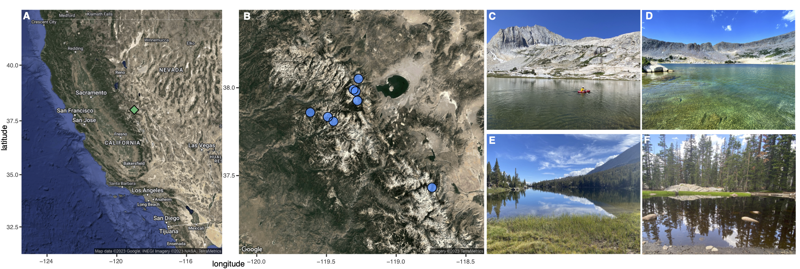

## Project Overview


<center>  
  
{width=80%}
 
</center>  

  
Compound specific isotope analysis of individual amino acids (CSIA-AA) is a new and exciting tool in the study of trophic ecology and animal nutrition. CSIA-AA are not constrained by the same spatiotemporal variability and fractionation effects observed in stable isotope analyses (SIA) of bulk tissues (carbons + lipids + proteins). Therefore, CSIA-AA represent a sea change in our ability to understand food webs and  trophic interactions.  

Certain amino acids can only be synthesized *de novo* by primary producers (e.g., bacteria, algae, plants, fungi) and must be acquired by animals through feeding/dietary means. Thus, such amino acids are considered 'essential amino acids (AA~ESS~)' for animals. AA~ESS~ are passed from producers to consumers with limited carbon isotope fractionation, making the carbon isotope analysis of individual AA~ESS~ an ideal tool to examine the sources of carbon in consumers. Moreover, the AA~ESS~ carbon isotope values of different groups of primary producers (e.g., microalgae, macroalgae, C~3~/C~4~/CAM plants) vary due to unique biochemical pathways, pools, and fluxes, allowing primary producers AA~ESS~ carbon isotope patterns (i.e., fingerprints) to be separated with high resolution. AA~ESS~ carbon isotope fingerprints can be used to identify the sources of AA~ESS~ supporting consumers and the proportional contributions of different primary producers to consumer diets and/or food chains.

Terrestrial energy channels (known as allochthonous energy channels in aquatic systems) are a resource of energy and nutrients for aquatic consumers and ecosystems, although their significance can vary greatly across space and time. Zooplankton prefer (and require) the high fatty acid content of microalgae, which are a vital nutritional source and considered the base of an important autochthonous energy channel in most aquatic systems.Terrestrial resources entering lakes can lead to browning through the leaching dissolved organic matter and subsequently, a decrease in microalgae productivity as light is attenuated. In such a case, allochthonous energy channels may limit primary production, decreasing the importance of autochthonous energy channels, and provide an important alternative resource for consumers that are able to utilize the abundant (although potentially low quality) terrestrial nutritional sources.

Here, we used CSIA-AA to ask whether zooplankton in high elevation alpine Lakes of the Sierra Nevada Mountains obtain their AA~ESS~ from in-water producers (particulate organic matter dominated by microalgae and benthic algae) or from terrestrial C~3~ plants (sedges, pines, and broadleaf deciduous trees). We sampled 7 Lakes and 1 pond across an elevation gradient (2500-3200m) and measured environmental conditions (temperature, pH, DOC, TDN, TDP, chlorophyll-*a*). We analyzed the AA~ESS~ carbon isotope values of three primary producer groups and zooplankton consumers as both a community size-fraction (>350um) and individual taxa. 

```{r setup chunk, setup, include = FALSE}
if (!require('knitr')) install.packages('knitr'); library('knitr')
knitr::opts_chunk$set(warning=FALSE, message=FALSE, fig.align='center', cache=TRUE)
```

```{r packages, include = FALSE}
# load packages
if (!require("pacman")) install.packages("pacman") # for rapid install if not in library

# use pacman to load all the packages you are missing!
pacman::p_load("knitr", "lme4", "lmerTest", "tidyverse", "effects", "plyr", "plotrix", "car","gridExtra", "cowplot", "tools", "mgcv", "gratia", "MASS", "stats", "sjstats", "coin", "emmeans", "ggplot2", "mda", "nortest", "reshape2", "gmm", "propagate","ggmap", "RgoogleMaps", "R2jags", "MixSIAR","GGally", "ggbiplot", "ggcorrplot", "vegan", "devtools", "multcompView", "scales", "pairwiseAdonis", "ggplot2", "ggcorrplot", "ggord", "dplyr", "ordr", "remotes", "pak")

remotes::install_github("pmartinezarbizu/pairwiseAdonis/pairwiseAdonis")
remotes::install_github("brianstock/MixSIAR", dependencies=T)
#pak::pak("r-lib/devtools") # if having an issue with devtools, can load the development version


### general formatting for figures 
Fig.formatting <- 
  theme(axis.ticks.length = unit(0.2, "cm"),
        axis.text.x = element_text(size = 12, color = "black"),
        axis.text.y = element_text(size = 12, color = "black"),
        axis.title.x = element_text(size = 14, color = "black"),
        axis.title.y = element_text(size = 14, color = "black"),
        legend.text = element_text(size = 10, color = "black"),
        legend.title = element_blank(),
        axis.ticks = element_line(color = "black"),
        legend.key.size = unit(0.6, "cm"))

```

### Site Maps
This map shows sampling locations in the Sierra Nevada Mountains. Note you must have a Google API to generate maps in `get_googlmaps`.  
```{r, site maps, fig.cap="**Figure 1**. Site map of the Eastern Sierra Nevada Mountains and sampling sites.", fig.align='center', results='hide'}

# load data
SNL.env <- read.csv("data/SNL.envdata.csv")
API <- read.csv("data/API_key.csv") # can we put the API_key.csv in the data folder? I don't see it, if not, let's remove this chunk of code from our .Rmd file in GitHub because it's not reproducible?
API.key <- API[1,1]

# quick map
# ggplot(SNL.env, aes(x = longitude, y = latitude)) + coord_quickmap() + geom_point()

######## using ggmap
ggmap::register_google(key=API.key)

##################
# California Map #
##################

CA.map <- ggmap::get_googlemap(center = c(-121, y = 37), zoom = 6, source = "google", mapType = "hybrid",
                      style = c(feature = "poi", element = "labels", visibility = "off")) 

# "poi" is to remove places of interest from map, other options avaialble too...
# no cities, roads, just "CA"...
# style = 'feature:road|element:all|visibility:simplified&style=feature:administrative.locality|element:labels|visibility:off')
# https://developers.google.com/maps/documentation/maps-static/styling#features

CA.map_for_man <- ggmap::ggmap(CA.map) + 
  geom_point(aes(x = -119, y = 38), pch = 23, color = "black", 
                     fill = "mediumseagreen", size = 3, stroke=0.5) +
  xlab("longitude") + ylab("latitude") +
  theme(text = element_text(size = 6),
       plot.margin = unit(c(0.2, 0.5, 0.2, 0.2), "cm")) 
  #ggsn::scalebar(x.min=-124, x.max=-123, y.min=32.5, y.max=33, dist=2000, dist_unit="km",transform=TRUE,st.bottom=FALSE, st.size=2, box.fill=c("gray50", "white"), model="WGS84",st.color="white", border.size=0.5)


############
# site map #
############
SNL.rev = c(x = -119.25, y = 37.75)

map.SNL <- get_map(SNL.rev, 
                      zoom = 9, 
                      scale = 2, 
                      mapType = "satellite",
                      source = "google", extent = "device", legend = "topright")

## sites lat long
lat.long <- SNL.env %>%
  dplyr::select(Lake, latitude, longitude, elevation..m)

SNL.sites <-
  ggmap(map.SNL) +
  geom_point(aes(x = longitude, y = latitude), data = lat.long, alpha = 0.8, color = "dodgerblue", size = 4)+
  geom_point(aes(x = longitude, y = latitude), data = lat.long, alpha = 1, color = "black", size = 4, pch = 21)+
  labs(x = "longitude", y = "latitude") +
  theme(text = element_text(size = 6),
       plot.margin = unit(c(0.2, 0.5, 0.2, 0.2), "cm"))

###
site.plots <- plot_grid(CA.map_for_man, SNL.sites, 
          labels = c('A', 'B'), label_size = 8, hjust = -1, vjust = 6, ncol = 2, nrow = 1)


### export it
pdf(file = "figures/Fig1.sites_AB.pdf", height = 4, width = 8)
site.plots
dev.off()

```


<center>  
  
{width=90%}
 
</center>  


### Bulk Isotope 
Tissue carbon and nitrogen values from Symons et al. 2019.  
  
Data here is from:  
**Symons, C. C., M. A. Schulhof, H. B. Cavalheri, and J. B. Shurin. 2019.** *Antagonistic effects of temperature and dissolved organic carbon on fish growth in California mountain Lakes. Oecologia 189: 231–241. doi:10.1007/s00442-018-4298-9*

In this study, they sampled fish, grass, pines, zooplankton, and POM for bulk tissue carbon and nitrogen isotope analyses. The figure shows that there is considerable overlap and high variance in the isotopic composition of these groups, making it difficult to determine relative allochthonous and autochthonous contributions to consumers.

```{r Bulk SIA Symons, fig.dim= c(6,5), fig.cap="**Figure S1**. Biplot of bulk tissue stable isotope analysis for carbon (δ^13^C) and nitrogen (δ^15^N) in fish, grasses, pines, POM, and zooplankton from montane Lakes in the Eastern Sierra Nevada Mountains of California (data from Symons et al. 2019).", results='hide'}

# read in the bulk tissue stable isotope data set from Symons et al. 2019
bulk.iso <- read.csv("data/Symons iso data/Symons_Yos_bulkSIA.csv")

bulk.iso$Type<-factor(bulk.iso$Type, levels=c("fish", "zooplankton", "POM", "grass", "pine"))

# make a biplot (d13C vs d15N)
d13C.d15N <- ggplot(bulk.iso, aes(x = d13C, y = d15N, fill = Type, shape = Type)) +
  geom_point(size = 3, color = "black", alpha=0.8) +
  scale_shape_manual(values = c(22,21,24,25,25)) +
  scale_fill_manual(values = c("orchid", "gray40", "dodgerblue", "lightgoldenrod3", "lightsalmon3")) +
  stat_ellipse(aes(color = Type)) +
  scale_color_manual(values =c ("orchid", "gray40", "dodgerblue", "lightgoldenrod3", "lightsalmon3")) +
  xlab(expression(paste(delta^{13}, C, " ("^o,"/"[o][o],", V-PDB)"))) +
  ylab(expression(paste(delta^{15}, N, " ("^o,"/"[o][o],", Air)"))) +
  coord_cartesian(xlim = c(-45, -5), ylim = c(-6, 10)) +
  theme_classic() +
 Fig.formatting

### View and  FIGURE S1 ###
d13C.d15N
dev.copy(pdf, "figures/FigS1.Bulk_13C.15N.pdf", height = 6, width = 7, encoding='ISOLatin2.enc')
dev.off()

### jpeg option
#ggsave("figures/FigS1.Bulk_13C.15N.jpeg", height = 6, width = 7)
#d13C.d15N
```

### AA~ESS~ Carbon Isotope Values
Read in the full data set (corrected using the NMX in-house reference material; not to be confused with mean-normalized data) and pull out just the essential amino acid (AA~ESS~) data, then subset by sample **Type**.  

- We will be excluding Lysine due to poor peak size and/or separation.
```{r essAA load}
# read in the essential amino acid carbon isotope data set generated for this study
SNL.d13C.aa <- read.csv("data/Sierra Nevada Lakes AA d13C Data NMX standard_update.csv")

# pull out just the ess AA values (excluding Lys)
SNL.ess <- data.frame(SNL.d13C.aa$SampleID, SNL.d13C.aa$Ile13C, 
                      SNL.d13C.aa$Leu13C, SNL.d13C.aa$Phe13C,
                      SNL.d13C.aa$Thr13C, SNL.d13C.aa$Val13C)

# rename columns
colnames(SNL.ess) <- c("SampleID", "Ile", "Leu", "Phe", "Thr", "Val")
SNL.ess$SampleID <- as.character(SNL.ess$SampleID)

# read in metadata and merge with SNL.ess data frame
meta <- read.csv("data/All_sample_meta.csv") ### SNL-ZOOP-GFF12A is in the metadata but not our actual data set

SNL.ess.meta <- merge.data.frame(meta, SNL.ess, by.x = "SampleID", by.y = "SampleID")
SNL.ess.meta <- SNL.ess.meta[!(SNL.ess.meta$Lake == "TB-tanks"),]

# make a new level for "Elevation" (in m), "0" for ordering, but actually is "NA"
SNL.ess.meta$elevation..m <- ifelse(SNL.ess.meta$Lake == "Lukens", "2513",
                            ifelse(SNL.ess.meta$Lake == "MayPond", "2714",
                            ifelse(SNL.ess.meta$Lake == "Sunrise2", "2830",
                            ifelse(SNL.ess.meta$Lake == "Blue", "3054",
                            ifelse(SNL.ess.meta$Lake == "Greenstone", "3091",
                            ifelse(SNL.ess.meta$Lake == "Cascade", "3140",
                            ifelse(SNL.ess.meta$Lake == "EasternBrook", "3155",
                            ifelse(SNL.ess.meta$Lake == "Granite2", "3178",
                                    "0"))))))))

# add a "phy.group" column
SNL.ess.meta$phy.group <- ifelse(SNL.ess.meta$Type == "calanoid", "copepoda",
                          ifelse(SNL.ess.meta$Type == "calanoid_cyclopoid", "copepoda",
                          ifelse(SNL.ess.meta$Type == "Ceriodaphnia", "cladocera",
                          ifelse(SNL.ess.meta$Type == "Daphnia", "cladocera",
                          ifelse(SNL.ess.meta$Type == "Holopedium", "cladocera",
                          ifelse(SNL.ess.meta$Type == "Ceriodaphnia", "cladocera",
                          ifelse(SNL.ess.meta$Type == ">350um", ">350um",
                          ifelse(SNL.ess.meta$Group == "Terrestrial Plants", "Plants",
                          ifelse(SNL.ess.meta$Group == "Algae", "Algae", "POM")))))))))

# add a "group4" column, which is the same as "orig.class" but with taxonomy for cal+cylco
SNL.ess.meta$group4<-SNL.ess.meta$orig.class
SNL.ess.meta$group4<-SNL.ess.meta$group4<-recode_factor(SNL.ess.meta$group4,
                                 Holopedium = "Cladocera",
                                 Ceriodaphnia = "Cladocera",
                                 Daphnia = "Cladocera",
                                 calanoid_cyclopoid = "Neocopepoda",
                                 calanoid = "Calanoida")
SNL.ess.meta$group4<-factor(SNL.ess.meta$group4, 
                            levels=c("Algae", "POM", "Terrestrial Plants", 
                                     ">350um", "Cladocera", "Calanoida", "Neocopepoda"))


# make an ID column and run the mean normalization procedure
SNL.ess.meta$ID <- 1:nrow(SNL.ess.meta)
for(i in 1:length(SNL.ess.meta$ID)){
  SNL.ess.meta$Ile.n[i] <- (SNL.ess.meta$Ile[i]-mean(as.numeric(SNL.ess.meta[i,6:10])))
  SNL.ess.meta$Leu.n[i] <- (SNL.ess.meta$Leu[i]-mean(as.numeric(SNL.ess.meta[i,6:10])))
  SNL.ess.meta$Phe.n[i] <- (SNL.ess.meta$Phe[i]-mean(as.numeric(SNL.ess.meta[i,6:10])))
  SNL.ess.meta$Thr.n[i] <- (SNL.ess.meta$Thr[i]-mean(as.numeric(SNL.ess.meta[i,6:10])))
  SNL.ess.meta$Val.n[i] <- (SNL.ess.meta$Val[i]-mean(as.numeric(SNL.ess.meta[i,6:10])))
}

# reorder the columns
SNL.ess.meta.ordered<- SNL.ess.meta %>% 
  dplyr::select(SampleID, Lake, elevation..m, Group, Type, orig.class, phy.group, group4,
                Ile, Leu, Phe, Thr, Val, Ile.n, Leu.n, Phe.n, Thr.n, Val.n)
```


#### Individual AA~ESS~
Arrange and format the data frame for ggplot. We will use this data for linear model tests to determine which (if any)  AA~ESS~ carbon isotope values are different among each **Group**. 
```{r essAA df formatting, collapse=TRUE}

# make new level for "phy.group" based on taxonomy
EAA.df.wide <- SNL.ess.meta.ordered # rename

# subset by Type using the SampleID
plants <- EAA.df.wide[substr(EAA.df.wide$SampleID,1,11) == "SNL-TERPLA-",]
pom <- EAA.df.wide[substr(EAA.df.wide$SampleID,1,8) == "SNL-POM-",]
algae <- EAA.df.wide[substr(EAA.df.wide$SampleID,1,4) == "ALR-",]
zoops <- EAA.df.wide[substr(EAA.df.wide$SampleID,1,9) == "SNL-ZOOP-",]

# subset ess AA data for terrestrial plants
Ile.plants <- as.data.frame(cbind(plants$Group, plants$Lake, "Isoleucine", plants$Ile, plants$Ile.n))
Leu.plants <- as.data.frame(cbind(plants$Group, plants$Lake, "Leucine", plants$Leu, plants$Leu.n))
Phe.plants <- as.data.frame(cbind(plants$Group, plants$Lake, "Phenylalanine", plants$Phe, plants$Phe.n))
Thr.plants <- as.data.frame(cbind(plants$Group, plants$Lake, "Threonine", plants$Thr, plants$Thr.n))
Val.plants <- as.data.frame(cbind(plants$Group, plants$Lake, "Valine", plants$Val, plants$Val.n))

plants.reshape.df <- rbind(Ile.plants, Leu.plants, Phe.plants, Thr.plants, Val.plants)
colnames(plants.reshape.df) <- c("Group", "Lake", "EAA", "d13C", "d13C.n")

# subset ess AA data for POM
Ile.pom <- as.data.frame(cbind(pom$Group, pom$Lake, "Isoleucine", pom$Ile, pom$Ile.n))
Leu.pom <- as.data.frame(cbind(pom$Group, pom$Lake, "Leucine", pom$Leu, pom$Leu.n))
Phe.pom <- as.data.frame(cbind(pom$Group, pom$Lake, "Phenylalanine", pom$Phe, pom$Phe.n))
Thr.pom <- as.data.frame(cbind(pom$Group, pom$Lake, "Threonine", pom$Thr, pom$Thr.n))
Val.pom <- as.data.frame(cbind(pom$Group, pom$Lake, "Valine", pom$Val, pom$Val.n))

pom.reshape.df <- rbind(Ile.pom, Leu.pom, Phe.pom, Thr.pom, Val.pom)
colnames(pom.reshape.df) <- c("Group", "Lake", "EAA", "d13C", "d13C.n")

# subset ess AA data for algae
Ile.algae <- as.data.frame(cbind(algae$Group, algae$Lake, "Isoleucine", algae$Ile, algae$Ile.n))
Leu.algae <- as.data.frame(cbind(algae$Group, algae$Lake, "Leucine", algae$Leu, algae$Leu.n))
Phe.algae <- as.data.frame(cbind(algae$Group, algae$Lake, "Phenylalanine", algae$Phe, algae$Phe.n))
Thr.algae <- as.data.frame(cbind(algae$Group, algae$Lake, "Threonine", algae$Thr, algae$Thr.n))
Val.algae <- as.data.frame(cbind(algae$Group, algae$Lake, "Valine", algae$Val, algae$Val.n))

algae.reshape.df <- rbind(Ile.algae, Leu.algae, Phe.algae, Thr.algae, Val.algae)
colnames(algae.reshape.df) <- c("Group", "Lake", "EAA", "d13C", "d13C.n")

# subset ess AA data for zooplankton
Ile.zoops <- as.data.frame(cbind(zoops$Group, zoops$Lake, "Isoleucine", zoops$Ile, zoops$Ile.n))
Leu.zoops <- as.data.frame(cbind(zoops$Group, zoops$Lake, "Leucine", zoops$Leu, zoops$Leu.n))
Phe.zoops <- as.data.frame(cbind(zoops$Group, zoops$Lake, "Phenylalanine", zoops$Phe, zoops$Phe.n))
Thr.zoops <- as.data.frame(cbind(zoops$Group, zoops$Lake, "Threonine", zoops$Thr, zoops$Thr.n))
Val.zoops <- as.data.frame(cbind(zoops$Group, zoops$Lake, "Valine", zoops$Val, zoops$Val.n))

zoops.reshape.df <- rbind(Ile.zoops, Leu.zoops, Phe.zoops, Thr.zoops, Val.zoops)
colnames(zoops.reshape.df) <- c("Group", "Lake", "EAA", "d13C", "d13C.n")

# create a compiled data frame
EAA.df.long <- rbind(plants.reshape.df, pom.reshape.df, algae.reshape.df, zoops.reshape.df)

EAA.df.long$EAA <- recode_factor(EAA.df.long$EAA,
                                 Isoleucine = "Ile",
                                 Leucine = "Leu",
                                 Phenylalanine = "Phe",
                                 Threonine = "Thr",
                                 Valine = "Val")

EAA.df.long$Lake <- factor(EAA.df.long$Lake,
                           levels=c("Lukens", "MayPond", "Sunrise2", "Blue", "Greenstone",
                                    "Cascade", "EasternBrook", "Granite2"))

# restructure the compiled data frame
EAA.df.long$Group<-as.factor(EAA.df.long$Group)
EAA.df.long$EAA<-as.factor(EAA.df.long$EAA)
EAA.df.long$d13C<-as.numeric(EAA.df.long$d13C)
EAA.df.long$d13C.n<-as.numeric(EAA.df.long$d13C.n)

EAA.summary.table <- EAA.df.wide %>%
  group_by(group4) %>%
  reframe(n = n(),
            mean_Ile = mean(Ile),
            stdev_Ile = sd(Ile),
            mean_Leu = mean(Leu),
            stdev_Leu = sd(Leu),
            mean_Phe = mean(Phe),
            stdev_Phe = sd(Phe),
            mean_Thr = mean(Thr),
            stdev_Thr = sd(Thr),
            mean_Val = mean(Val),
            stdev_Val = sd(Val))

write.csv(EAA.summary.table, "output/EAA.mean.stdev.summary.table.csv")

```


##### Boxplots: raw & mean-normalized essential amino acid carbon isotope values
We see clear effects of sample **Lake** and **Type** that reflect elevation (possibly in interaction with other environmental factors) as well as biology, notably in benthic algae.  *This is Figure S3A-B*.

Mean normalization of essential amino acid carbon isotope values is recommended to handle such variation and allow for group comparisons:  
**Larsen, T., T. Hansen, and J. Dierking. 2020.** *Characterizing niche differentiation among marine consumers with amino acid δ13C fingerprinting. Ecol. Evol. 10: 7768–7782. doi:10.1002/ece3.6502*  

```{r EssAA boxplot, fig.dim=c(12,6), results='hide', fig.cap="**Figure S4**. Boxplot of *(A)* measured and *(B)* mean-normalized essential amino acids (AA~EES~) δ^13^C values for benthic algae, terrestrial plants, particulate organic matter (POM), and zooplankton in aquatic habitats in the Eastern Sierras Nevada mountains."}

# now that the data is appropriately structured, make boxplots of AA~ESS~ carbon isotope values as a function of Group (algae, POM, terrestrial plants, zooplankton) 

# color palette for algae, POM, terrestrial plants, and zooplankton, respectively
colors2 <- c("dodgerblue", "springgreen4","lightsalmon3", "gray50")

EAA.df.long$Group<- factor(EAA.df.long$Group, levels=
                             c("POM", "Algae", "Terrestrial Plants", "Zooplankton"))

# create boxplots of raw essential amino acid carbon isotope values (Fig. S3A)
EAA.box <- ggplot(EAA.df.long, aes(x = EAA, y = d13C, fill = Group))+
  geom_boxplot(color = "black", alpha =0.8)+
  scale_fill_manual(values = colors2)+ 
  ylab(expression(paste(delta^{13}, C, " ("^o,"/"[o][o],")"),)) +
  xlab(element_blank()) +
  theme_classic() +
  Fig.formatting +
  guides(fill = "none")

# create boxplots of mean-normalized essential amino acid carbon isotope values (Fig. S3B)
# check order if setting label names, levels(EAA.df.long$Group)
EAA.box.nrm <- ggplot(EAA.df.long, aes(x = EAA, y = d13C.n, fill = Group))+
  geom_boxplot(color = "black", alpha=0.8)+
  scale_fill_manual(values = colors2,
                    labels = c("POM", "Benthic Algae", "Terrestrial Plants", "Zooplankton")) + 
  ylab(expression(paste(delta^{13}, C[norm]," ("^o,"/"[o][o],")"),)) +
  xlab(element_blank()) +
  theme_classic() +
  Fig.formatting

# combine the raw and mean-normalized essential amino acid carbon isotope value boxplots into one figure and export 
EAA.box.raw.nrm <- plot_grid(EAA.box, EAA.box.nrm, rel_widths = c(1.65, 2.2), labels = c("A", "B"))

### VIEW FIGURE S3 ###
EAA.box.raw.nrm
dev.copy(pdf, "figures/FigS4.SNL.EssAA.Boxplot_rev.pdf", width = 12, height = 6)
dev.off()

#if jpeg
#jpeg("figures/FigS3.SNL.EssAA.Boxplot_rev.jpeg", width = 11, height = 5, units = "in", res = 300)
#EAA.box.raw.nrm
#dev.off()
```


##### Facet means: raw & mean-normalized essential amino acid carbon isotope values
Make point-line plots (mean +/-SE) for the individual AA~ESS~ carbon isotope values, both raw and mean-normalized. Do this for each primary producer **Group** (algae, POM, terrestrial plants) and zooplankton. This will allow us to evaluate effects of mean-normalization on different groups. *This is Figure S3A-B*.
```{r ESS zoop by site, results='hide', fig.dim=c(12,8), collapse=TRUE, fig.cap="**Figure S3**. Mean (± standard error) δ^13^C values of individual essential amino acids in producers and plankton. Panel *(A)* is raw, non-normalized data and panel *(B)* is mean-normalized data."}

# group by sample Type, Lake, and EAA, then calculate the mean d13C for EAA for each Group
EAA.long.grouped <- EAA.df.long %>%
  group_by(Group) %>%
  group_by(Lake, .add = TRUE) %>%
  group_by(EAA, .add = TRUE) %>%
  dplyr::summarize(Mean.d13C = mean(d13C, na.rm = TRUE), n = n(), 
                   SD.d13C = sd(d13C, na.rm = TRUE), 
                   SE.d13C = SD.d13C/sqrt(n),
                   Mean.d13C.n = mean(d13C.n, na.rm = TRUE), n = n(), 
                   SD.d13C.n = sd(d13C.n, na.rm = TRUE), 
                   SE.d13C.n = SD.d13C.n/sqrt(n)) 


# set dodge parameters
dodge = position_dodge(width = 0.40)

# plot the raw essential amino acid carbon isotope values (Fig. S3A)
indiv.EAA.plot <- ggplot(EAA.long.grouped, aes(x = EAA, y = Mean.d13C, fill = Lake)) +
  facet_wrap(. ~ Group)+
  theme_bw() +
  geom_errorbar(aes(ymin = Mean.d13C-SE.d13C, ymax = Mean.d13C+SE.d13C, color = Lake), 
                position = dodge, width = 0.0, linewidth = 0.75) +
  geom_line(data = EAA.long.grouped, 
            aes(x = EAA, y = Mean.d13C, color = Lake, group = Lake), position=dodge, linewidth = 0.75) +
  geom_point(size = 3, shape = 21, color = "black", position = dodge, aes(color = Lake)) +
  ylab(expression(paste(delta^{13},C," ("^o,"/"[o][o],")"),)) +
  xlab(element_blank())+
  scale_color_brewer(palette = "Spectral") +
  scale_fill_brewer(palette = "Spectral") +
  theme(axis.text = element_text(size = 10, color = "black"), 
        axis.title = element_text(size = 10, color = "black"),
        panel.grid.major.x = element_blank(),
        aspect.ratio = 1.7) +
  guides(fill = 'none') +
  guides(color = 'none')

# plot the mean-normalized essential amino acid carbon isotope values (Fig. S3B)
indiv.EAA.plot.norm <- ggplot(EAA.long.grouped, aes(x = EAA, y = Mean.d13C.n, fill = Lake)) +
  facet_wrap(. ~ Group) +
  theme_bw() +
  geom_errorbar(aes(ymin = Mean.d13C.n-SE.d13C.n, ymax = Mean.d13C.n+SE.d13C.n, color = Lake), 
                position = dodge, width = 0.0, linewidth = 0.75) +
  geom_line(data = EAA.long.grouped, aes(x = EAA, y = Mean.d13C.n, color = Lake, group = Lake),
            position = dodge, linewidth = 0.75) +
  geom_point(size = 3, shape = 21, color = "black", position = dodge, aes(color = Lake)) +
  ylab(expression(paste(delta^{13},C[norm]," ("^o,"/"[o][o],")"),)) +
  xlab(element_blank()) +
  scale_color_brewer(palette = "Spectral") +
  scale_fill_brewer(palette = "Spectral") +
  theme(axis.text = element_text(size = 10, color = "black"), 
        axis.title = element_text(size = 10, color = "black"),
        panel.grid.major.x = element_blank(),
        aspect.ratio = 1.7) +
  guides(fill = guide_legend(reverse = TRUE)) +
  guides(color = 'none')

# combine into one figure and export
EAA.raw.nrm.lines <- plot_grid(indiv.EAA.plot, indiv.EAA.plot.norm, rel_widths = c(1.65,2.1),
          labels = c("A", "B"))

### VIEW FIGURE S4 ###
EAA.raw.nrm.lines
dev.copy(pdf, "figures/FigS3.indivAA_Lines_rev.pdf", height = 8, width = 11)
dev.off()
```


#### Linear models
Use measured and normalized EAAs and test for differences in individual EAA carbon isotope values among the four **Groups** (primary producers [benthic algae, POM, terrestrial plants], zooplankton).   

Which amino acids are different across Groups?  

- These models are combined into Table S4 in the supporting information for the manuscript.  
- Plots of individual AA~ESS~ (measured and normalized) carbon isotope values are displayed in Figure S4.  

##### AA~ESS~ measured
testing differences in EAA among Groups using linear models
```{r linear models measured, fig.show='hide'}

##################### MEASURED DATA ####################
# testing differences in EAA among Groups using linear models #
###############################################################

# first, set the factor levels and make factors for columns
make.fac <- c("Group", "orig.class", "phy.group", "Lake")
EAA.df.wide[make.fac] <- lapply(EAA.df.wide[make.fac], factor)
# str(EAA.df.wide)

# get the raw data frame re-organized for the analyses
ESS.df.raw <- EAA.df.wide %>%
  dplyr::select(SampleID, Lake, elevation..m, Group, Type, orig.class, phy.group,
                Ile, Leu, Phe, Thr, Val)

#####################
# look at assumptions
# for(i in c(8:12)){
#  Y <- ESS.df.raw[,i]
#  full <- lm(Y ~ Group, data = ESS.df.raw, na.action = na.exclude)
#  R <- resid(full) #save glm residuals
  
#  op <- par(mfrow = c(2,2), mar = c(5,4,1,2), pty = "sq")
#  plot(full, add.smooth = FALSE, which = 1)
#  QQ <- qqnorm(R, main = colnames(ESS.df.raw)[i]) 
#  QQline <- qqline(R)
#  hist(R, xlab = "Residuals", main = colnames(ESS.df.raw)[i])}

##############################################################
# run the linear models to see which EAA differ among Groups #
##############################################################

### Table S4 ###

# Isoleucine
Ile.mod <- lm(Ile ~ Group, data = ESS.df.raw)
print(anova(Ile.mod), digits = 6) # p=0.0126
#plot(allEffects(Ile.mod), ylab = "Ile", par.strip.text = list(cex = 0.7))

posthoc.Ile <- emmeans(Ile.mod, ~ Group)
#multcomp::cld(posthoc.Ile, Letters = letters) # POM (A), Zoop (A), Plants (AB), Algae (B)


# Leucine
Leu.mod <- lm(Leu ~ Group, data = ESS.df.raw)
print(anova(Leu.mod), digits = 6) # p<0.001
#plot(allEffects(Leu.mod), ylab = "Leu", par.strip.text = list(cex = 0.7))

posthoc.Leu <- emmeans(Leu.mod, ~ Group)
#multcomp::cld(posthoc.Leu, Letters = letters) # Plants (A), Zoop (A), POM (A), Algae (B)


# Phenylalanine
Phe.mod <- lm(Phe ~ Group, data = ESS.df.raw)
print(anova(Phe.mod), digits = 6) # p<0.001
#plot(allEffects(Phe.mod), ylab = "Phe", par.strip.text = list(cex = 0.7))

posthoc.Phe <- emmeans(Phe.mod, ~ Group)
#multcomp::cld(posthoc.Phe, Letters = letters) # Zoop (A), POM (A), Plants (B), Algae (B)


# Threonine
Thr.mod <- lm(Thr ~ Group, data = ESS.df.raw)
print(anova(Thr.mod), digits = 4) # p<0.001
#plot(allEffects(Thr.mod), ylab = "Thr", par.strip.text = list(cex = 0.7))

posthoc.Thr <- emmeans(Thr.mod, ~ Group)
#multcomp::cld(posthoc.Thr, Letters = letters) # POM (A), Zoop (AB), Plants (B), Algae (B)


# Valine 
Val.mod <- lm(Val ~ Group, data = ESS.df.raw)
print(anova(Val.mod), digits = 4) # p=0.329
#plot(allEffects(Val.mod), ylab = "Val", par.strip.text = list(cex = 0.7))

```

#### AA~ESS-norm~ 
testing differences in EAA among Groups using linear models
```{r linear models normalized, fig.show='hide'}

##################### MEAN-NORMALIZED DATA ####################
# testing differences in EAA among Groups using linear models #
###############################################################

# get the mean-normalized data frame re-organized for the analyses
ESS.df.norm <- EAA.df.wide %>%
  dplyr::select(SampleID, Lake, elevation..m, Group, Type, orig.class, phy.group,
                Ile.n, Leu.n , Phe.n, Thr.n, Val.n)

#####################
# look at assumptions

# for(i in c(8:12)){
#  Y <- ESS.df.norm[,i]
#  full <- lm(Y ~ Group, data = ESS.df.norm, na.action = na.exclude)
#  R <- resid(full) #save glm residuals
  
#  op <- par(mfrow = c(2,2), mar = c(5,4,1,2), pty = "sq")
#  plot(full, add.smooth = FALSE, which = 1)
#  QQ <- qqnorm(R, main = colnames(ESS.df.norm)[i]) 
#  QQline <- qqline(R)
#  hist(R, xlab = "Residuals", main = colnames(ESS.df.norm)[i])}

##############################################################
# run the linear models to see which EAA differ among Groups #
##############################################################

### Table S3 ###

# Isoleucine
Ile.n.mod <- lm(Ile.n ~ Group, data = ESS.df.norm)
print(anova(Ile.n.mod), digits = 4) # p=0.027
#plot(allEffects(Ile.n.mod), ylab = "Ile.n", par.strip.text = list(cex = 0.7))

posthoc.Ile.n <- emmeans(Ile.n.mod, ~ Group)
#multcomp::cld(posthoc.Ile.n, Letters = letters) # Plants (A), Algae (A), POM (A), Zoop (A)


# Leucine
Leu.n.mod <- lm(Leu.n ~ Group, data = ESS.df.norm)
print(anova(Leu.n.mod), digits = 4) # p<0.001
#plot(allEffects(Leu.n.mod), ylab = "Leu.n", par.strip.text = list(cex = 0.7))

posthoc.Leu.n <- emmeans(Leu.n.mod, ~ Group)
#multcomp::cld(posthoc.Leu.n, Letters = letters) # Plants (A), Zoop (B), POM (C), Algae (C)


# Phenylalanine
Phe.n.mod <- lm(Phe.n ~ Group, data = ESS.df.norm)
print(anova(Phe.n.mod), digits = 4) # p<0.001
#plot(allEffects(Phe.n.mod), ylab = "Phe.n", par.strip.text = list(cex = 0.7))

posthoc.Phe.n <- emmeans(Phe.n.mod, ~ Group)
#multcomp::cld(posthoc.Phe.n, Letters = letters) # Zoop (A), POM (B), Algae (B), Plants (B)


# Threonine
Thr.n.mod <- lm(Thr.n ~ Group, data = ESS.df.norm)
print(anova(Thr.n.mod), digits = 4) # p<0.001
#plot(allEffects(Thr.n.mod), ylab = "Thr.n", par.strip.text = list(cex = 0.7))

posthoc.Thr.n <- emmeans(Thr.n.mod, ~ Group)
#multcomp::cld(posthoc.Thr.n, Letters = letters) # POM (A), Algae (AB), Zoop (B), Plants (C)


# Valine 
Val.n.mod <- lm(Val.n ~ Group, data = ESS.df.norm)
print(anova(Val.n.mod), digits = 4) # p<0.001
#plot(allEffects(Val.n.mod), ylab = "Val.n", par.strip.text = list(cex = 0.7))

posthoc.Val.n <- emmeans(Val.n.mod, ~ Group)
#multcomp::cld(posthoc.Val.n, Letters = letters) # Algae (A), Plants (B), Zoop (B), POM (B)

```

### Multivariate analyses
Using the AA~ESS-norm~ δ^13^C data, we will use a PERMANOVA to test whether the four Groups (POM, algae, terrestrial plants, zooplankton) differ in multivariate space. Considering we observed significant site-level differences due to isotopic variation at the base of the food web, we use mean-normalized data.  

#### Permanova
This PERMANOVA `EAA.norm.perm.Group` uses *normalized data* to test for differences among benthic algae, POM, terrestrial plants, and zooplankton (pooled).  
 
- Investigate mean-normalized data.  
- Test using all 3 Groups: are there differences among benthic algae, POM and/or terrestrial plants?  
- Run PERMANOVA to test for Group effects.  

```{r permanova normalized groups}
# create a new data frame by dropping Lake and phy.group
ESS.norm.perm <- ESS.df.norm %>% dplyr::select(-c(SampleID, elevation..m, orig.class))

# factors: Group (algae, POM, terrestrial plants, zooplankton)
Group.n.fac <- ESS.norm.perm %>% 
  dplyr::select(Group)

# response variables: each EAA
ESS.n.dat <- ESS.norm.perm %>% 
  dplyr::select(Ile.n, Leu.n, Phe.n, Thr.n, Val.n)

################### NORMALIZED DATA ####################
# run a PERMANOVA to test for differences among Groups #
########################################################

# drop zooplankton
ESS.norm.perm.source <- ESS.norm.perm[!(ESS.norm.perm$Group == "Zooplankton"),]
ESS.norm.dat.source <- ESS.norm.perm.source %>% dplyr::select(Ile.n, Leu.n, Phe.n, Thr.n, Val.n)
Source.n.fac <- ESS.norm.perm.source %>% dplyr::select(Group)

# run PERMANOVA
set.seed(51)
EAA.perm.Source<-adonis2(ESS.norm.dat.source ~ Group, data = Source.n.fac, 
                         permutations = 999, method = "euclidian", by = "terms")
EAA.perm.Source # Groups: different at p=0.001, R2=0.61

# run pairwise
set.seed(51)
pairwise.adonis(ESS.norm.dat.source, factors = c(Source.n.fac$Group), sim.method = "euclidian", p.adjust.m = "none")
# all groups differ from each other

```

#### PCA
This PCA (`PC.norm.sorc`) uses mean-normalized data to examine patterns across sources (benthic algae, POM, terrestrial plants). *This is Figure S5*
```{r PCA sources, results='hide', fig.dim=c(5,5), fig.cap="**Figure S5**. Principal component analysis (PCA) for mean-normalized AA~ESS~ δ^13^C values (AA~ESS-norm~) for sources (POM, terrestrial plants). Ellipses represent 95% confidence intervals."}

# reorder factors
ESS.norm.perm$phy.group <- factor(ESS.norm.perm$phy.group, 
                                levels = c("Algae", "POM", "Plants", "cladocera", "copepoda", ">350um"))
ESS.norm.perm$category <- ifelse(ESS.norm.perm$Group == "Zooplankton", "Zooplankton", "Producer")
ESS.norm.perm$category <- as.factor(ESS.norm.perm$category)

# create a new data frame for only the three sources 
ESS.norm.source <- ESS.norm.perm[(ESS.norm.perm$category == "Producer"),]

# factors: Group (algae, POM, terrestrial plants)
PC.n.fac.sorc <- ESS.norm.source  %>% 
  dplyr::select(Group)

# response variables: each EAA
ESS.n.dat.sorc <- ESS.norm.source  %>% 
  dplyr::select(Ile.n, Leu.n, Phe.n, Thr.n, Val.n)

# run the PCA on scaled and centered data
set.seed(508)
PC.norm.sorc <- prcomp(ESS.n.dat.sorc, center = TRUE, scale = TRUE) 

PC.norm.summ.sorc <- summary(PC.norm.sorc)
PC.norm.summ.sorc
# plot(PC.norm, type = "l", main = "PC.area eigenvalues")
# 2 PCs explain 63.2% of the variation, 4 PCs explain 100%

# assign colors for algae, POM, and terrestrial plants, respectively
pca.3.colors <- c("springgreen4", "dodgerblue", "lightsalmon3")

# plot PCA (PC1 and PC2)
PCA.norm.sorc.plot <- ggbiplot::ggbiplot(PC.norm.sorc, choices = 1:2, obs.scale = 1, var.scale = 1, 
                                         groups = PC.n.fac.sorc$Group,
                                         varname.color = "saddlebrown", varname.adjust = 1.5,
                                         ellipse = TRUE, ellipse.fill = FALSE, ellipse.alpha = 0.05, 
                                         ellipse.prob = 0.95, ellipse.linewidth = 1, circle = FALSE) +
  geom_point(size = 3.5, color = "black",
             aes(fill = PC.n.fac.sorc$Group, shape = PC.n.fac.sorc$Group)) +
  scale_color_manual(values = pca.3.colors) +
  scale_fill_manual(values = pca.3.colors) +
  scale_shape_manual(values = c(24,24,25)) +
  ggtitle(expression(paste(AA[ESS], " ", delta^{13}, C[normalized]))) +
  coord_cartesian(xlim = c(-3, 3)) +
  theme_classic() +
  Fig.formatting +
  guides(shape = 'none') + guides(fill = 'none') + guides(color = 'none') +
  annotate("text", x = 0.4, y = -3.7, label = "Terrestrial Plants", 
           color = "lightsalmon3", size = 5, fontface = "bold") +
  annotate("text", x = 0.6, y = 2.8, label = "POM", 
           color = "dodgerblue", size = 5, fontface = "bold") +
  annotate("text", x = 2.1, y = -3.05, label = "Benthic Algae", 
           color = "springgreen4", size = 5, fontface = "bold")

### VIEW and SAVE FIGURE S5 ###
PCA.norm.sorc.plot
dev.copy(pdf, "figures/FigS5.PCA.Sources.pdf", height = 7, width = 6.5)
dev.off()

#if want jpeg
#jpeg("figures/FigS5.PCA.Sources.jpeg", height = 7, width = 6.5, units = "in", res = 300)
#PCA.norm.sorc.plot
#dev.off()
```

### LDA 
Use a linear discriminant analysis (LDA) in two ways. 
- First, compare the POM collected in our study with literature values for cultured microalgae. This will address the Q "is POM an appropriate end member for microalgae?" 
- Second, characterize the fingerprints of primary producers (e.g., AA~ESS~ sources) and classify zooplankton with one of these AA~ESS~ sources: *benthic algae, POM, terestrial plants*.    

#### LDA: POM vs. Literature
We use cultured and commercially sourced microalgae found in the literature. These are found in:  
`Arsenault, et al. 2022. Ecol. Lett. 25: 2624–2636.`. 
`Larsen, et al. 2013. PLoS One 8: e73441.`.  
`Thorp and Bowes. 2017. Ecosystems 20: 1029–1041.`
  
- We find 81% model correct reassignment, overall
- Percent of each producer Group correctly reclassified: 81% microalgae, 67% benthic algae, 100% plants
- POM classified as = 7 microalgae, 1 as benthic algae, 0 as plants
```{r LDA POM and microalgae comparison, results='hide', results='hide'}
############################################################################
############################################################################
# Pooled food sources: algae, plants, microbes, fungi
############################################################################
############################################################################

# this is all the food source data
# includes: Besser et al. 2022, Arsenault et al. 2022, Thorp & Bowes 2017,
# code will add in the data from the present study 
micro.source.df<-read.csv("data/producers lit/Producers_microalgae_lit.csv")
micro.source.df<-na.omit(micro.source.df)

#make ID column to run the normalization
micro.source.df$SampleID<-1:nrow(micro.source.df)
for(i in 1:length(micro.source.df$SampleID)){
  micro.source.df$Ile.n[i] <- (micro.source.df$Ile[i]-mean(as.numeric(micro.source.df[i,11:15])))
  micro.source.df$Leu.n[i] <- (micro.source.df$Leu[i]-mean(as.numeric(micro.source.df[i,11:15])))
  micro.source.df$Phe.n[i] <- (micro.source.df$Phe[i]-mean(as.numeric(micro.source.df[i,11:15])))
  micro.source.df$Thr.n[i] <- (micro.source.df$Thr[i]-mean(as.numeric(micro.source.df[i,11:15])))
  micro.source.df$Val.n[i] <- (micro.source.df$Val[i]-mean(as.numeric(micro.source.df[i,11:15])))
}

micro.source.df.norm<- micro.source.df %>% 
  dplyr::select(Source, Group, Culture_Wild, Ile.n, Leu.n, Phe.n, Thr.n, Val.n)

micro.source.df.meas<- micro.source.df %>% 
  dplyr::select(Source, Group, Ile, Leu, Phe, Thr, Val)


#### #### #### #### #### #### #### #### #### 
#### #### #### #### #### #### #### #### #### 
#### lests check out the PCA first, ust to see waht this looks like
# the response variables
PCA.pool.norm.micro<- micro.source.df.norm %>%
  dplyr::select(Ile.n, Leu.n, Phe.n, Thr.n, Val.n)

# the factors 
PCA.pool.norm.micro.fac<- micro.source.df.norm %>%
  dplyr::select(Group, Source)

# run the PCA on scaled and centered data
PC.pooled.norm.micro<- prcomp(PCA.pool.norm.micro, center = TRUE, scale= TRUE) 

PC.pooled.norm.sum<-summary(PC.pooled.norm.micro) #61% in 2 PCs
#plot(PC.pooled.norm, type="lines", main="PC.area eigenvalues")

PCA.pool.norm.micro.fac$Group<-factor(PCA.pool.norm.micro.fac$Group,
                                           levels=c("POM", "Benthic algae", "Terrestrial plants", "Microalgae"))


###### plot for PCA by Lake
# colors for 3 groups
phy.3.colors<-c("dodgerblue", "springgreen4", "lightsalmon3")

# colors for 4 groups
phy.4.colors<-c("dodgerblue", "springgreen4", "lightsalmon3", "orchid")

## PC1 and PC2
PCA.pooled.norm <- ggbiplot::ggbiplot(PC.pooled.norm.micro, choices = 1:2, obs.scale = 1, var.scale = 1, 
                            groups=PCA.pool.norm.micro.fac$Group,
                            varname.color = "saddlebrown", varname.adjust = 1.5,
                            ellipse = TRUE, ellipse.fill = FALSE, ellipse.alpha = 0.05, 
                            ellipse.prob = 0.95, ellipse.linewidth = 1, circle = FALSE) + #alpha = zero makes points clear
  geom_point(aes(color=PCA.pool.norm.micro.fac$Group), size=2.5) +
  scale_x_continuous(breaks=pretty_breaks(n=5))+
  scale_color_manual(values=phy.4.colors)+
  scale_shape_manual(values=c(1,1,1,16))+
  theme(axis.ticks.length=unit(-0.25, "cm"), axis.text.y=element_text(margin=unit(c(0.5, 0.5, 0.5, 0.5), "cm")),
        axis.text.x=element_text(margin=unit(c(0.5, 0.5, 0.5, 0.5), "cm"))) +
  ggtitle("ESS-norm")+
  theme_classic()+
  theme(legend.text=element_text(size=10), legend.title=element_blank(), 
        aspect.ratio=1, axis.ticks.length=unit(-0.25, "cm"),
        axis.text.y=element_text(margin=unit(c(0.5, 0.5, 0.5, 0.5), "cm")),
        axis.text.x=element_text(margin=unit(c(0.5, 0.5, 0.5, 0.5), "cm")))


#### #### #### #### #### #### #### #### #### 
# LDA for POM
#### #### #### #### #### #### #### #### #### 

micro.source.df.meas$Group<-factor(micro.source.df.meas$Group,
                                      levels=c("POM", "Microalgae", "Benthic algae", "Terrestrial plants"))

prod.micro <- micro.source.df.meas[!(micro.source.df.meas$Group == "POM"),]
prod.micro$Group<-droplevels(prod.micro$Group) # drop POM level


#Run an LDA with a jackknifing model fit to look at error rate
#'CV = TRUE' makes the LDA run a jackknifed - leave one out - model fit
All.lda.micro <- lda(Group ~ Ile + Leu + Phe + Thr + Val, data = prod.micro, CV = TRUE)

#Create a table which compares the classification from the LDA model to the actual classification
All.reclass.micro <- table(prod.micro$Group, All.lda.micro$class)

#Total percent of samples correctly classified is the sum of the diagonal of this table: 82%
sum(diag(prop.table(All.reclass.micro)))

#mean(All.lda.micro$class == prod.micro$Group)  = mean accuracy

#Percent of each producer Group correctly reclassified: 81% microalgae, 67% benthic algae, 100% plants,
diag(prop.table(All.reclass.micro, 1))

#Create a training LDA function from the library data
All.train.micro <- lda(Group~ Ile + Leu + Phe + Thr + Val, data = prod.micro)
All.train.micro

#plot LD1 and LD2 to show the sources
Source.LDA.micro <- ggord(All.train.micro, prod.micro$Group, arrow=0,
                    txt = NULL, veclsz = 0, vectyp="blank",# remove vectors and arrows
                    cols = c("orchid","springgreen4", "lightsalmon3"), grp_title = "Producers",
                    ellipse_pro = 0.95, xlim = c(-6,6), ylim = c(-5,5)) + theme_classic() + theme(legend.position = 'top')


#Create a data frame with these LDA coordinates
AllProdPredict.micro <- data.frame(Source=prod.micro$Source, Group = prod.micro$Group, class="Producer", predict(All.train.micro)$x)

############### Now classiify POM
POM.micro <- micro.source.df[(micro.source.df$Group == "POM"),]

#Classify POM
POM.predict <- predict(object = All.train.micro, newdata = POM.micro)
POM.predict.data <- data.frame(Source = POM.micro$Source, Group = POM.micro$Group, 
                              class= POM.predict$class, POM.predict$x)

POM.All.reclass <- table(POM.micro$Group, POM.predict.data$class) 
# POM = 7 microalgae, 1 as benthic algae, 0 as plants !!
```

```{r LDA POM and microalgae plot, fig.cap="**Figure S6**. Linear discriminant analysis on the δ^13^C values of five AA~EES~ (Ile, Leu, Phe, Thr, Val) for three AA~EES~ sources from the literature (microalgae) and within the present study (benthic algae, terrestrial plants). Particulate organic matter (POM) was assigned to producer groups to determine its AAEES source.", fig.dim=c(6,5), results='hide'}
#### #### #### #### #### #### #### #### #### 
####### plot consumers
# Producers == 'AllProdPredict.micro'
# POM == `POM.predict.data`

####### bind the producer and zooplankton data frames
Micro.LDA.df<-rbind(AllProdPredict.micro, POM.predict.data)
Micro.LDA.df$Group<-factor(Micro.LDA.df$Group,
                                   levels=c("Microalgae", "Benthic algae", "Terrestrial plants", "POM"))

# colors for 4 groups
lda.4.colors.micro<-c( "orchid", "springgreen4", "lightsalmon3", "dodgerblue")

#### #### #### #### #### #### #### #### #### 
# LDA with POM assigned and the producers
LDA.micro.Group <- ggplot(Micro.LDA.df, aes(x = LD1, y = LD2))+
  geom_point(size = 3.5, color="black",
             aes(fill = Group, color = Group, shape = Group), alpha = 0.9) +
  stat_ellipse(type = "norm", level = 0.95, linewidth = 0.5, aes(lty = Group, color = Group))+
  scale_color_manual(values = lda.4.colors.micro)+
  scale_fill_manual(values = lda.4.colors.micro)+
  scale_shape_manual(values = c(24, 24, 25 ,21))+
  scale_linetype_manual(values = c(2,2,2,0))+
  xlab("LD1 (87.0%)") + ylab("LD2 (13.0%)") +
  theme_classic() + guides(lty = "none")

LDA.micro.Group
dev.copy(pdf, "figures/FigS6.LDA.micro_biplot.pdf", height = 6, width = 6)
dev.off()

```

#### LDA: Train Primary Producers
LDA has an internal normalization procedure (there is no difference in output for data that are mean-normalized versus those that are not). Therefore, we use the measured (NOT mean-normalized) data for all subsequent analyses, including LDA and mixing models. We first train the LDA using the primary producers only, and inspect the error rate/model accuracy using a jackknifed, leave-one-out cross-validation procedure.  

- Training LDA for three AA~ESS sources (benthic algae, POM, terrestrial plants)
- We show percent of each producer Group correctly reclassified: 77.8% algae, 100% plants, 87.5% POM
```{r LDA primary producers training, results='hide', fig.cap="**Figure NA**. Plot of LDA Sources and their separation."}

# full data = 'EAA.df.wide'
prod <- EAA.df.wide[!(EAA.df.wide$Group == "Zooplankton"),]
prod$Group<-droplevels(prod$Group) # drop zooplankton level

#Run an LDA with a jackknifing model fit to look at error rate
#'CV = TRUE' makes the LDA run a jackknifed - leave one out - model fit
All.lda <- lda(Group ~ Ile + Leu + Phe + Thr + Val, data = prod, CV = TRUE)

#Create a table which compares the classification from the LDA model to the actual classification
All.reclass <- table(prod$Group, All.lda$class)

#Total percent of samples correctly classified is the sum of the diagonal of this table: 88.9%
sum(diag(prop.table(All.reclass)))

mean(All.lda$class == prod$Group) # mean accuracy

#Percent of each producer Group correctly reclassified: 77.8% algae, 87.5% POM, 100% plants
diag(prop.table(All.reclass, 1))

#Create a training LDA function from the library data
#Note - you can't use the 'All.lda' object above because the 'CV = TRUE' command was used to create it, and for some reason this won't work with the predict() function
All.train <- lda(Group~ Ile + Leu + Phe + Thr + Val, data = prod)
All.train

# save as txt file
sink("output/LDA_models/LDA_Train_Info.txt")
print(All.train)
sink()

#plot LD1 and LD2 to show the sources
Source.LDA <- ggord(All.train, prod$Group, arrow=0,
      txt = NULL, veclsz = 0, vectyp="blank",# remove vectors and arrows
      cols = c("springgreen4","dodgerblue", "lightsalmon3"), grp_title = "Producers",
      ellipse_pro = 0.95, xlim = c(-6,6), ylim = c(-5,5)) + theme_classic() + theme(legend.position = 'top')

#view plot, not used in manuscript
Source.LDA

#Write a csv file for the coefficients of LD1/2
lda.info <- as.data.frame(All.train$scaling)
write.csv(lda.info, "output/LDA_models/SNL_Producers_LDA_loadings_NMX.csv", row.names=FALSE)

#Create a data frame with these LDA coordinates
AllProdPredict <- data.frame(Group = prod$Group, SampleID = prod$SampleID, predict(All.train)$x)

#Write a csv file for the LDA coordinates
#write.csv(AllProdPredict, "output/SNL_Producers_LDA_coords_NMX.csv", row.names = FALSE)
```


#### LDA: Classify zooplankton
Classify zooplankton within this LDA model. Zooplankton will classify with benthic algae, POM, or terrestrial plants. LDA coordinates (LD1 and LD2) can be used in subsequent mixing models, however, using the actual data (mean-normalized data here) directly in mixing model is advisable, albeit the 2 approaches often yeild similar results.  

- We find zooplankton classification to be: 3 as algae, 25 as POM, 0 as plants
```{r LDA Zoop1}

# full data for zoops only = 'zoops'
zoops.raw<-zoops %>% 
  dplyr::select(-Ile.n, -Leu.n, -Phe.n, -Thr.n, -Val.n)
  
#Classify zooplankton
zoop.predict <- predict(object = All.train, newdata = zoops.raw)
zoop.predict.data <- data.frame(SampleID = zoops.raw$SampleID, Type = zoops.raw$Type, 
                                Lake = zoops.raw$Lake, zoop.predict$class, zoop.predict$x)

All.reclass <- table(zoops.raw$Group, zoop.predict$class) # 3 as algae, 25 as POM, 0 as plants

#Write a csv file for the zooplankton LDA info
#write.csv(zoop.predict.data, "output/SNL_Zooplankton_LDA_info_NMX.csv", row.names=FALSE)

```

Combine training (AA~ESS~ source/primary producer) LDA data with zooplankton LDA data into one unified data frame that includes measured AA~ESS~ δ^13^C values, sampling information, and LDA classifications, and LDA coordinates.
```{r LDA smithing, results='hide'}

##########################################
# combine the zooplankton and source LDA #
##########################################

### Producers
# AllProdPredict original columns are: "Group", "SampleID", "LD1", "LD2"
# rearrange
AllProdPredict.mod <- AllProdPredict %>%
  dplyr::select("SampleID", "Group", "LD1", "LD2")

# rename columns
colnames(AllProdPredict.mod) <- c("SampleID", "orig.class", "LD1", "LD2")

# make new columns to allow merge
AllProdPredict.mod$LD.class <- "Source"

all(prod$SampleID == AllProdPredict.mod$SampleID) #SampleIDs the same, add in Lake
AllProdPredict.mod$Lake <- prod$Lake

# rearrange
AllProdPredict.mod <- AllProdPredict.mod %>%
  dplyr::select("SampleID", "orig.class", "Lake", "LD.class", "LD1", "LD2")

### Zooplankton
# grab columns we want
zoop.predict.data.NMX<- zoop.predict.data %>%
  dplyr::select("SampleID", "Type", "Lake", "zoop.predict.class", "LD1", "LD2")

# rename factors
zoop.predict.data.NMX <- zoop.predict.data.NMX %>% 
       dplyr::rename("orig.class" = "Type")

zoop.predict.data.NMX <- zoop.predict.data.NMX %>% 
       dplyr::rename("LD.class" = "zoop.predict.class")

####### bind the producer and zooplankton data frames
LDA.df<-rbind(zoop.predict.data.NMX, AllProdPredict.mod)

# make new level for "phy.group" based on taxonomy
LDA.df$phy.group<- ifelse(LDA.df$orig.class == "calanoid", "copepoda",
                             ifelse(LDA.df$orig.class == "calanoid_cyclopoid", "copepoda",
                             ifelse(LDA.df$orig.class == "Ceriodaphnia", "cladocera",
                             ifelse(LDA.df$orig.class == "Daphnia", "cladocera",
                             ifelse(LDA.df$orig.class == "Holopedium", "cladocera",
                             ifelse(LDA.df$orig.class == "Ceriodaphnia", "cladocera",
                             ifelse(LDA.df$orig.class == ">350um", ">350um",
                             ifelse(LDA.df$orig.class == "Terrestrial Plants", "Plants",
                             ifelse(LDA.df$orig.class == "Algae", "Algae",
                                    "POM")))))))))
# rearrange
LDA.df.simple<- LDA.df %>%
  dplyr::select("SampleID", "LD.class", "LD1", "LD2")

# combine with raw and mean-normalized data
raw.norm.LD.data <- merge(SNL.ess.meta.ordered, LDA.df.simple, by = "SampleID", all.x = TRUE)
#write.csv(raw.norm.LD.data, "output/All.essAA.LDA.data.compiled.csv")

############################## select data and arrange
LDA.df<- raw.norm.LD.data %>%
  dplyr::select("SampleID", "Group", "Lake", "elevation..m", "orig.class", 
                "phy.group", "LD.class", "LD1", "LD2")

LDA.df$elevation..m<-as.numeric(LDA.df$elevation..m)

# reorder Lake by relative elevation
LDA.df$Lake<-reorder(LDA.df$Lake, LDA.df$elevation..m)

# reorder factors 
LDA.df$orig.class<-factor(LDA.df$orig.class, levels=c("Algae", "POM", "Terrestrial Plants",
                                                      ">350um", "calanoid", 
                                                      "calanoid_cyclopoid", "Ceriodaphnia",
                                                      "Daphnia", "Holopedium"))

```

Plot the LDA. *This is Figure 2.*
```{r LD biplot, results='hide', fig.cap="**Figure 2**. Linear discriminant analysis on the δ^13^C values of five AA~EES~ (Ile, Leu, Phe, Thr, Val) for three AA~EES~ sources (particulate organic matter [POM], benthic algae, and terrestrial plants) and four zooplankton consumer groups (>350 μm size fraction, Cladocera, Calanoida, and Neocopepoda).", fig.dim=c(6,5)}

LDA.df$Group <- as.factor(LDA.df$Group)
LDA.df$phy.group <- factor(LDA.df$phy.group, 
                           levels=c("POM", "Algae", "Plants", 
                                    ">350um", "cladocera", "copepoda"))
LDA.df$group4<-LDA.df$orig.class
LDA.df$group4<-LDA.df$group4<-recode_factor(LDA.df$group4,
                                 Holopedium = "Cladocera",
                                 Ceriodaphnia = "Cladocera",
                                 Daphnia = "Cladocera",
                                 calanoid_cyclopoid = "Neocopepoda",
                                 calanoid = "Calanoida")
LDA.df$group4<-factor(LDA.df$group4, 
                            levels=c("POM", "Algae", "Terrestrial Plants", 
                                     ">350um", "Cladocera", "Calanoida", "Neocopepoda"))

lda.4.colors <- c("dodgerblue", "springgreen4","lightsalmon3", "gray50")

# version 1 with pooled plankton 
LDA.scat.Group <- ggplot(LDA.df, aes(x = LD1, y = LD2))+
  geom_point(size = 3.5, color="black",
             aes(fill = Group, color = Group, shape = Group), alpha = 0.9) +
  stat_ellipse(type = "norm", level = 0.95, linewidth = 0.5, aes(lty = Group, color = Group))+
  scale_color_manual(values = lda.4.colors)+
  scale_fill_manual(values = lda.4.colors)+
  scale_shape_manual(values = c(24, 24, 24 ,21))+
  scale_linetype_manual(values = c(2,2,2,0))+
  xlab("LD1 (85.8%)") + ylab("LD2 (14.2%)") +
  theme_classic() + guides(lty = "none")

#LDA box plot by phy.group
lda.7.colors.main <- c("dodgerblue", "springgreen4", "lightsalmon3", "gray65", "orange", "brown3", "coral1")

# version 2 with plankton groups separated out
LDA.scat.group4 <- ggplot(LDA.df, aes(x = LD1, y = LD2)) +
  geom_point(size = 3.5, color = "black",
             aes(fill = group4, color = group4, shape = group4), alpha = 0.9) +
  scale_fill_manual(values = lda.7.colors.main,
                    labels = c("POM", "Benthic Algae", "Terrestrial Plants", 
                               "> 350 \u03bcm",
                               "Cladocera", "Calanoida", "Neocopepoda"), name = NULL) +
  scale_shape_manual(values = c(24, 24, 25, 21 ,21, 21, 21),
                     labels = c("POM", "Benthic Algae", "Terrestrial Plants", 
                                "> 350 \u03bcm",
                               "Cladocera", "Calanoida", "Neocopepoda"), name = NULL) +
  stat_ellipse(type = "norm", level = 0.95, linewidth = 0.5, aes(lty = group4, color = group4)) +
  scale_color_manual(values = lda.7.colors.main, guide = NULL) +
  scale_linetype_manual(values = c(2, 2, 2, 0, 0, 0, 0), guide = NULL) +
  xlab("Linear Discriminant 1 (85.8%)") + ylab("Linear Discriminant 2 (14.2%)") +
  theme_classic() + Fig.formatting
  

### VIEW and SAVE FIGURE 2 ###
LDA.scat.group4
dev.copy(pdf, "figures/Fig2.LDA_biplot.pdf", height = 6, width = 7)
dev.off()

# if want jpeg
#ggsave("figures/Fig2_LDA_biplot.jpeg", height = 6, width = 7)
#LDA.scat.phygroup
```

Use data from present study with  δ^13^C values of five AA~EES~ in bacteria from Besser et al (2025) and Larsen et al. (2009). Are bacteria significantly contributing to zooplankton? If so, which?  
- 1 zooplankton (Neocopepodan, Blue Lake) assigned as Bacteria. 
- 4 zooplankton assigned as Benthic algae vs. 3 in training dataset without bacteria.  
- This is *Figure Sx*
```{r pooled bacteria, results='hide', fig.cap="**Figure Sx**. Linear discriminant analysis on the δ^13^C values of five AA~EES~ (Ile, Leu, Phe, Thr, Val) for three AA~EES~ sources (particulate organic matter [POM], benthic algae,  terrestrial plants, bacteria) and four zooplankton consumer groups (>350 μm size fraction, Cladocera, Calanoida, and Neocopepoda).", fig.dim=c(6,5)}
############################################################################
# Pooled food sources: algae, plants, microbes, fungi
############################################################################
############################################################################

# data from present study + microbes from Larsen et al (2009) and Besser et al (2025)

bact.source.df<-read.csv("data/producers lit/SNL_wMicrobes.csv")

make.numeric <- c("Ile", "Leu", "Phe", "Thr", "Val")
bact.source.df[make.numeric] <- lapply(bact.source.df[make.numeric], as.numeric)

#make ID column to run the normalization
bact.source.df$SampleID<-1:nrow(bact.source.df)
for(i in 1:length(bact.source.df$SampleID)){
  bact.source.df$Ile.n[i] <- (bact.source.df$Ile[i]-mean(as.numeric(bact.source.df[i,10:14])))
  bact.source.df$Leu.n[i] <- (bact.source.df$Leu[i]-mean(as.numeric(bact.source.df[i,10:14])))
  bact.source.df$Phe.n[i] <- (bact.source.df$Phe[i]-mean(as.numeric(bact.source.df[i,10:14])))
  bact.source.df$Thr.n[i] <- (bact.source.df$Thr[i]-mean(as.numeric(bact.source.df[i,10:14])))
  bact.source.df$Val.n[i] <- (bact.source.df$Val[i]-mean(as.numeric(bact.source.df[i,10:14])))
}

bact.source.df.norm<- bact.source.df %>% 
  dplyr::select(Source, Lake, Sample.names, Group, group4, Ile.n, Leu.n, Phe.n, Thr.n, Val.n)

bact.source.df.meas<- bact.source.df %>% 
  dplyr::select(Source, Lake, Sample.names, Group, group4, Ile, Leu, Phe, Thr, Val)


##############
# LDA
bact.source.df.meas<- bact.source.df.meas %>% 
  dplyr::mutate(Group = fct_recode(Group, "Benthic algae" = "Algae", "Terrestrial plants" = "Terrestrial Plants"))

bact.source.df.meas<- bact.source.df.meas %>% 
  dplyr::mutate(group4 = fct_recode(group4, "Benthic algae" = "Algae", "Terrestrial plants" = "Plants"))

bact.source.df.meas$Group<-factor(bact.source.df.meas$Group,
                                   levels=c("POM", "Benthic algae", "Terrestrial plants", "Bacteria", "Zooplankton"))

#bact.source.df.meas$pool.sourc<- ifelse(bact.source.df.meas$Group == "Terrestrial plants", "Terrestrial plants",
#                                        ifelse(bact.source.df.meas$Group == "Bacteria", "Bacteria",
#                                               ifelse(bact.source.df.meas$Group == "Zooplankton", "Zooplankton",
#                                               "POM-Alg")))
                                        
prod.bact <- bact.source.df.meas[!(bact.source.df.meas$Group == "Zooplankton"),] # remove zooplankton
prod.bact$Group<-droplevels(prod.bact$Group) # drop Zoop level

#Run an LDA with a jackknifing model fit to look at error rate
#'CV = TRUE' makes the LDA run a jackknifed - leave one out - model fit
All.lda.bact <- lda(Group ~ Ile + Leu + Phe + Thr + Val, data = prod.bact, CV = TRUE)

#Create a table which compares the classification from the LDA model to the actual classification
All.reclass.bact <- table(prod.bact$Group, All.lda.bact$class)

#Total percent of samples correctly classified is the sum of the diagonal of this table: 85%
sum(diag(prop.table(All.reclass.bact)))

mean(All.lda.bact$class == prod.bact$Group) # mean accuracy

#Percent of each producer Group correctly reclassified: 75% POM, 78% benthic algae, 80% plants, 91% bacteria
diag(prop.table(All.reclass.bact, 1))

#Create a training LDA function from the library data
#Note - you can't use the 'All.lda' object above because the 'CV = TRUE' command was used to create it, and for some reason this won't work with the predict() function

All.train.bact <- lda(Group~ Ile + Leu + Phe + Thr + Val, data = prod.bact)
All.train.bact

#plot LD1 and LD2 to show the sources
Source.LDA.bact <- ggord(All.train.bact, prod.bact$Group, arrow=0,
                    txt = NULL, veclsz = 0, vectyp="blank",# remove vectors and arrows
                    cols = c("dodgerblue","springgreen4", "lightsalmon3", "goldenrod"), grp_title = "Producers",
                    ellipse_pro = 0.95, xlim = c(-8,6), ylim = c(-5,5)) + theme_classic() + theme(legend.position = 'top')


#Create a data frame with these LDA coordinates
AllZoopPredict.bact <- data.frame(Source=prod.bact$Source, 
                                  Sample.names = prod.bact$Sample.names,
                                  Lake = prod.bact$Lake,
                                  Group = prod.bact$Group, 
                                  group4 = prod.bact$group4,
                                  class="Producer", 
                                  predict(All.train.bact)$x)

############### Now clasiify Zooplankton
Zoop.bact <- bact.source.df.meas[(bact.source.df.meas$Group == "Zooplankton"),]
Zoop.bact$Group<-droplevels(Zoop.bact$Group)
Zoop.bact$group4<-droplevels(Zoop.bact$group4)

#Classify Zoop
Zoop.predict <- predict(object = All.train.bact, newdata = Zoop.bact)
Zoop.predict.data <- data.frame(Source = Zoop.bact$Source, 
                                Sample.names = Zoop.bact$Sample.names,
                                Lake = Zoop.bact$Lake,
                                Group = Zoop.bact$Group, 
                                group4 = Zoop.bact$group4, 
                                class= Zoop.predict$class, 
                                Zoop.predict$x)

Zoop.All.reclass <- table(Zoop.bact$Group, Zoop.predict.data$class) 
# Zooplankton =  23 POM, 4 benthic algae, 0 terrestrial plants, 1 as bacteria

Zoop.group4.reclass <- table(Zoop.bact$group4, Zoop.predict.data$class) 
# Zooplankton =  23 POM, 4 benthic algae, 0 terrestrial plants, 1 as bacteria

########## output data
Bact.zoop.LDA.df<-rbind(AllZoopPredict.bact, Zoop.predict.data)
write.csv(Bact.zoop.LDA.df, "output/Bact.zoop.LDA.df.csv")

####### ####### ####### 
####### ####### 
####### plots for consumers
# Producers == 'AllZoopPredict.bact'
# Zoop == `Zoop.predict.data`

####### bind the producer and zooplankton data frames
Bact.zoop.LDA.df$Group<-factor(Bact.zoop.LDA.df$Group,
                           levels=c("POM", "Benthic algae", "Terrestrial plants", "Bacteria", "Zooplankton"))
Bact.zoop.LDA.df$group4<-factor(Bact.zoop.LDA.df$group4, 
                                levels=c("POM", "Benthic algae", "Terrestrial plants", "Bacteria",
                                         ">350um", "Cladocera", "Calanoida", "Neocopepoda"))

# colors for 5 groups
lda.5.colors.bact<-c("dodgerblue","springgreen4", "lightsalmon3", "goldenrod", "coral")

# version 1 with pooled plankton 
LDA.bact.Group <- ggplot(Bact.zoop.LDA.df, aes(x = LD1, y = LD2))+
  geom_point(size = 3.5, color="black",
             aes(fill = Group, color = Group, shape = Group), alpha = 0.9) +
  stat_ellipse(type = "norm", level = 0.95, linewidth = 0.5, aes(lty = Group, color = Group))+
  scale_color_manual(values = lda.5.colors.bact)+
  scale_fill_manual(values = lda.5.colors.bact)+
  scale_shape_manual(values = c(24, 24, 25, 23, 21))+
  scale_linetype_manual(values = c(2,2,2,2, 0), guide = NULL)+
  xlab("LD1 (60.0%)") + ylab("LD2 (26.0%)") +
  theme_classic()

#################
#################
# colors for 8 groups
lda.8.colors.main <- c("dodgerblue", "springgreen4", "lightsalmon3", "khaki3", "gray55", "orange", "brown3", "coral1")

# version 2 with separated plankton 
LDA.bact.group4 <- ggplot(Bact.zoop.LDA.df, aes(x = LD1, y = LD2))+
  geom_point(size = 3.5, color="black",
             aes(fill = group4, color = group4, shape = group4), alpha = 0.9) +
  stat_ellipse(type = "norm", level = 0.95, linewidth = 0.5, aes(lty = group4, color = group4))+
  scale_color_manual(values = lda.8.colors.main) +
  scale_fill_manual(values = lda.8.colors.main,
                    labels = c("POM", "Benthic algae", "Terrestrial plants", "Bacteria",
                               "> 350 \u03bcm",
                               "Cladocera", "Calanoida", "Neocopepoda"), name=NULL) +
  scale_shape_manual(values = c(24, 24, 25, 23, 21, 21, 21, 21),
                     labels = c("POM", "Benthic algae", "Terrestrial plants", "Bacteria",
                                "> 350 \u03bcm",
                                "Cladocera", "Calanoida", "Neocopepoda"), name=NULL) +
  scale_linetype_manual(values = c(2, 2, 2, 2, 0, 0, 0, 0), name = NULL) +
  xlab("LD1 (57.4%)") + ylab("LD2 (27.6%)") +
  coord_cartesian(xlim = c(-7, 4), ylim = c(-5, 5)) +
  theme_classic() + guides(lty="none", color="none")

#########
LDA.bact.group4.LD3 <- ggplot(Bact.zoop.LDA.df, aes(x = LD1, y = LD3))+
  geom_point(size = 3.5, color="black",
             aes(fill = group4, color = group4, shape = group4), alpha = 0.9) +
  stat_ellipse(type = "norm", level = 0.95, linewidth = 0.5, aes(lty = group4, color = group4))+
  scale_color_manual(values = lda.8.colors.main) +
  scale_fill_manual(values = lda.8.colors.main,
                    labels = c("POM", "Benthic algae", "Terrestrial plants", "Bacteria",
                               "> 350 \u03bcm",
                               "Cladocera", "Calanoida", "Neocopepoda"), name=NULL) +
  scale_shape_manual(values = c(24, 24, 25, 23, 21, 21, 21, 21),
                     labels = c("POM", "Benthic algae", "Terrestrial plants", "Bacteria",
                                "> 350 \u03bcm",
                                "Cladocera", "Calanoida", "Neocopepoda"), name=NULL) +
  scale_linetype_manual(values = c(2, 2, 2, 2, 0, 0, 0, 0), name = NULL) +
  xlab("LD1 (57.4%)") + ylab("LD3 (15.0%)") +
  coord_cartesian(xlim = c(-7, 4), ylim = c(-5, 5)) +
  theme_classic() + guides(lty="none", color="none")

## get legend
extract.legend <- get_legend(
  # create some space to the left of the legend
  LDA.bact.group4.LD3 + theme(legend.box.margin = margin(0, 0, 0, 10)))

######### combined plot
Bact.LD1_3<-plot_grid(LDA.bact.group4+ guides(lty="none", color="none", fill="none", shape="none"), 
          LDA.bact.group4.LD3 + guides(lty="none", color="none", fill="none", shape="none"),
          extract.legend, 
          ncol=3,  labels = c('A', 'B', ""), rel_widths = c(1,1,0.7))

Bact.LD1_3
dev.copy(pdf, "figures/FigS13.LDA.EAA.bact_biplot.pdf", height = 5.5, width = 11)
dev.off()
```


### MixSIAR on measured EAA 
Run MixSIAR on measured EAA to determine autochthonous and allochthonous energy channel support of plankton EAAs.  

- import data and create model structure.  
- clean model outputs and generate figures. 
- *note* some chunk set to `eval = false` to avoid issues with knitr and MixSIAR outputs in jags(). 
```{r EAA mixsiar by sample, echo=TRUE, collapse=TRUE, fig.keep='none',results='hide'}
############
# MIXTURES #
############

# ZOOPLANKTON 

# create a new data frame with desired columns for the zooplankton consumers (mixtures)
Mix.df.EAA <- EAA.df.wide %>%
  dplyr::select("SampleID", "orig.class", "phy.group", "Lake", "elevation..m", 
                "Ile", "Leu", "Phe", "Thr", "Val")

# remove algae, POM, and plants from the data frame
MixSIAR.df.EAA.zoop <- Mix.df.EAA[!(Mix.df.EAA$orig.class == "Algae" | Mix.df.EAA$orig.class == "POM" |
                         Mix.df.EAA$orig.class == "Terrestrial Plants"),]
#Mix.df.zoop$orig.class <- droplevels(Mix.df.zoop$orig.class)

# write and export a csv of the zooplankton data frame
write.csv(MixSIAR.df.EAA.zoop, "output/MixSIAR_models/loaded data/MixSIAR.df.EAA.zoop.csv", row.names = FALSE)

###########
# SOURCES #
###########

# BENTHIC ALGAE, POM, PLANTS 

# create a new data frame with desired columns for the primary producers (sources)
Source.df.EAA <-  Mix.df.EAA[(Mix.df.EAA$phy.group == "Algae" | Mix.df.EAA$phy.group == "POM" |
                            Mix.df.EAA$phy.group == "Plants"),]

# drop levels and subset
#Source.df$phy.group <- droplevels(Source.df$phy.group)
Source.df.EAA <- Source.df.EAA %>%
  dplyr::select("phy.group", "Ile", "Leu", "Phe", "Thr", "Val")

### Ile mean and SD
# calculate mean Ile values for the sources
mean.Ile.df.EAA <- aggregate(Ile ~ phy.group, data = Source.df.EAA, FUN = mean)
colnames(mean.Ile.df.EAA) <- c("phy.group", "Mean.Ile")

# calculate standard deviations of Ile values for the sources
sd.Ile.df.EAA <- aggregate(Ile ~ phy.group, data = Source.df.EAA, FUN = sd)
colnames(sd.Ile.df.EAA) <- c("phy.group", "SD.Ile")

### Leu mean and SD
# calculate mean Leu values for the sources
mean.Leu.df.EAA <- aggregate(Leu ~ phy.group, data = Source.df.EAA, FUN = mean)
colnames(mean.Leu.df.EAA) <- c("phy.group", "Mean.Leu")

# calculate standard deviations of Leu values for the sources
sd.Leu.df.EAA <- aggregate(Leu ~ phy.group, data = Source.df.EAA, FUN = sd)
colnames(sd.Leu.df.EAA) <- c("phy.group", "SD.Leu")

### Phe mean and SD
# calculate mean Phe values for the sources
mean.Phe.df.EAA <- aggregate(Phe ~ phy.group, data = Source.df.EAA, FUN = mean)
colnames(mean.Phe.df.EAA) <- c("phy.group", "Mean.Phe")

# calculate standard deviations of Phe values for the sources
sd.Phe.df.EAA <- aggregate(Phe ~ phy.group, data = Source.df.EAA, FUN = sd)
colnames(sd.Phe.df.EAA) <- c("phy.group", "SD.Phe")

### Thr mean and SD
# calculate mean Thr values for the sources
mean.Thr.df.EAA <- aggregate(Thr ~ phy.group, data = Source.df.EAA, FUN = mean)
colnames(mean.Thr.df.EAA) <- c("phy.group", "Mean.Thr")

# calculate standard deviations of Thr values for the sources
sd.Thr.df.EAA <- aggregate(Thr ~ phy.group, data = Source.df.EAA, FUN = sd)
colnames(sd.Thr.df.EAA) <- c("phy.group", "SD.Thr")

### Val mean and SD
# calculate mean Val values for the sources
mean.Val.df.EAA <- aggregate(Val ~ phy.group, data = Source.df.EAA, FUN = mean)
colnames(mean.Val.df.EAA) <- c("phy.group", "Mean.Val")

# calculate standard deviations of Val values for the sources
sd.Val.df.EAA <- aggregate(Val ~ phy.group, data = Source.df.EAA, FUN = sd)
colnames(sd.Val.df.EAA) <- c("phy.group", "SD.Val")

#### sample size
# calculate the number of samples for each of the sources
df.size.EAA <- aggregate(Val ~ phy.group, data = Source.df.EAA, FUN = length)
colnames(df.size.EAA) <- c("phy.group", "Val.size")

# bind the values calculated above into one data frame
source.agg.df.EAA <- cbind(df.size.EAA, 
                         mean.Ile.df.EAA[2], sd.Ile.df.EAA[2], mean.Leu.df.EAA[2], sd.Leu.df.EAA[2], 
                         mean.Phe.df.EAA[2], sd.Phe.df.EAA[2], mean.Thr.df.EAA[2], sd.Thr.df.EAA[2], 
                         mean.Val.df.EAA[2], sd.Val.df.EAA[2])
colnames(source.agg.df.EAA) <- c("", "n", "MeanIle", "SDIle", "MeanLeu", "SDLeu", 
                               "MeanPhe", "SDPhe", "MeanThr", "SDThr", "MeanVal", "SDVal")

# write and export a csv of the source data frame
write.csv(source.agg.df.EAA, "output/MixSIAR_models/loaded data/source.agg.df.EAA.csv", row.names = FALSE, na = "")


# load zooplankton (consumer/mixture) data and assign factors
# SampleID is a fixed factor
cons.EAA <- load_mix_data(filename = "output/MixSIAR_models/loaded data/MixSIAR.df.EAA.zoop.csv",
                          iso_names = c("Ile", "Leu", "Phe", "Thr", "Val"),
                          factors = "SampleID",
                          fac_random = FALSE,
                          fac_nested = FALSE,
                          cont_effects = NULL)

# load source data
source.EAA <- load_source_data(filename = "output/MixSIAR_models/loaded data/source.agg.df.EAA.csv",
                             source_factors = NULL,
                             conc_dep = FALSE,
                             data_type = "means",
                             cons.EAA)

#Load TDF data
discr.EAA <- load_discr_data(filename = "output/MixSIAR_models/loaded data/MixSIAR_EAA_TDFs.csv", cons.EAA)
```

```{r EAA mixsiar by sample setup}
# set to eval=FALSE to save processing power in knitr

### RUN MIXSIAR MODEL BY SAMPLEID ###

# define the model and error structure and write JAGS model file
# PROCESS ERROR ONLY - HAVE TO DO THIS WHEN RUNNING MIXTURE POINTS INDIVIDUALLY
  model_filename.EAA <- "output/MixSIAR_models/EAA_SampleID_model/MixSIAR_Model_SampleID_fixed.txt"
  resid_err <- FALSE
  process_err <- TRUE
  write_JAGS_model(model_filename.EAA, resid_err, process_err, cons.EAA, source.EAA)
```

```{r run the JAGS model, echo=TRUE, collapse=TRUE, fig.keep='none',results='hide', eval=FALSE}
############# run the JAGS model 

set.seed(12)
zoop.jags.mod.EAA <- run_model(run = "normal", cons.EAA, source.EAA, discr.EAA, model_filename.EAA, alpha.prior = 1, resid_err, process_err)
  
#save RDS object of JAGS model
saveRDS(zoop.jags.mod.EAA, file = "output/MixSIAR_models/EAA_SampleID_model/MixSIAR_Model_SampleID_rjags.rds")
```

```{r reload jags}
# code below will read back in the RDS object
zoop.jags.mod.EAA <- readRDS(file = "output/MixSIAR_models/EAA_SampleID_model/MixSIAR_Model_SampleID_rjags.rds")
```

```{r EAA mixsiar diagnostic, echo=TRUE, collapse=TRUE, fig.keep='none',results='hide', eval=FALSE}
# set to "eval = FALSE" to avoid issues with Rmd and the "FALSE" calls below that lead to quartz opening windows

# process diagnostics, summary stats, and posterior plots
output_options_EAA <- list(
    summary_save = TRUE,                   
    summary_name = "output/MixSIAR_models/EAA_SampleID_model/MixSIAR_SampleID_summary_stats.EAA",
    sup_post = FALSE,                       
    plot_post_save_pdf = TRUE,              
    plot_post_name = "output/MixSIAR_models/EAA_SampleID_model/MixSIAR_SampleID_posterior_density.EAA",   
    sup_pairs = TRUE,                       
    plot_pairs_save_pdf = FALSE,             
    plot_pairs_name = "output/MixSIAR_models/EAA_SampleID_model/MixSIAR_SampleID_pairs_plot.EAA",         
    sup_xy = FALSE,                          
    plot_xy_save_pdf = TRUE,                
    plot_xy_name = "output/MixSIAR_models/EAA_SampleID_model/MixSIAR_SampleID_xy_plot.EAA",             
    gelman = TRUE,                         
    heidel = FALSE,                         
    geweke = TRUE,                         
    diag_save = TRUE,                       
    diag_name = "output/MixSIAR_models/EAA_SampleID_model/MixSIAR_SampleID_diagnostics.EAA",
    indiv_effect = FALSE,
    plot_post_save_png = FALSE,            
    plot_pairs_save_png = FALSE,            
    plot_xy_save_png = FALSE,
    graphics.off())

# set max to get all data
options(max.print = 3000)
out.JAGS <- output_JAGS(zoop.jags.mod.EAA, cons.EAA, source.EAA, output_options_EAA)

# get the output stats for the model
# output_stats(zoop.jags.mod.EAA, cons.EAA, source.EAA, output_options_EAA)
# a posteriori aggregation of sources
# combine benthic algae and POM into one autochthonous source
zoop.auto.combined.EAA <- combine_sources(zoop.jags.mod.EAA, cons.EAA, source.EAA, alpha.prior = 1,
                                      groups = list(Autochthonous = c("Algae", "POM"),
                                                    Allochthonous = "Plants"))

# print and save the interval plot
plot_intervals(zoop.auto.combined.EAA, toplot = "fac1")
dev.copy(pdf, "output/MixSIAR_models/EAA_SampleID_model/combines_output_intervals.EAA.pdf", width=10, height=10)
dev.off()

file.create("output/MixSIAR_models/EAA_SampleID_model/MixSIAR_SampleID_summary_stats_a_posteriori.EAA.txt")

# summary statistics for a posteriori aggregation of sources (autochthonous vs allochthonous)
summary_stat(zoop.auto.combined.EAA, toprint = "fac1", meanSD = TRUE, savetxt = TRUE,
             quantiles = c(0.025, 0.05, 0.25, 0.5, 0.75, 0.95, 0.975),
             filename = "output/MixSIAR_models/EAA_SampleID_model/MixSIAR_SampleID_summary_stats_a_posteriori.EAA")
```

Plot of Mixsiar model using measured data - all three sources for SI figure. This is *Figure S7.*
```{r SampleID EAA mixsiar SI plot, fig.cap="**Figure S7.** Boxplots of proportional contributions of three AAESS sources (POM, benthic algae, and terrestrial plants) to zooplankton consumers estimated from MixSIAR.", fig.dim=c(6,5), results='hide'}
### CLEAN MIXSIAR MODEL BY SAMPLEID RESULTS ###

SAMP.mixSIAR.EAA.output.3 <- read.table(
  "output/MixSIAR_models/EAA_SampleID_model/MixSIAR_SampleID_summary_stats.EAA.txt",
  sep = '\t', header = FALSE, skip = 6)

SAMP.mixSIAR.EAA.output.3 <- as.data.frame(SAMP.mixSIAR.EAA.output.3)
colnames(SAMP.mixSIAR.EAA.output.3) <- "full.data"

# remove all extra spaces using "squish", make them 1 space only
library(stringr)
SAMP.mixSIAR.EAA.output.3$full.data <- str_squish(SAMP.mixSIAR.EAA.output.3$full.data)

# rename columns
library(plyr)
samp.mix.EAA.out.3 <- separate(SAMP.mixSIAR.EAA.output.3, full.data,  
                         into = c("factor", "Mean", "SD", "2.5.perc", "5.perc", "25.perc", "50.perc",
                                  "75.perc", "95.perc", "97.5.perc"), sep=" ")

# parse the factors here into 3 columns
new.cols.EAA.3 <- stringr::str_split_fixed(samp.mix.EAA.out.3$factor, "\\.", 3) %>%
        as.data.frame() %>%
       setNames(c("proportion", "SampleID", "Source"))

new.cols.EAA.3 <- new.cols.EAA.3 %>%
  dplyr::select("SampleID", "Source")

# combine the new, separated columns with the data, verify the levels match, then remove "factor"
Samp.out.cleaned.EAA.3 <- cbind(new.cols.EAA.3, samp.mix.EAA.out.3[1:10])
Samp.out.cleaned.EAA.3 <- Samp.out.cleaned.EAA.3 %>%
  dplyr::select(-factor)

Samp.out.cleaned.EAA.3<-Samp.out.cleaned.EAA.3[-1,]
                          
write.csv(Samp.out.cleaned.EAA.3, "output/MixSIAR_models/EAA_SampleID_model/MixSIAR_SampleID.df.EAA.3sources.csv", row.names = FALSE)

############# make plot of 3 sources
# model output = 'Samp.out.cleaned.n' = the mean-normalized EAA data

# bring in some metadata to make sense of it
Mix.samp.EAA.3 <- merge.data.frame(zoops, Samp.out.cleaned.EAA.3, by="SampleID")
Mix.samp.EAA.3$Source <- factor(Mix.samp.EAA.3$Source, levels = c("POM", "Algae", "Plants"))

# set structure and reorder lakes by elevation
Mix.samp.EAA.3$Mean <- as.numeric(Mix.samp.EAA.3$Mean)
Mix.samp.EAA.3$elevation..m <- as.numeric(Mix.samp.EAA.3$elevation..m)
Mix.samp.EAA.3$Lake <- as.factor(reorder(Mix.samp.EAA.3$Lake, Mix.samp.EAA.3$elevation..m))
Mix.samp.EAA.3$phy.group<-droplevels(as.factor(Mix.samp.EAA.3$phy.group))

# plot it
Mix.samp.plot.EAA.3 <- ggplot(data = Mix.samp.EAA.3, aes(x = phy.group, y = Mean, fill = Source)) +
  geom_boxplot(alpha = 0.9, color = "black")+
  geom_point(aes(fill = Source), pch = 21, alpha = 0.5, color = "black", 
             position = position_dodge(0.75))+
  scale_fill_manual(values = c("dodgerblue", "springgreen4", "lightsalmon3")) +
  ylab("Proportional Contribution") +
  xlab(NULL) +
  ylim(0,1) +
  guides(fill = guide_legend(title = expression(paste(AA[ESS], " ", Source)))) +
  theme_classic() + Fig.formatting + guides(color = "none")


########## separate copepods out 
Mix.samp.EAA.3$group4<-Mix.samp.EAA.3$orig.class
Mix.samp.EAA.3$group4<-recode_factor(Mix.samp.EAA.3$group4,
                                 Holopedium = "Cladocera",
                                 Ceriodaphnia = "Cladocera",
                                 Daphnia = "Cladocera",
                                 calanoid_cyclopoid = "Neocopepoda",
                                 calanoid = "Calanoida")
Mix.samp.EAA.3$group4<-factor(Mix.samp.EAA.3$group4, 
                            levels=c(">350um", "Cladocera", "Calanoida", "Neocopepoda"))
# plot it
Mix.samp.plot.EAA.3.cope.out <- 
  ggplot(data = Mix.samp.EAA.3, aes(x = group4, y = Mean, fill = Source)) +
  geom_boxplot(alpha = 0.9, color = "black")+
  geom_point(aes(fill = Source), pch = 21, alpha = 0.5, color = "black", 
             position = position_dodge(0.75))+
  scale_fill_manual(values = c("dodgerblue", "springgreen4", "lightsalmon3")) +
  ylab("Proportional Contribution") +
  xlab(NULL) +
  ylim(0,1) +
  guides(fill = guide_legend(title = expression(paste(AA[ESS], " ", Source)))) +
  theme_classic() + Fig.formatting + guides(color = "none")

#print and save
Mix.samp.plot.EAA.3.cope.out
dev.copy(pdf, "figures/FigS7.mixsiar.3sources.EAA.pdf", width = 8, height = 7)
dev.off()
```

```{r, eval=FALSE}
# test plot for mean +/- SD for each point estiamate
Mix.samp.EAA.3$SD<-as.numeric(Mix.samp.EAA.3$SD)

##### alternative with posterior SD
Alloch.box.point.3source.GROUP<-
  ggplot(data = Mix.samp.EAA.3, aes(x = group4, y = Mean)) +
  geom_boxplot(aes(color=Source, fill=Source, x= group4:Source), alpha = 0.2, size=0.6)+
  geom_pointrange(aes(color=Source, x= group4:Source, ymin=Mean-SD, ymax=Mean+SD), 
                  position = position_jitter(width=0.2), alpha=0.4) +
  scale_color_manual(values = c("dodgerblue", "springgreen4", "lightsalmon3")) +
  scale_fill_manual(values = c("dodgerblue", "springgreen4", "lightsalmon3")) +
  ylab("Proportional Contribution") +
  xlab(NULL) +
  ylim(0,1) +
  guides(fill = guide_legend(title = expression(paste(AA[ESS], " ", Source)))) +
  theme_classic() + Fig.formatting + guides(fill = "none") 

Alloch.box.point.3source.GROUP
dev.copy(pdf, "figures/FigS7xrev.mixsiar.3sources.EAA.pdf", width = 8, height = 7)
dev.off()

```


See if there is a difference between the contribution of the 3 sources and the consumer plankton
```{r mixsiar 3 source lms}
### test a model of %source diff : no differences among zooplankton groups but difference among producer types

#### POM
POM<-Mix.samp.EAA.3[(Mix.samp.EAA.3$Source=="POM"),]
POM.mod<-lm(Mean~ group4, data=POM)
anova(POM.mod) # p=0.088

posthoc.POM.chan <- emmeans(POM.mod, ~ group4)
multcomp::cld(posthoc.POM.chan, Letters = letters) # all (A)


#### benthic algae
alg<-Mix.samp.EAA.3[(Mix.samp.EAA.3$Source=="Algae"),]
alg.mod<-lm(Mean~ group4, data=alg)
anova(alg.mod) #p=NS

posthoc.alg.chan <- emmeans(alg.mod, ~ group4)

#### Terrestrial plants
ter.Pl<-Mix.samp.EAA.3[(Mix.samp.EAA.3$Source=="Plants"),]
terPl.mod<-lm(Mean~ group4, data=ter.Pl)
anova(terPl.mod) # p=0.0015

posthoc.terPl.chan <- emmeans(terPl.mod, ~ group4)
multcomp::cld(posthoc.terPl.chan, Letters = letters) # calan (A), >350um (AB), cladoc (BC) cal_cycl (C)
```


```{r summaries for  3source contribution}
############## summary df for reporting % of sources
mean.df.3source<-aggregate(Mean~ Source, data=Mix.samp.EAA.3, FUN=mean)
sd.df.3source<-aggregate(Mean~ Source, data=Mix.samp.EAA.3, FUN=sd)
colnames(sd.df.3source)<-c("Source", "sd")

n.df.3source<-aggregate(Mean~ Source, data=Mix.samp.EAA.3, FUN=length)
colnames(n.df.3source)<-c("Source", "n")

sum.df<-cbind(mean.df.3source, sd.df.3source$sd/sqrt(n.df.3source$n))
colnames(sum.df)<-c("Source", "mean", "se")

```

Clean Mixsiar model output for plotting using a posteriori aggregration
```{r EAA mixsiar by sample results, echo=TRUE, fig.keep='none'}

### CLEAN MIXSIAR MODEL BY SAMPLEID RESULTS ###

SAMP.mixSIAR.EAA.output <- read.table(
  "output/MixSIAR_models/EAA_SampleID_model/MixSIAR_SampleID_summary_stats_a_posteriori.EAA.txt",
  sep = '\t', header = FALSE, skip = 6)

SAMP.mixSIAR.EAA.output <- as.data.frame(SAMP.mixSIAR.EAA.output)
colnames(SAMP.mixSIAR.EAA.output) <- "full.data"

# remove all extra spaces using "squish", make them 1 space only
library(stringr)
SAMP.mixSIAR.EAA.output$full.data <- str_squish(SAMP.mixSIAR.EAA.output$full.data)

# rename columns
library(plyr)
samp.mix.EAA.out <- separate(SAMP.mixSIAR.EAA.output, full.data,  
                         into = c("factor", "Mean", "SD", "2.5.perc", "5.perc", "25.perc", "50.perc",
                                  "75.perc", "95.perc", "97.5.perc"), sep=" ")

# parse the factors here into 3 columns
new.cols.EAA <- stringr::str_split_fixed(samp.mix.EAA.out$factor, "\\.", 3) %>%
        as.data.frame() %>%
       setNames(c("proportion", "Source", "SampleID"))

new.cols.EAA <- new.cols.EAA %>%
  dplyr::select("SampleID", "Source")

# combine the new, separated columns with the data, verify the levels match, then remove "factor"
Samp.out.cleaned.EAA <- cbind(new.cols.EAA, samp.mix.EAA.out[1:10])
Samp.out.cleaned.EAA <- Samp.out.cleaned.EAA %>%
  dplyr::select(-factor)
                          
write.csv(Samp.out.cleaned.EAA, "output/MixSIAR_models/EAA_SampleID_model/MixSIAR_SampleID_a_posteriori.df.EAA.csv", row.names = FALSE)
```

*Combine all data*   
Now that we have all the data, combine it with the previous dataframe so that we have a unified dataframe.  

- the sampling information and metadata.   
- measured AA~ESS~ data. 
- normalized AA~ESS~ data. 
- LD-classification. 
- LD1 and LD2 coordinates. 
- mixing model output for % Allochthony. 

```{r generate full data, results='hide'}
#### by sample
#check.names=FALSE prevents an "X" being added to the columns that start with a number
samp.mix.df <- 
  read.csv("output/MixSIAR_models/EAA_SampleID_model/MixSIAR_SampleID_a_posteriori.df.EAA.csv", check.names = FALSE) 

samp.mix.reduced <- samp.mix.df %>% 
  dplyr::select(SampleID, Source, Mean, SD)

# extract out the df for the two sources
Auto.mix <- samp.mix.reduced[(samp.mix.reduced$Source == "Autochthonous"),]
colnames(Auto.mix) <- c("SampleID", "Source", "Auto.mean", "Auto.SD")
Auto.mix <- Auto.mix %>% dplyr::select(-Source) # remove this column for merge below

Alloch.mix <- samp.mix.reduced[(samp.mix.reduced$Source == "Allochthonous"),]
colnames(Alloch.mix) <- c("SampleID", "Source", "Alloch.mean", "Alloch.SD")
Alloch.mix <- Alloch.mix %>% dplyr::select(-Source) # remove this column for merge below

# combine
Mixes<-merge.data.frame(Auto.mix, Alloch.mix, by="SampleID")
Mixes.test.2<- Mixes %>% distinct(SampleID, .keep_all = TRUE) # NO DUPLICATES confirmed

# combine zoops and producers, called in from 'EAA.df.wide'
head(EAA.df.wide)

# reduce LDA df for merge
LDA.df.reduced <- LDA.df %>% 
  dplyr::select(SampleID, LD.class, LD1, LD2)

# merge LDA and Mixsiar
MSiar.LD.meta <- merge.data.frame(LDA.df.reduced, Mixes, by.x = "SampleID", by.y = "SampleID", all = TRUE)

# merge with all raw and normalized data
MSiar.LD.meta.EAA <- merge.data.frame(EAA.df.wide, MSiar.LD.meta,
                                      by.x = "SampleID", by.y = "SampleID", all = TRUE)

MSiar.LD.meta.EAA <- MSiar.LD.meta.EAA %>% dplyr::select(-elevation..m) # duplicate in merge below

# read in environmental data (loaded above, <-read.csv("data/SNL.envdata.csv"), "SNL.env"
SNL.CSIA.fulldata <- merge.data.frame(SNL.env, MSiar.LD.meta.EAA, by.x = "Lake", by.y = "Lake", all = TRUE)

duplicated(SNL.CSIA.fulldata$SampleID) # CONFIRM no duplicate sampleIDs

#### export full data for project
write.csv(SNL.CSIA.fulldata, "output/SNL.CSIA.fulldata.csv", row.names=FALSE)

```

Plot of Mixsiar model *pooled across locations*, using measured data % allochthony in zooplankton and **2 sources**.  
This is *Figure 3.*
```{r SampleID EAA mixsiar plot, fig.cap="**Figure 3.** Boxplot of proportional contributions of two AAESS source channels (autochthonous in water production [POM + benthic algae] and allochthonous production [terrestrial plants]) to zooplankton consumers.", fig.dim=c(6,5), results='hide'}
# model output = 'EAA.df.wide' = is the full EAA data
# SNL.CSIA.fulldata is ALLLLL the data

# bring in some metadata to make sense of it
EAA.df.temp <- SNL.CSIA.fulldata %>% dplyr::select(SampleID, Lake, Group, orig.class, phy.group, elevation..m)
EAA.df.zoop <- EAA.df.temp[(EAA.df.temp$Group == "Zooplankton"),]
Mix.samp.EAA <- merge.data.frame(EAA.df.zoop, Samp.out.cleaned.EAA, by.x = "SampleID", by.y = "SampleID", all = TRUE)
Mix.samp.EAA <- Mix.samp.EAA[-1,]
Mix.samp.EAA$Source <- factor(Mix.samp.EAA$Source, levels = c("Autochthonous", "Allochthonous"))

# set structure and reorder lakes by elevation
Mix.samp.EAA$Mean <- as.numeric(Mix.samp.EAA$Mean)
Mix.samp.EAA$elevation..m <- as.numeric(Mix.samp.EAA$elevation..m)
Mix.samp.EAA$Lake <- as.factor(reorder(Mix.samp.EAA$Lake, Mix.samp.EAA$elevation..m))

# drop levels and make a new factor
Mix.samp.EAA$orig.class<-droplevels(Mix.samp.EAA$orig.class)

########### plot as 3 group s########### plot as 3 groups
Mix.samp.plot.EAA.grouped <- ggplot(data = Mix.samp.EAA, aes(x = phy.group, y = Mean, fill = Source)) +
  geom_boxplot(alpha = 0.9, color = "black")+
  geom_point(aes(fill = Source), pch = 21, alpha = 0.5, color = "black", position = position_dodge(0.75))+
  scale_fill_manual(values = c("dodgerblue", "springgreen4")) +
  #scale_color_manual(values = c("dodgerblue", "springgreen4")) +
  ylab("Proportional Contribution") +
  xlab(NULL) +
  ylim(0,1) +
  guides(fill = guide_legend(title = expression(paste(AA[ESS], " ", Source)))) +
  theme_classic() + Fig.formatting + guides(color = "none")


############ parse apart the copepods to calanoids and pooled cal+cyclo
Mix.samp.EAA$group4<-Mix.samp.EAA$orig.class
Mix.samp.EAA$group4<-recode_factor(Mix.samp.EAA$group4,
                                 Holopedium = "Cladocera",
                                 Ceriodaphnia = "Cladocera",
                                 Daphnia = "Cladocera",
                                 calanoid_cyclopoid = "Neocopepoda",
                                 calanoid = "Calanoida")
Mix.samp.EAA$group4<-factor(Mix.samp.EAA$group4, 
                            levels=c(">350um", "Cladocera", "Calanoida", "Neocopepoda"))

# plot it
Mix.samp.plot.EAA.copep <- ggplot(data = Mix.samp.EAA, aes(x = group4, y = Mean, fill = Source)) +
  geom_boxplot(alpha = 0.9, color = "black")+
  geom_point(aes(fill = Source), pch = 21, alpha = 0.5, color = "black", 
             position = position_dodge(0.75))+
  scale_fill_manual(values = c("dodgerblue", "springgreen4")) +
  #scale_color_manual(values = c("dodgerblue", "springgreen4")) +
  ylab("Proportional Contribution") +
  xlab(NULL) +
  ylim(0,1) +
  guides(fill = guide_legend(title = expression(paste(AA[ESS], " ", Source)))) +
  theme_classic() + Fig.formatting + guides(color = "none") +
  # add text for posthocs
  annotate("text", x = 1.2, y = 0.2, label = "AB", size = 4) +
  annotate("text", x = 2.2, y = 0.33, label = "BC", size = 4) +
  annotate("text", x = 3.2, y = 0.1, label = "A", size = 4) +
  annotate("text", x = 4.2, y = 0.31, label = "C", size = 4)

#print and save
Mix.samp.plot.EAA.copep
dev.copy(pdf, "figures/Fig3.mixsiar.EAA.pdf", width = 7.5, height = 7)
dev.off()
```

```{r, eval=FALSE}
# test with 2 sources
Mix.samp.EAA$SD<-as.numeric(Mix.samp.EAA$SD)

Alloch.box.point.2source<-
  ggplot(data = Mix.samp.EAA, aes(x = group4, y = Mean)) +
  geom_pointrange(aes(color=Source, x= group4:Source, ymin=Mean-SD, ymax=Mean+SD), 
                  position = position_jitter(width=0.2), alpha=0.2) +
  geom_boxplot(aes(color=Source, fill=Source, x= group4:Source), alpha = 0.2, size=0.6)+
  scale_color_manual(values = c("dodgerblue", "lightsalmon3")) +
  scale_fill_manual(values = c("dodgerblue", "lightsalmon3")) +
  ylab("Proportional Contribution") +
  xlab(NULL) +
  ylim(0,1) +
  guides(fill = guide_legend(title = expression(paste(AA[ESS], " ", Source)))) +
  theme_classic() + Fig.formatting + guides(fill = "none") +
  # add text for posthocs
  annotate("text", x = 2, y = 0.2, label = "AB", size = 4) +
  annotate("text", x = 4, y = 0.33, label = "BC", size = 4) +
  annotate("text", x = 6, y = 0.1, label = "A", size = 4) +
  annotate("text", x = 8, y = 0.31, label = "C", size = 4)

#print and save
Alloch.box.point.2source
dev.copy(pdf, "figures/Fig3.revx.mixsiar.EAA.pdf", width = 7.5, height = 7)
dev.off()
```

Test whether there are differences in %allochthony among groups of zooplankton. This is the same test above using %allocht from the mixing model with 3 sources.  
```{r mixsiar lm}
### test a model of %source diff : no differences among zooplankton groups but difference among producer types
Mix.samp.EAA.cope.sep.alloch<-Mix.samp.EAA[(Mix.samp.EAA$Source=="Allochthonous"),]

# using separated copepods with calanoids and Neocopepoda (= cal + cycl)
channels.alloch.cope.sep<-lm(Mean~ group4, data=Mix.samp.EAA.cope.sep.alloch)
anova(channels.alloch.cope.sep) # significant p = 0.0015

posthoc.chan.alloch.cope.sep <- emmeans(channels.alloch.cope.sep, ~ group4)
multcomp::cld(posthoc.chan.alloch.cope.sep, Letters = letters) 

# allochthony least in calanoids (A) =7%, then >350um (AB), cladocerans (BC), cal_cyclo (C) = 24%

############# as the inverse, this should show more authochthony in same groups
Mix.samp.EAA.cope.sep.auto<-Mix.samp.EAA[(Mix.samp.EAA$Source=="Autochthonous"),]

# using separated copepods with calanoids and Neocopepoda (= cal + cycl)
channels.auto.cope.sep<-lm(Mean~ group4, data=Mix.samp.EAA.cope.sep.auto)
anova(channels.auto.cope.sep) # significant p = 0.0013

posthoc.chan.auto.cope.sep <- emmeans(channels.auto.cope.sep, ~ group4)
multcomp::cld(posthoc.chan.auto.cope.sep, Letters = letters) 

# authochthony least in cal_cyclo (=Neocopepoda) (A) =76%, then >cladocera (AB), >350um (BC), calanoida (C) = 93%
```
 
Plot Mixing model *for each lake*, using measured data % allochthony in zooplankton and 2 sources. This is *Figure S8*. 
```{r SampleID EAA mixsiar plot by lake, fig.cap="**Figure S8.** Boxplots of proportional contributions of two AAESS sources (autochthonous in water production [POM + benthic algae] and allochthonous production [terrestrial plants]) to all zooplankton samples", fig.dim=c(7,5.5), results='hide'}
#### plot by lake
Mix.lake.plot.EAA <- ggplot(data = Mix.samp.EAA, aes(x = Lake, y = Mean, fill = Source)) +
  geom_boxplot(alpha = 0.9, color = "black")+
  geom_point(aes(fill = Source), pch = 21, alpha = 0.4, color = "black", position = position_dodge(0.75))+
  scale_fill_manual(values = c("dodgerblue", "lightsalmon3")) +
  ylab("Proportional Contribution") +
  xlab(NULL) +
  ylim(0,1) +
  guides(fill = guide_legend(title = expression(paste(AA[ESS], " ", Source)))) +
  theme_classic() + Fig.formatting + guides(color = "none") +
  theme(axis.text.x = element_text(angle = 45, hjust = 1))

Mix.lake.plot.EAA
dev.copy(pdf, "figures/FigS8.mixsiar.lake.EAA.pdf", width = 10, height = 7)
dev.off()


##### alternative with posterior SD
Alloch.box.point.2source.LAKE<-
  ggplot(data = Mix.samp.EAA, aes(x = Lake, y = Mean)) +
  geom_boxplot(aes(color=Source, fill=Source, x= Lake:Source), alpha = 0.2)+
  geom_pointrange(aes(color=Source, x= Lake:Source, ymin=Mean-SD, ymax=Mean+SD), 
                  position = position_jitter(width=0.2), alpha=0.4, size=0.6) +
  scale_color_manual(values = c("dodgerblue", "lightsalmon3")) +
  scale_fill_manual(values = c("dodgerblue", "lightsalmon3")) +
  ylab("Proportional Contribution") +
  xlab(NULL) +
  ylim(0,1) +
  guides(fill = guide_legend(title = expression(paste(AA[ESS], " ", Source)))) +
  theme_classic() + Fig.formatting + guides(fill = "none") 

Alloch.box.point.2source.LAKE
dev.copy(pdf, "figures/FigS8xrev.mixsiar.lake.EAA.pdf", width = 10, height = 7)
dev.off()
```

```{r, eval=FALSE}
############### plot as mean-SE
Mix.samp.EAA.alloch<-Mix.samp.EAA[(Mix.samp.EAA$Source=="Allochthonous"),]

alloch.mean.EAA <- aggregate(Mean ~ Source + group4, data = Mix.samp.EAA, FUN = mean)

alloch.EAA <- aggregate(Mean ~ Source + group4, data = Mix.samp.EAA, FUN = length)
colnames(alloch.EAA) <- c("Source", "group4", "n")

alloch.SD.EAA <- aggregate(Mean ~ Source + group4, data = Mix.samp.EAA, FUN = sd)
colnames(alloch.SD.EAA) <- c("Source", "group4", "SD")

alloch.df.EAA <- cbind(alloch.mean.EAA, (alloch.SD.EAA$SD/sqrt(alloch.EAA$n)))
colnames(alloch.df.EAA) <- c("Source", "group4", "mean", "SE")

# plot it
pd <- position_dodge(0.71) #offset for error bars and columns

# probably won't use this fig anywhere
alloch.mean.plot.EAA <- ggplot(alloch.df.EAA, aes(x = group4, y = mean, color = Source)) +
  geom_point(position = pd, size=4) +
  scale_color_manual(values = c("dodgerblue", "springgreen4")) +
  geom_errorbar(aes(ymin = mean-SE, ymax = mean+SE), linewidth = 0.5, width = 0, position = pd) +
  ylab("Proportional Contribution") +
  ylim(0,1)+
  xlab("") + theme_bw()

```


### Multiple linear regressions 
Use the proportion of AA~ESS~ from terrestrial plants/allochthony from the Mixsiar model with a multiple linear regressions analysis to find the environmental and geographic conditions that correlate with each other and exhibit a relationship with changes in allochthony for each zooplanton category.  

- First generate the correlation matrix for environmental conditions. 
- This will determine the model predictors. 
```{r correlation matrix, results='hide', fig.cap="**Figure S2** Correlation matrix displaying Pearson’s coefficient (r) between geography and physicochemical metrics at eight aquatic habitats in the Eastern Sierras Nevada Mountains.", fig.dim=c(5,5), results='hide'}
# use 'ESS.mods' to run models

# look at % plant contributions by environmental data
mod.data<- SNL.CSIA.fulldata %>%
  dplyr::select(SampleID, Lake, Group, group4, elevation..m, depth..m, lake.area..ha, temp..C, DO..mg.L, pH, DOC..mg.L,
                TDN..ug.L, TDP..ug.L, chla..ug.L, phy.group, Ile, Leu, Phe, Thr, Val, LD.class, 
                LD1, LD2, Alloch.mean, Alloch.SD)

# remove Sources
Plant.nut.env<-mod.data[!(mod.data$LD.class=="Source"),] 
Plant.nut.env$Group<- droplevels(Plant.nut.env$Group) # droplevels
Plant.nut.env$phy.group<- droplevels(Plant.nut.env$phy.group) # droplevels
Plant.nut.env$LD.class<- droplevels(Plant.nut.env$LD.class) # droplevels

Plant.nut.env$Alloch.mean<-as.numeric(Plant.nut.env$Alloch.mean)
############# ############# ############# ############# 
############# look at correlation matrix, what variables strongly correlate?

# Install and load the ggcorrplot package

# Keep predictors for the model
reduced_data <- Plant.nut.env %>%
  dplyr::select(elevation..m, lake.area..ha, temp..C, pH,
                TDN..ug.L, TDP..ug.L, chla..ug.L, DOC..mg.L)

# Compute correlation at 2 decimal places
corr_matrix = round(cor(reduced_data), 2)

# Compute and show the  result
ggcorrplot(corr_matrix, hc.order = TRUE, type = "lower",
          lab = TRUE)

### export it
dev.copy(pdf, "figures/FigS2.correl.matrix.pdf", height=6, width=8)
dev.off()

# from here, TDN, TDP, DOC all correlate with >0.77 (TN and DOC at 0.94!) So only need 1 of these in a multiple linear regression
```

**Multiple regressions for ALL zooplankton** = >350 um, cladocerans, copepods.  

*Take homes*. 

- Examine if there are any geographic or spatial effects. *Elevation matters!*   
- Is % allochthony different among groups? *YES! when you separate the 4 taxa groups*. 
- Examine in-water traits (nutrients, chlorophyll, pH). *Chlorophyll matters!*. 
  
```{r spatial effects, results='hide', fig.keep='none'}
# library(MASS)

# any effect of depth or elevation or area?
mod.mult.spat<-lm(Alloch.mean~elevation..m+ depth..m + lake.area..ha, 
             data=Plant.nut.env)
Anova(mod.mult.spat, Type=2) # significant elevation effect

# differences among groups?
mod.mult.phy<-lm(Alloch.mean~phy.group,
             data=Plant.nut.env)
Anova(mod.mult.phy) # not at the "3 group level"

# try at 4 groups
mod.mult.4group<-lm(Alloch.mean~ group4,
             data=Plant.nut.env)
Anova(mod.mult.4group) # YES at the "4 group level"


#### environment
# run a full model
mod.mult<-lm(Alloch.mean~elevation..m+ pH+TDN..ug.L+chla..ug.L,
             data=Plant.nut.env)

# model fit
summary(mod.mult)

# check distribution and residuals
hist(mod.mult$residuals)
qqnorm(mod.mult$residuals)
qqline(mod.mult$residuals)

sigma(mod.mult)/mean(Plant.nut.env$Alloch.mean) #34% error rate, not awesome. 

# run model selection
all.zoop.mods<-stepAIC(mod.mult, trace=TRUE)

# best model is with elevation (p=0.001), pH (p=NS), chla (p<0.001) R2-adjust = 0.682, RSE= 0.047
mod.mult.all<-lm(Alloch.mean~elevation..m + chla..ug.L, 
             data=Plant.nut.env)
summary(mod.mult.all)
Anova(mod.mult.all, Type=2) # sinificant temp effect

###### elevation alone
mod.mult.all.elev<-lm(Alloch.mean~elevation..m,data=Plant.nut.env)
summary(mod.mult.all.elev) # R2 = 0.392, RSE = 0.064, p<0.001
Anova(mod.mult.all.elev, Type=2) # signif temp effect

# as a mixed effect model
mod.mult.all.lme<-lmer(Alloch.mean~ elevation..m+chla..ug.L + (1|phy.group),  data=Plant.nut.env)
summary(mod.mult.all.lme)
anova(mod.mult.all.lme, type=2)

# elevation, all Groups
elevat.prop.plant<-ggplot(Plant.nut.env, aes(x=elevation..m, y=Alloch.mean)) +
  geom_smooth(method = lm, color="purple", alpha=0.2, fill="purple")+
  geom_point(color="violet", size=2.5)+
  ylab("Proportion Plant-EAA")+
  xlab("elevation (m)")+
  ggtitle("All Zooplankton")+
  annotate("text", x = 2650, y = 0.4, label = "R2=0.392, p<0.001", size = 3) +
  ylim(-0.05,0.4)+
  theme_classic()

## Chlorophyll alone
mod.mult.all.chla<-lm(Alloch.mean~ chla..ug.L , data=Plant.nut.env)
summary(mod.mult.all.chla) # R2 = 0.487, RSE = 0.059, p<0.001
Anova(mod.mult.all.chla, Type=2) # signif chal effect

# chl, all Groups
chl.prop.plant<-ggplot(Plant.nut.env, aes(x=chla..ug.L, y=Alloch.mean)) +
  geom_smooth(method = lm, color="purple", alpha=0.2, fill="purple")+
  geom_point(color="violet", size=2.5)+
  ylab("Proportion Plant-EAA")+
  xlab("chlorophyll (ug/L)")+
  annotate("text", x = 0.67, y = 0.4, label = "R2=0.487, p<0.001", size = 3) +
  ylim(-0.05,0.4)+
  theme_classic()

```

```{r all plankton best model}
Anova(mod.mult.all, Type=2)
```

**Multiple regressions** *Cladocera alone*.  

- significant decrease in allochthony with increasing primary production.  
```{r cladocera multR2, results='hide', fig.keep='none'}
#############################
##### Cladocerans
cladoc.plant<-Plant.nut.env[(Plant.nut.env$phy.group=="cladocera"),]

# run a full model, but 3 not defined because of singularities
mod.mult.cladoc<-lm(Alloch.mean~elevation..m+ pH+TDN..ug.L+chla..ug.L,
             data=cladoc.plant)

# model fit
summary(mod.mult.cladoc)

# check distribution and residuals
hist(mod.mult.cladoc$residuals)
qqnorm(mod.mult.cladoc$residuals)
qqline(mod.mult.cladoc$residuals)

sigma(mod.mult.cladoc)/mean(cladoc.plant$Alloch.mean) #31% error rate 

# run model selection
cladoc.mods<-stepAIC(mod.mult.cladoc, trace=TRUE)

# chla best, b ut include elevation for contrasts
clad.best.mod<-lm(Alloch.mean~elevation..m+chla..ug.L, data=cladoc.plant)

clad.chl.mod<-lm(Alloch.mean~chla..ug.L, data=cladoc.plant)
summary(clad.chl.mod) # R2 = 0.378, RSE = 0.061
Anova(clad.chl.mod, Type=2) # chla effect

clad.elev.mod<-lm(Alloch.mean~elevation..m, data=cladoc.plant)
summary(clad.elev.mod) # R2 = 0.378, RSE = 0.061
Anova(clad.elev.mod, Type=2) # chla effect


# Cladocera, elevation (NS)
clad.elevat.plant<-ggplot(cladoc.plant, aes(x=elevation..m, y=Alloch.mean)) +
  geom_smooth(method = lm, color="goldenrod4", alpha=0.2, fill="goldenrod4")+
  geom_point(color="goldenrod2", size=2)+
  ylab("Proportion Plant-EAA")+
  xlab("elevation (m)")+
  ylim(-0.05,0.4)+
  annotate("text", x = 2500, y = 0.4, label = "NS", size = 3) +
  ggtitle("Cladocera")+
  theme_classic()

# Cladocera, decline with chla
clad.chla.plant<-ggplot(cladoc.plant, aes(x=chla..ug.L, y=Alloch.mean)) +
  geom_smooth(method = lm, color="goldenrod4", alpha=0.2, fill="goldenrod4")+
  geom_point(color="goldenrod2", size=2)+
  ylab("Proportion Plant-EAA")+
  xlab("chlorophyll (ug/L)")+
  ylim(-0.05,0.4)+
  annotate("text", x = 0.5, y = 0.4, label = "R2=0.378, p=0.034", size = 3) +
  theme_classic()

```

```{r cladoc best model}
Anova(clad.best.mod, Type=2) # chla effect
```

**Multiple regressions** *Copepods alone*

- significant decrease in allochthony with increasing primary production.  
- significant increase in allochthony with elevation (as primary production falls).  
```{r Copepoda MultR2, results='hide', fig.keep='none'}
### separate dataframes
copep.plant<-Plant.nut.env[(Plant.nut.env$phy.group=="copepoda"),]

#############################
##### Copepods
# run a full model, but 3 not defined because of singularities
mod.mult.copepod<-lm(Alloch.mean~elevation..m+pH+TDN..ug.L+chla..ug.L,
             data=copep.plant)

# model fit
summary(mod.mult.copepod)

# check distribution and residuals
hist(mod.mult.copepod$residuals)
qqnorm(mod.mult.copepod$residuals)
qqline(mod.mult.copepod$residuals)

sigma(mod.mult.copepod)/mean(copep.plant$Alloch.mean) #21% error rate. 

# run model selection
copep.mods<-stepAIC(mod.mult.copepod, trace=TRUE)

# best model null but pH only other
copepod.best.mod<-lm(Alloch.mean~elevation..m+chla..ug.L, data=copep.plant)
summary(copepod.best.mod)
Anova(copepod.best.mod, Type=2) # chla and elevation signif

### elevation alone
copepod.elev.mod<-lm(Alloch.mean~elevation..m, data=copep.plant)
summary(copepod.elev.mod) #R2 = 0.762, RSE = 0.050, p<0.001
Anova(copepod.elev.mod, Type=2) # chla and temp signif

# copepods, elevation
copepod.elevat<-ggplot(copep.plant, aes(x=elevation..m, y=Alloch.mean)) +
  geom_smooth(method = lm, color="darkred", alpha=0.2, fill="darkred")+
  geom_point(color="coral", size=2)+
  ylab("Proportion Plant-EAA")+
  xlab("elevation (m)")+
  ylim(-0.05,0.4)+
  annotate("text", x = 2650, y = 0.4, label = "R2=0.762, p<0.001", size = 3) +
  ggtitle("Copepoda")+
  theme_classic()

### chla alone
copepod.chla.mod<-lm(Alloch.mean~chla..ug.L, data=copep.plant)
summary(copepod.chla.mod) #R2 = 0.487, RSE = 0.073, p=0.015
Anova(copepod.chla.mod, Type=2) # chla and temp signif

# copepods, chla 
copepod.chla<-ggplot(copep.plant, aes(x=chla..ug.L, y=Alloch.mean)) +
  geom_smooth(method = lm, color="darkred", alpha=0.2, fill="darkred")+
  geom_point(color="coral", size=2)+
  ylab("Proportion Plant-EAA")+
  xlab("chlorophyll (ug/L)")+
  ylim(-0.06,0.4)+
  annotate("text", x = 0.65, y = 0.4, label = "R2=0.487, p=0.015", size = 3) +
  theme_classic()
```

Best model for Copepoda alone
```{r copepod best model}
Anova(copepod.best.mod, Type=2) # chla and temp signif
```

Plot combined figure for elevation and chlorophyll for all 3 groups.
```{r regression plot, fig.cap="**Figure 4**.Best-fit terms applied to multiple linear regression models testing relationships between geography and water physiochemical metrics and the proportional contribution of allochthony from terrestrial plant A~ESS~ to zooplankton consumers.", fig.dim=c(12,9), results='hide'}
#combine plot

plot_grid(elevat.prop.plant, clad.elevat.plant, copepod.elevat, chl.prop.plant, clad.chla.plant, copepod.chla, nrow=2, ncol=3)
dev.copy(pdf, "figures/Fig4.group.regress.pdf", height=6.5, width=9)
dev.off()

```

